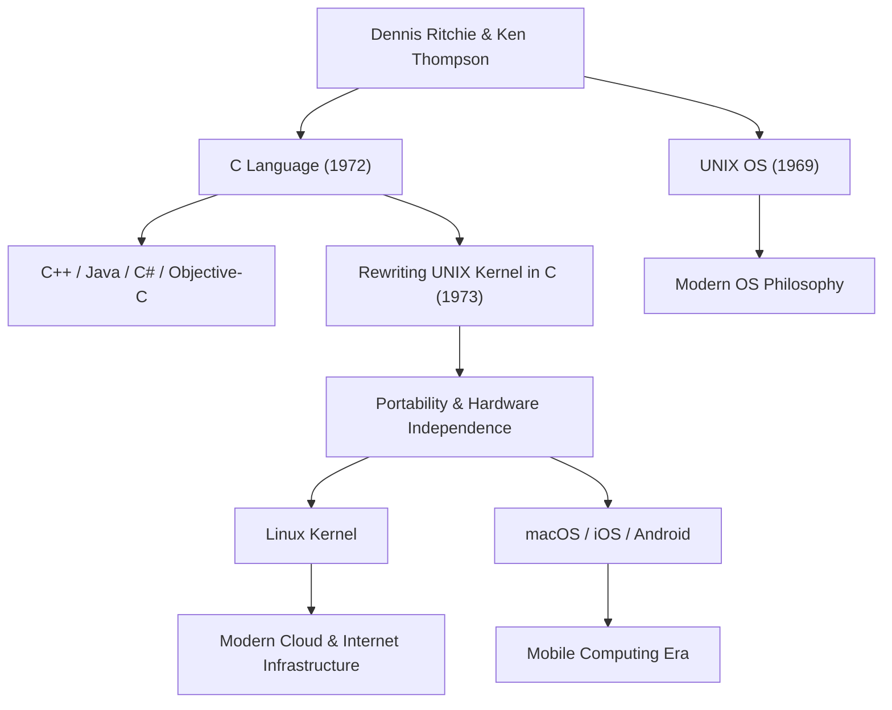

Dennis MacAlistair Ritchie (9 September 1941 - 12 Oktober 2011) adalah salah satu tokoh paling penting dan berpengaruh dalam ilmu komputer modern. Meskipun ia jarang mendapat sorotan yang mencolok seperti Steve Jobs atau Bill Gates, warisan yang ditinggalkannya adalah fondasi dari setiap teknologi yang kita gunakan saat ini. Bahasa "C" dan sistem operasi "UNIX" yang sangat ia kembangkan secara mendalam, terus berdetak di mana-mana di dunia digital modern, dari server internet hingga ponsel cerdas, superkomputer, dan bahkan peralatan rumah tangga.

## Latar Belakang dan Hari-hari di Bell Labs

Dennis Ritchie lahir di Bronxville, New York, dan dibesarkan di New Jersey. Ayahnya, Alistair Ritchie, adalah seorang ilmuwan yang bekerja lama di Bell Labs, dan merupakan otoritas dalam teori sirkuit switching. Tumbuh besar dikelilingi oleh sains dan teknologi sejak usia muda, Dennis melanjutkan pendidikan ke Universitas Harvard, tempat ia memperoleh gelar di bidang fisika dan matematika terapan. Setelah itu, ia melakukan penelitian di awal mula ilmu komputer di sekolah pascasarjana di universitas yang sama, tetapi ia memiliki minat yang jauh lebih kuat dalam membangun sistem praktis daripada bertahan di dunia akademis.

Pada tahun 1967, ia bergabung dengan Bell Labs yang sama dengan ayahnya. Bell Labs pada saat itu adalah buaian inovasi terkemuka di dunia, tempat transistor dan teori informasi diciptakan, dan merupakan tempat di mana pikiran-pikiran cemerlang dari seluruh dunia berkumpul. Di sanalah ia bertemu Ken Thompson, yang akan menjadi sekutu seumur hidupnya. Pertemuan kedua jenius ini pada dasarnya, dan untuk selamanya, mengubah sejarah komputer.

## Kelahiran Bahasa C dan UNIX

Pada akhir 1960-an, Ritchie dan Thompson terlibat dalam proyek pengembangan sistem operasi yang sangat ambisius dan kompleks untuk masanya, yang disebut "Multics (Multiplexed Information and Computing Service)". Namun, karena proyek yang membengkak dan penundaan yang berulang, Bell Labs memutuskan untuk menarik diri dari Multics.

Setelah kehilangan lingkungan pengembangan yang sangat baik, keduanya mencari sistem yang lebih sederhana dan lebih mudah digunakan di mana mereka dapat dengan nyaman menulis program. Mereka menggunakan kembali komputer PDP-7 yang tidak diinginkan yang berdebu di sudut laboratorium, dan mulai mengembangkan sistem ringan mereka sendiri. Ini adalah prototipe OS yang nantinya akan dinamai "UNIX".

Awalnya, UNIX ditulis dalam bahasa assembly, sehingga bergantung sepenuhnya pada arsitektur perangkat keras tertentu. Untuk mengatasi hal ini dan memungkinkan sistem untuk di-porting ke komputer lain, Ritchie menyempurnakan "Bahasa B" yang dikembangkan oleh Thompson, dan menciptakan "Bahasa C" pada tahun 1972.

Revolusi terbesar dari bahasa C adalah kemampuannya untuk mengoperasikan memori tingkat rendah perangkat keras (seperti pointer), sementara secara bersamaan menyeimbangkannya dengan sempurna dengan karakteristik bahasa tingkat tinggi (seperti pemrograman terstruktur) yang secara logis mudah dibaca dan ditulis oleh manusia.

Pada tahun 1973, Ritchie dan Thompson sepenuhnya menulis ulang bagian inti (kernel) UNIX dengan bahasa C ini. Melalui pendekatan penulisan sistem operasi dalam bahasa tingkat tinggi alih-alih bahasa assembly yang bergantung pada perangkat keras — sebuah pendekatan yang tidak biasa untuk saat itu — UNIX berevolusi secara dramatis menjadi sistem yang sangat portabel yang dapat di-porting ke perangkat keras apa pun.

## Filosofi: "Keep it simple" dan Kepercayaan pada Pemrogram

Di pusat filosofi desain Dennis Ritchie selalu ada "Kesederhanaan (Simplicity)" dan "Keanggunan (Elegance)". Bahasa C dirancang untuk tidak memiliki fitur bahasa yang sangat besar itu sendiri, melainkan untuk menyediakan fungsi sederhana yang sangat penting, menyerahkan sisanya pada kebijaksanaan pemrogram. Sebagaimana sering dikatakan, "Bahasa C dibangun dengan premis bahwa pemrogram tahu persis apa yang mereka coba lakukan", itu adalah alat tajam dengan tingkat kebebasan yang tinggi bagi para profesional.

Filosofi ini juga terukir dalam-dalam pada filosofi desain UNIX, yang disebut "Filosofi UNIX". Prinsip-prinsip seperti "Biarkan satu program melakukan satu hal dengan baik" dan "Hubungkan program dengan pipa dan gunakan aliran teks sebagai antarmuka universal" adalah lambang modularitas dan kolaborasi: alih-alih membangun sistem raksasa yang kompleks, gabungkan alat-alat sederhana dan independen untuk memecahkan masalah yang kompleks.

## Dampak pada Generasi Mendatang dan Warisan Bintang Raksasa yang Tenang

Pencapaian Dennis Ritchie melampaui sekadar menciptakan satu bahasa atau OS. Konsep-konsep yang ia ciptakan telah menjadi cetak biru bagi seluruh industri perangkat lunak modern.

Bahasa pemrograman seperti C++, Java, C#, Objective-C, Go, dan Rust, yang diturunkan dari atau sangat dipengaruhi oleh C, terus mendominasi pengembangan perangkat lunak saat ini. Silsilah UNIX juga telah diteruskan ke Linux sumber terbuka, macOS dan iOS dari Apple, dan bahkan Android. Infrastruktur server yang mendukung internet dan ponsel cerdas yang kita sentuh setiap hari tidak akan ada tanpa DNA dari kode yang ditinggalkannya.

Berkat pencapaiannya yang luar biasa, ia dianugerahi Penghargaan Turing, yang sering disebut sebagai Penghargaan Nobel di bidang komputasi, bersama Ken Thompson pada tahun 1983, dan menerima Medali Teknologi Nasional AS dari Presiden Clinton pada tahun 1999, di antara penghargaan-penghargaan tertinggi lainnya. Namun, ia sendiri sangat rendah hati, tidak suka menonjolkan diri di depan umum, dan tetap menjadi insinyur dengan mentalitas peretas sepanjang hidupnya.

Pada 12 Oktober 2011, hanya seminggu setelah kematian Steve Jobs, Dennis Ritchie meninggal dengan tenang di rumahnya di New Jersey. Sementara kematian Jobs diliput secara luas di seluruh dunia dan membawa banyak orang pada air mata, kematian Ritchie tidak terlalu menarik perhatian publik umum. Namun, dalam komunitas TI global, itu diterima dengan tenang, namun dengan rasa terima kasih dan kesedihan yang tak terkira.

"Steve Jobs memberi kita jendela (produk) yang indah, tetapi Dennis Ritchie membangun fondasi dan alat untuk membangun rumah itu."

Kutipan ini berbicara tentang besarnya kontribusi praktisnya bagi masyarakat modern. Dunia digital modern dibangun di atas fondasi yang kuat dan elegan yang ia bangun. Prestasi Dennis Ritchie yang tenang tidak akan pernah pudar; itu akan hidup selamanya sebagai dasar komputasi.

## Diagram Korelasi Pencapaian dan Pengaruh

Diagram berikut menunjukkan bagaimana pencapaian utama Dennis Ritchie terhubung dengan teknologi modern.

