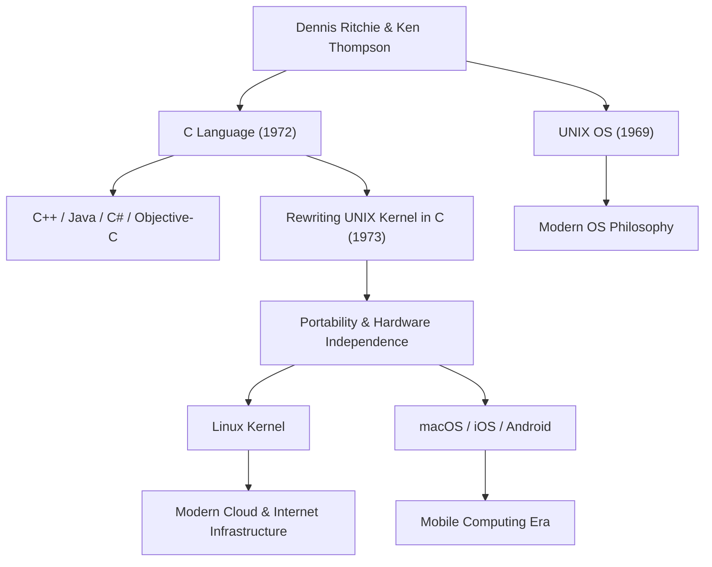

데니스 매캘리스터 리치(Dennis MacAlistair Ritchie, 1941년 9월 9일 - 2011년 10월 12일)는 현대 컴퓨터 과학에서 가장 중요하고 가장 영향력 있는 인물 중 한 명입니다. [스티브 잡스](/ko/p/biography-steve-jobs/)나 빌 게이츠처럼 화려한 조명을 받는 일은 적었지만, 그가 남긴 유산은 우리가 오늘날 사용하는 모든 기술의 기반이 되고 있습니다. 그가 개발에 깊이 관여한 'C언어'와 'UNIX' 운영 체제는 인터넷 서버에서 스마트폰, 슈퍼컴퓨터, 나아가 가전제품에 이르기까지 현대 디지털 사회의 모든 곳에서 맥박처럼 살아 숨쉬고 있습니다.

## 어린 시절과 벨 연구소에서의 나날들

데니스 리치는 뉴욕주 브롱스빌에서 태어나 뉴저지주에서 자랐습니다. 그의 아버지 앨리스터 리치는 벨 연구소(Bell Labs)에서 오랫동안 일한 과학자이자 스위칭 회로 이론의 권위자였습니다. 어릴 적부터 과학과 기술에 둘러싸여 자란 데니스는 하버드 대학교에 진학하여 물리학과 응용수학 학위를 취득했습니다. 그 후 같은 대학원에서 컴퓨터 과학의 여명기에 연구를 수행했지만, 그는 학계에 머물기보다는 실용적인 시스템 구축에 강한 관심을 가지고 있었습니다.

1967년, 그는 아버지와 같은 벨 연구소에 입사합니다. 당시 벨 연구소는 트랜지스터와 정보 이론이 탄생한 세계 굴지의 혁신 요람이었으며, 전 세계의 우수한 두뇌들이 모이는 곳이었습니다. 그곳에서 그는 평생의 맹우가 될 켄 톰슨을 만납니다. 이 두 천재의 만남이 컴퓨터의 역사를 근본적으로, 그리고 영원히 바꾸게 됩니다.

## C언어와 UNIX의 탄생

1960년대 후반, 리치와 톰슨은 'Multics(Multiplexed Information and Computing Service)'라는, 당시로서는 매우 야심 차고 복잡한 운영 체제 개발 프로젝트에 참여하고 있었습니다. 그러나 프로젝트의 비대화와 거듭된 지연으로 인해 벨 연구소는 Multics에서 철수하기로 결정합니다.

훌륭한 개발 환경을 잃은 두 사람은 더 단순하고 사용하기 쉬운, 자신들이 편안하게 프로그램을 작성할 수 있는 시스템을 원했습니다. 그들은 연구소 한구석에서 먼지를 뒤집어쓰고 있던 불필요한 PDP-7 컴퓨터를 재사용하여 독자적이고 가벼운 시스템을 개발하기 시작했습니다. 이것이 나중에 'UNIX'라고 명명되는 OS의 원형입니다.

초기 UNIX는 어셈블리어로 작성되었기 때문에 특정 하드웨어 아키텍처에 완전히 의존하고 있었습니다. 이를 해결하고 다른 컴퓨터에도 시스템을 이식할 수 있도록 하기 위해, 리치는 톰슨이 개발한 'B언어'를 기반으로 개량을 거듭하여 1972년에 'C언어'를 만들어냅니다.

C언어의 가장 큰 혁명은 하드웨어의 저수준 메모리 조작([포인터](/ko/p/c-language-pointers-memory-management-stack-heap/) 등)이 가능하면서도, 인간이 논리적으로 읽고 쓰기 쉬운 고수준 언어의 특성(구조화 프로그래밍 등)을 완벽한 균형으로 겸비하고 있었다는 점입니다.

1973년, 리치와 톰슨은 UNIX의 핵심 부분(커널)을 이 C언어로 전면적으로 다시 작성했습니다. 운영 체제를 하드웨어 의존적인 어셈블리어가 아닌 고급 언어로 기술한다는 당시로서는 상식을 벗어난 접근 방식을 통해, UNIX는 모든 하드웨어에 이식 가능한(이식성이 높은) 시스템으로 극적인 진화를 이룩했습니다.

## 철학: "Keep it simple"과 프로그래머에 대한 신뢰

데니스 리치의 설계 철학의 중심에는 항상 '단순함(Simplicity)'과 '우아함(Elegance)'이 있었습니다. C언어는 언어 자체가 거대한 기능을 가지는 것이 아니라, 필요 최소한의 단순한 기능을 제공하고 나머지는 프로그래머의 재량에 맡기도록 설계되었습니다. "C언어는 프로그래머가 자신이 무엇을 하려는지 정확히 이해하고 있다는 전제에 서 있다"고 말해지듯, 그것은 전문가를 위한 예리하고 자유도 높은 칼이었습니다.

그의 이런 철학은 UNIX의 설계 사상, 이른바 '[UNIX 철학](/ko/p/philosophy-unix-modular-design/)'에도 깊이 새겨져 있습니다. "하나의 프로그램에는 하나의 일을 잘하게 하라", "프로그램들을 파이프로 연결하고, 텍스트 스트림을 보편적인 인터페이스로 사용하라"와 같은 원칙들은, 복잡하고 거대한 시스템을 만드는 것이 아니라, 단순하고 독립적인 도구들을 결합하여 복잡한 문제를 해결한다는 모듈성과 협동성의 극치였습니다.

## 후세에 미친 영향과 조용한 거성의 유산

데니스 리치의 공적은 단순히 하나의 언어나 OS를 만든 것에 그치지 않습니다. 그가 만들어낸 개념은 현대 소프트웨어 산업 전체의 설계도가 되었습니다.

C언어에서 파생되거나 강한 영향을 받은 C++, Java, C#, Objective-C, Go, Rust 등의 프로그래밍 언어는 현재도 소프트웨어 개발의 주류를 차지하고 있습니다. 또한 UNIX의 계보를 잇는 오픈 소스인 Linux나 Apple의 macOS, iOS, 나아가 Android로 이어지고 있습니다. 인터넷을 지탱하는 서버 인프라도, 우리가 매일 만지는 스마트폰도 그가 남긴 코드의 DNA 없이는 존재할 수 없습니다.

그 거대한 공적으로 인해 1983년에 켄 톰슨과 함께 컴퓨터계의 노벨상이라 불리는 튜링상을 수상했고, 1999년에는 클린턴 대통령으로부터 미국 국가 기술상을 수여받는 등 수많은 최고의 영예를 안았습니다. 그러나 그 자신은 매우 겸손했고 공개적인 자리에서 자기주장을 하는 것을 좋아하지 않았으며, 평생을 해커 기질을 가진 한 명의 엔지니어로 남았습니다.

2011년 10월 12일, [스티브 잡스](/ko/p/biography-steve-jobs/)의 죽음으로부터 불과 일주일 후, 데니스 리치는 뉴저지주의 자택에서 조용히 세상을 떠났습니다. 잡스의 죽음이 전 세계에 대대적으로 보도되며 많은 이들이 눈물을 흘린 반면, 리치의 죽음은 일반 사회에서는 크게 주목받지 못했습니다. 그러나 전 세계 IT 커뮤니티 내에서는 조용하고 헤아릴 수 없이 깊은 감사와 슬픔으로 받아들여졌습니다.

"[스티브 잡스](/ko/p/biography-steve-jobs/)는 우리에게 아름다운 창(제품)을 주었지만, 데니스 리치는 그 집을 짓기 위한 토대와 도구를 만들었다."

이 말이 현대 사회에서 그의 실질적인 공헌의 크기를 말해줍니다. 현대의 디지털 세계는 그가 구축한 견고하고 우아한 토대 위에 세워져 있습니다. 데니스 리치의 조용한 위업은 앞으로도 퇴색하지 않고 컴퓨팅의 기초로서 영원히 살아 숨 쉴 것입니다.

## 공적과 영향의 상관도

다음 그림은 데니스 리치의 주요 공적이 어떻게 현대 기술로 이어지고 있는지 보여줍니다.

