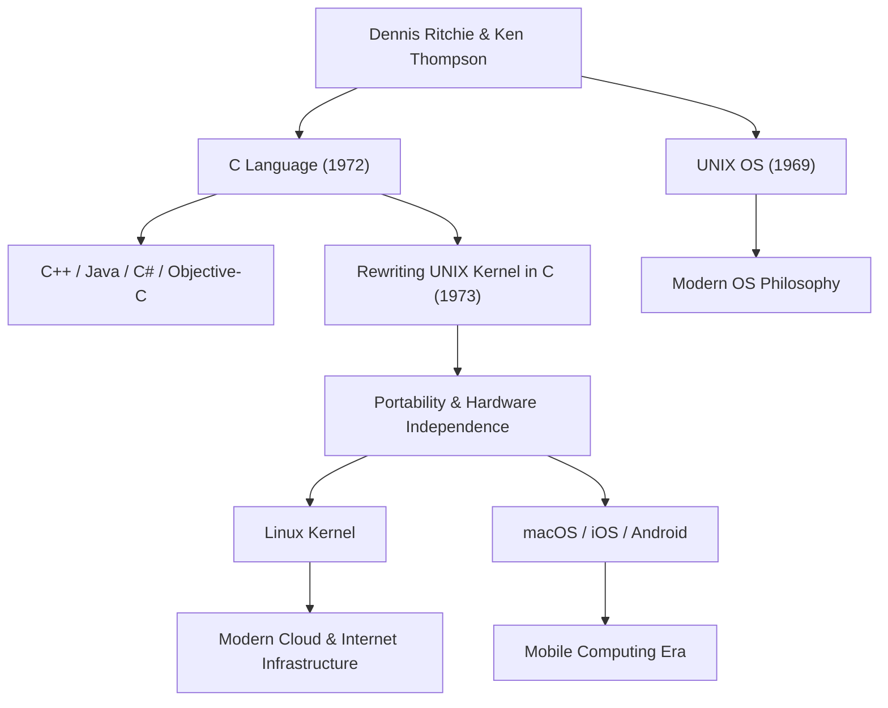

デニス・マカリスター・リッチー（Dennis MacAlistair Ritchie、1941年9月9日 - 2011年10月12日）は、現代のコンピューター科学において最も重要で、かつ最も影響力のある人物の一人です。スティーブ・ジョブズやビル・ゲイツのような派手な脚光を浴びることは少なかったものの、彼が残した遺産は、私たちが今日使用しているあらゆるテクノロジーの基盤となっています。彼が開発に深く関わった「C言語」と「UNIX」オペレーティングシステムは、インターネットのサーバーからスマートフォン、スーパーコンピューター、さらには家電製品に至るまで、現代のデジタル社会のあらゆる場所で脈々と息づいています。

## 生い立ちとベル研究所での日々

デニス・リッチーはニューヨーク州ブロンクスヴィルに生まれ、ニュージャージー州で育ちました。父親のリストア・リッチーはベル研究所（Bell Labs）で長く働く科学者であり、スイッチング回路理論の権威でした。幼い頃から科学とテクノロジーに囲まれて育ったデニスは、ハーバード大学に進学し、物理学と応用数学の学位を取得します。その後、同大学院で計算機科学の黎明期における研究を行いましたが、彼は学界にとどまることよりも、実践的なシステム構築に強い関心を抱いていました。

1967年、彼は父親と同じベル研究所に入所します。当時のベル研究所は、トランジスタや情報理論が生み出された世界屈指のイノベーションの揺りかごであり、世界中の優秀な頭脳が集まる場所でした。そこで彼は、生涯の盟友となるケン・トンプソンと出会います。この二人の天才の出会いが、コンピューターの歴史を根本から、そして永遠に変えることになります。

## C言語とUNIXの誕生

1960年代後半、リッチーとトンプソンは「Multics（Multiplexed Information and Computing Service）」と呼ばれる、当時としては極めて野心的で複雑なオペレーティングシステムの開発プロジェクトに参加していました。しかし、プロジェクトの肥大化と度重なる遅延に伴い、ベル研究所はMulticsからの撤退を決定します。

優れた開発環境を失った二人は、よりシンプルで使いやすい、自分たちが快適にプログラムを書けるシステムを求めていました。彼らは研究所の片隅で埃をかぶっていた不要なPDP-7コンピューターを再利用し、独自の軽量なシステムを開発し始めました。これが後に「UNIX」と名付けられるOSの原型です。

当初、UNIXはアセンブリ言語で書かれていたため、特定のハードウェアアーキテクチャに完全に依存していました。これを解決し、他のコンピューターにもシステムを移植できるようにするため、リッチーはトンプソンの開発した「B言語」をベースに改良を重ね、1972年に「C言語」を生み出します。

C言語の最大の革命は、ハードウェアの低レベルなメモリ操作（ポインタなど）が可能でありながら、人間が論理的に読み書きしやすい高水準言語の特性（構造化プログラミングなど）を完璧なバランスで併せ持っていた点です。

1973年、リッチーとトンプソンはUNIXの中核部分（カーネル）をこのC言語で全面的に書き直しました。オペレーティングシステムをハードウェア依存のアセンブリ言語ではなく、高級言語で記述するという当時としては常識外れのアプローチにより、UNIXはあらゆるハードウェアに移植可能な（ポータビリティの高い）システムへと劇的な進化を遂げました。

## 哲学：「Keep it simple」とプログラマへの信頼

デニス・リッチーの設計哲学の中心には、常に「シンプルさ（Simplicity）」と「エレガンス（Elegance）」がありました。C言語は、言語自体が巨大な機能を持つのではなく、必要最小限のシンプルな機能を提供し、あとはプログラマの裁量に委ねるように設計されています。「C言語は、プログラマが自分が何をしようとしているのかを正確に理解しているという前提に立っている」と語られるように、それはプロフェッショナルのための鋭利で自由度の高い刃物でした。

彼のこの哲学は、UNIXの設計思想、いわゆる「UNIX哲学」にも深く刻み込まれています。「1つのプログラムには1つのことをうまくやらせる」「プログラム同士をパイプで繋ぎ、テキストストリームを普遍的なインターフェースとして使う」といった原則は、複雑な巨大システムを作るのではなく、シンプルで独立したツールを組み合わせて複雑な問題を解決するという、モジュール性と協調性の極致でした。

## 後世への影響と静かなる巨星の遺産

デニス・リッチーの功績は、単に一つの言語やOSを作ったことにとどまりません。彼の生み出した概念は、現代のソフトウェア産業全体の設計図となりました。

C言語から派生、あるいは強い影響を受けたC++、Java、C#、Objective-C、Go、Rustなどのプログラミング言語は、現在もソフトウェア開発の主流を占めています。また、UNIXの系譜はオープンソースのLinuxや、AppleのmacOS、iOS、さらにはAndroidへと受け継がれています。インターネットを支えるサーバーインフラも、私たちが毎日触れるスマートフォンも、彼の残したコードのDNAなしには存在し得ません。

その巨大な功績により、1983年にケン・トンプソンと共にコンピューター界のノーベル賞と呼ばれるチューリング賞を受賞し、1999年にはクリントン大統領からアメリカ国家技術賞を授与されるなど、数々の最高の栄誉に輝きました。しかし彼自身は非常に控えめで、公の場で自己主張をすることを好まず、生涯を通じてハッカー気質を持った一人のエンジニアであり続けました。

2011年10月12日、スティーブ・ジョブズの死からわずか1週間後、デニス・リッチーはニュージャージー州の自宅で静かにこの世を去りました。ジョブズの死が世界中で大々的に報じられ、多くの人が涙したのに対し、リッチーの死は一般社会ではあまり注目されませんでした。しかし、世界のITコミュニティの中では、静かに、そして計り知れないほど深い感謝と悲しみをもって受け止められました。

「スティーブ・ジョブズは私たちに美しい窓（製品）を与えたが、デニス・リッチーはその家を建てるための土台と道具を作った」

この言葉が、現代社会における彼の実質的な貢献の大きさを物語っています。現代のデジタル世界は、彼が構築した強固でエレガントな土台の上に成り立っています。デニス・リッチーの静かなる偉業は、これからも色褪せることなく、コンピューティングの基礎として永遠に生き続けるでしょう。

## 功績と影響の相関図

以下の図は、デニス・リッチーの主な功績がどのように現代のテクノロジーへと繋がっているかを示しています。

