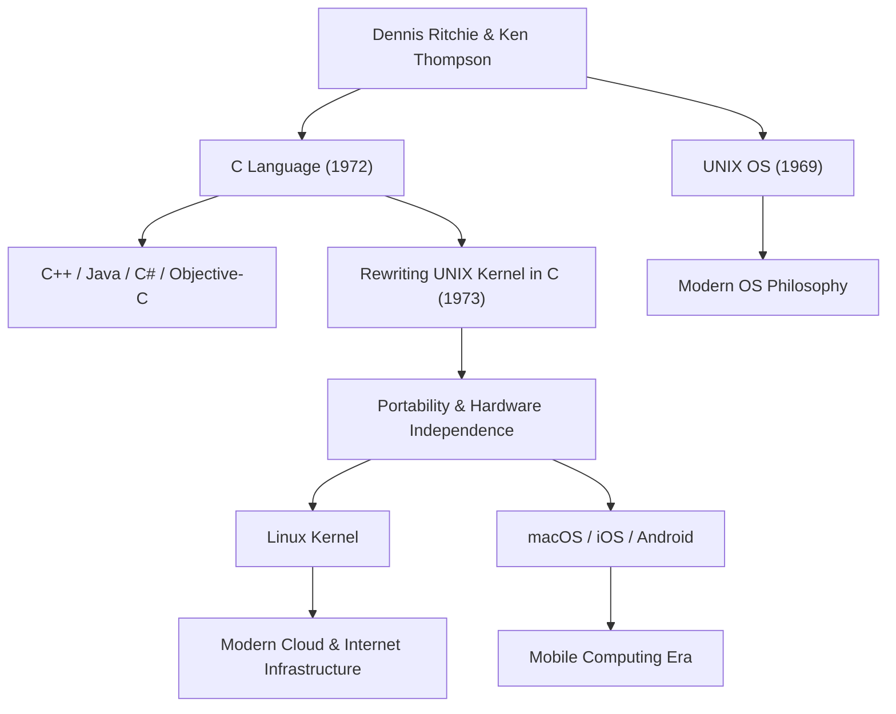

Dennis MacAlistair Ritchie (9 de setembro de 1941 - 12 de outubro de 2011) é uma das figuras mais importantes e influentes da ciência da computação moderna. Embora raramente tenha estado sob os holofotes extravagantes como Steve Jobs ou Bill Gates, o legado que ele deixou é a base de todas as tecnologias que usamos hoje. A "Linguagem C" e o sistema operacional "UNIX", nos quais ele esteve profundamente envolvido no desenvolvimento, pulsam em todos os cantos da nossa sociedade digital moderna, desde servidores de internet a smartphones, supercomputadores e até eletrodomésticos.

## Início da Vida e Dias na Bell Labs

Dennis Ritchie nasceu em Bronxville, Nova York, e cresceu em Nova Jersey. Seu pai, Alistair E. Ritchie, foi um cientista que trabalhou por muito tempo na Bell Labs e era uma autoridade em teoria de circuitos de comutação. Tendo crescido cercado de ciência e tecnologia desde cedo, Dennis ingressou na Universidade de Harvard, onde obteve diplomas em física e matemática aplicada. Posteriormente, ele realizou pesquisas no alvorecer da ciência da computação em sua pós-graduação, mas tinha um interesse muito mais forte em construir sistemas práticos do que em permanecer na academia.

Em 1967, ele ingressou na Bell Labs, a mesma instituição onde seu pai trabalhava. Naquela época, a Bell Labs era o berço de inovação mais proeminente do mundo, onde os transistores e a teoria da informação haviam nascido, e era um lugar onde se reuniam as mentes mais brilhantes de todo o mundo. Lá, ele conheceu Ken Thompson, que se tornaria seu aliado para a vida toda. O encontro desses dois gênios mudaria fundamentalmente - e para sempre - a história da computação.

## O Nascimento da Linguagem C e do UNIX

No final dos anos 1960, Ritchie e Thompson estavam envolvidos em um projeto de desenvolvimento de um sistema operacional extremamente ambicioso e complexo para a época, chamado "Multics" (Multiplexed Information and Computing Service). No entanto, devido ao inchaço do projeto e aos repetidos atrasos, a Bell Labs decidiu se retirar do Multics.

Tendo perdido seu excelente ambiente de desenvolvimento, os dois buscavam um sistema mais simples e fácil de usar, no qual pudessem escrever programas confortavelmente. Eles reutilizaram um computador PDP-7 obsoleto que estava acumulando poeira num canto do laboratório e começaram a desenvolver seu próprio sistema leve. Este seria o protótipo do sistema operacional que mais tarde seria chamado de "UNIX".

Inicialmente, o UNIX foi escrito em linguagem assembly, o que o tornava completamente dependente de uma arquitetura de hardware específica. Para resolver isso e permitir que o sistema fosse portado para outros computadores, Ritchie fez melhorias com base na "Linguagem B" desenvolvida por Thompson e, em 1972, criou a "Linguagem C".

A maior revolução da linguagem C foi o seu equilíbrio perfeito: ela permitia manipulações de memória de baixo nível de hardware (como ponteiros), ao mesmo tempo em que possuía as características de uma linguagem de alto nível (como programação estruturada) que era fácil para os humanos lerem e escreverem de forma lógica.

Em 1973, Ritchie e Thompson reescreveram inteiramente a parte central (kernel) do UNIX nessa linguagem C. Através dessa abordagem - que na época era considerada fora do comum - de escrever um sistema operacional em uma linguagem de alto nível em vez de linguagem assembly dependente de hardware, o UNIX sofreu uma evolução dramática para um sistema altamente portátil que podia ser adaptado para qualquer hardware.

## Filosofia: "Mantenha Simples" e a Confiança no Programador

No centro da filosofia de design de Dennis Ritchie sempre estiveram a "Simplicidade" (Simplicity) e a "Elegância" (Elegance). A linguagem C foi projetada não para ter uma gama massiva de funcionalidades em si, mas para fornecer o conjunto mínimo e simples de recursos necessários, deixando o resto a critério do programador. Como é frequentemente dito, "A linguagem C baseia-se na premissa de que os programadores entendem exatamente o que estão tentando fazer"; era uma ferramenta afiada e altamente flexível para profissionais.

Esta sua filosofia também está profundamente gravada na filosofia de design do UNIX, a chamada "Filosofia UNIX". Princípios como "Faça um programa fazer uma coisa e fazê-la bem" e "Conecte programas através de pipes e use streams de texto como uma interface universal" representavam o ápice da modularidade e da colaboração, resolvendo problemas complexos combinando ferramentas simples e independentes, em vez de construir sistemas enormes e complexos.

## Impacto nas Gerações Futuras e o Legado do Gigante Silencioso

As conquistas de Dennis Ritchie não se limitam apenas à criação de uma linguagem ou de um sistema operacional. Os conceitos que ele criou tornaram-se o projeto para toda a indústria de software moderna.

Linguagens de programação derivadas da C ou fortemente influenciadas por ela - como C++, Java, C#, Objective-C, Go e Rust - continuam a dominar o desenvolvimento de software convencional hoje. Além disso, a linhagem do UNIX foi passada para o Linux de código aberto, o macOS e iOS da Apple, e até mesmo para o Android. A infraestrutura de servidores que sustenta a internet e os smartphones que tocamos todos os dias não poderiam existir sem o DNA do código que ele deixou para trás.

Devido às suas enormes conquistas, ele foi agraciado com algumas das mais altas honrarias, incluindo o Prêmio Turing em 1983 - muitas vezes chamado de Prêmio Nobel da Computação - junto com Ken Thompson, e a Medalha Nacional de Tecnologia concedida pelo Presidente Clinton em 1999. No entanto, ele próprio era muito modesto, não gostava de se afirmar publicamente, e permaneceu um engenheiro com espírito de hacker por toda a sua vida.

Em 12 de outubro de 2011, apenas uma semana após a morte de Steve Jobs, Dennis Ritchie faleceu silenciosamente em sua casa em Nova Jersey. Enquanto a morte de Jobs foi amplamente noticiada no mundo todo, fazendo muitas pessoas chorarem, a morte de Ritchie recebeu pouca atenção do público em geral. Contudo, dentro da comunidade global de TI, ela foi recebida com profunda - e incomensurável - gratidão e tristeza.

"Steve Jobs nos deu uma janela bonita (produtos), mas Dennis Ritchie construiu as fundações e as ferramentas para construir a casa."

Essas palavras ilustram a magnitude de sua contribuição substancial para a sociedade moderna. O mundo digital de hoje é construído sobre a fundação sólida e elegante que ele estabeleceu. A conquista silenciosa de Dennis Ritchie não desaparecerá e viverá para sempre como a base da computação.

## Diagrama de Conquistas e Influências

O diagrama a seguir mostra como as principais conquistas de Dennis Ritchie estão conectadas à tecnologia moderna.

