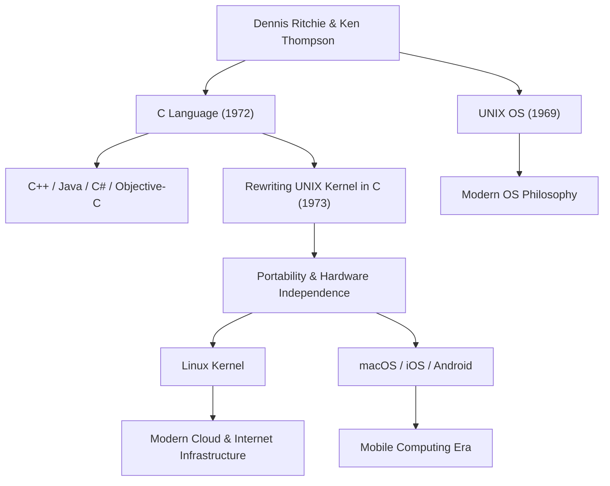

Деннис Макалистер Ритчи (Dennis MacAlistair Ritchie, 9 сентября 1941 г. — 12 октября 2011 г.) — один из самых важных и влиятельных людей в современной информатике. Хотя он редко оказывался в центре внимания, как Стив Джобс или Билл Гейтс, оставленное им наследие служит фундаментом всех технологий, которые мы используем сегодня. Язык программирования «C» и операционная система «UNIX», в разработке которых он принимал самое активное участие, продолжают жить повсюду в современном цифровом обществе — от интернет-серверов до смартфонов, суперкомпьютеров и даже бытовой техники.

## Ранние годы и дни в Bell Labs

Деннис Ритчи родился в Бронксвилле, штат Нью-Йорк, и вырос в Нью-Джерси. Его отец, Алистер Ритчи, был ученым, долгое время проработавшим в Bell Labs, и авторитетом в теории переключательных схем. С ранних лет окруженный наукой и технологиями, Деннис поступил в Гарвардский университет, где получил степени по физике и прикладной математике. Позже он проводил исследования на заре компьютерных наук в аспирантуре того же университета, но его больше интересовало практическое создание систем, чем академическая карьера.

В 1967 году он устроился на работу в Bell Labs, где работал его отец. В то время Bell Labs была одной из ведущих в мире колыбелей инноваций, где были созданы транзистор и теория информации, и местом, куда стекались лучшие умы со всего мира. Там он встретил Кена Томпсона, который стал его союзником на всю жизнь. Встреча этих двух гениев фундаментально и навсегда изменила историю вычислительной техники.

## Рождение языка C и UNIX

В конце 1960-х годов Ритчи и Томпсон участвовали в проекте разработки чрезвычайно амбициозной и сложной для того времени операционной системы под названием «Multics» (Multiplexed Information and Computing Service). Однако из-за разрастания проекта и постоянных задержек Bell Labs решила выйти из Multics.

Лишившись отличной среды разработки, двое ученых искали более простую и удобную систему, в которой они могли бы комфортно писать программы. Они использовали никому не нужный пылящийся в углу лаборатории компьютер PDP-7 и начали разрабатывать собственную легкую систему. Это был прототип ОС, которая позже была названа «UNIX».

Первоначально UNIX был написан на языке ассемблера, что делало его полностью зависимым от конкретной аппаратной архитектуры. Чтобы решить эту проблему и сделать систему переносимой на другие компьютеры, Ритчи, опираясь на разработанный Томпсоном язык «B», в 1972 году создал язык «C».

Величайшая революция языка C заключалась в том, что он представлял собой идеальный баланс между низкоуровневыми операциями с памятью (такими как указатели) и характеристиками языка высокого уровня, который легко логически читать и писать человеку (например, структурное программирование).

В 1973 году Ритчи и Томпсон полностью переписали ядро (kernel) UNIX на языке C. Благодаря этому нетрадиционному для того времени подходу — написанию операционной системы на языке высокого уровня, а не на аппаратно-зависимом ассемблере — UNIX кардинально эволюционировал в систему с высокой степенью переносимости (portability) на любое оборудование.

## Философия: «Keep it simple» и доверие к программистам

В основе философии дизайна Денниса Ритчи всегда лежали «простота» (Simplicity) и «элегантность» (Elegance). Язык C был спроектирован так, чтобы не иметь огромного количества функций в самом языке, а предоставлять лишь минимально необходимые простые функции, оставляя остальное на усмотрение программиста. Как говорится, «Язык C исходит из предпосылки, что программист точно понимает, что он пытается сделать» — это был острый и очень гибкий инструмент для профессионалов.

Его философия также глубоко укоренилась в концепции дизайна UNIX, так называемой «философии UNIX». Такие принципы, как «Каждая программа должна делать одну вещь хорошо» и «Программы должны быть связаны между собой каналами (pipes), используя текстовые потоки в качестве универсального интерфейса», были вершиной модульности и взаимодействия, позволяя решать сложные проблемы путем объединения простых, независимых инструментов, а не создания сложных монолитных систем.

## Влияние на будущие поколения и наследие тихого гиганта

Достижения Денниса Ритчи не ограничиваются созданием одного языка или ОС. Концепции, которые он породил, стали чертежом для всей современной индустрии программного обеспечения.

Языки программирования, производные от C или находящиеся под его сильным влиянием, такие как C++, Java, C#, Objective-C, Go и Rust, до сих пор доминируют в разработке программного обеспечения. Кроме того, генеалогия UNIX продолжается в Linux с открытым исходным кодом, macOS от Apple, iOS и даже Android. Ни серверная инфраструктура, поддерживающая Интернет, ни смартфоны, к которым мы прикасаемся каждый день, не могли бы существовать без ДНК его кода.

За эти колоссальные достижения он был удостоен множества высочайших наград: в 1983 году вместе с Кеном Томпсоном он получил премию Тьюринга, которую называют Нобелевской премией в области информатики, а в 1999 году президент Клинтон вручил ему Национальную медаль США в области технологий. Однако сам он был очень скромным, не любил самоутверждаться на публике и на протяжении всей жизни оставался инженером с духом хакера.

12 октября 2011 года, всего через неделю после смерти Стива Джобса, Деннис Ритчи мирно скончался в своем доме в Нью-Джерси. В то время как о смерти Джобса широко сообщали во всем мире и многие оплакивали его, уход Ритчи не привлек большого внимания широкой общественности. Однако в мировом ИТ-сообществе это было воспринято тихо, но с неизмеримо глубокой благодарностью и печалью.

«Стив Джобс дал нам красивые окна (продукты), но Деннис Ритчи создал фундамент и инструменты для постройки этого дома».

Эти слова говорят о масштабах его реального вклада в современное общество. Современный цифровой мир построен на прочном и элегантном фундаменте, который он заложил. Тихие, но великие свершения Денниса Ритчи никогда не померкнут и будут вечно жить как основа вычислений.

## Диаграмма достижений и их влияния

На следующей диаграмме показано, как основные достижения Денниса Ритчи связаны с современными технологиями.

