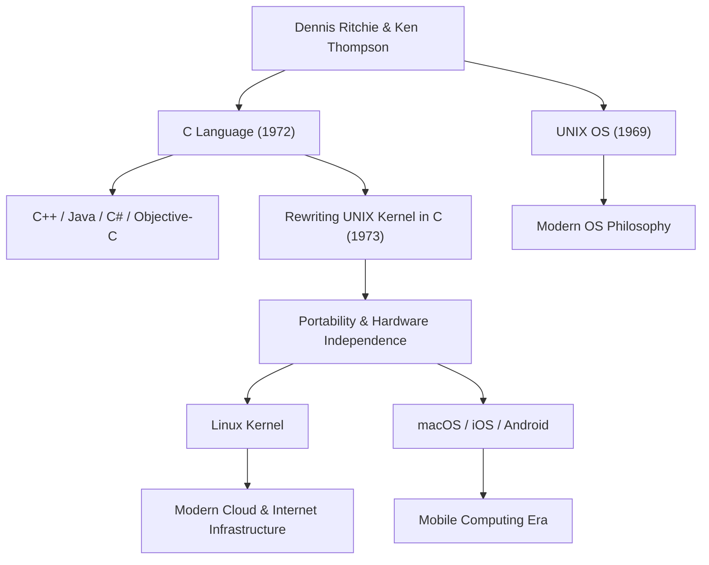

丹尼斯·麦卡利斯特·里奇（Dennis MacAlistair Ritchie，1941年9月9日 - 2011年10月12日）是现代计算机科学中最重要且最具影响力的核心人物之一。尽管他很少像史蒂夫·乔布斯或比尔·盖茨那样沐浴在耀眼的聚光灯下，但他留下的遗产构成了我们今天使用的所有技术的基石。他深度参与开发的“C语言”和“UNIX”操作系统，从互联网服务器、智能手机、超级计算机，甚至到家用电器，在现代数字社会的每一个角落都脉动着不息的生命力。

## 早年生活与贝尔实验室的岁月

丹尼斯·里奇出生于纽约州布朗克斯维尔，在新泽西州长大。他的父亲阿利斯泰尔·里奇（Alistair E. Ritchie）是一位在贝尔实验室（Bell Labs）长期工作的科学家，也是开关电路理论的权威。从小在科学和技术环境中长大的丹尼斯，考入哈佛大学并获得了物理学和应用数学学位。此后，他在该大学研究生院从事计算机科学黎明期的研究工作，但他对构建实用的系统产生了浓厚的兴趣，而不是留在学术界。

1967年，他加入了与父亲相同的贝尔实验室。当时的贝尔实验室是诞生了晶体管和信息论的世界顶尖创新摇篮，也是聚集了全球最优秀大脑的地方。在那里，他遇到了他一生的挚友肯·汤普森（Ken Thompson）。这两位天才的相遇，从根本上且永远地改变了计算机的历史。

## C语言与UNIX的诞生

20世纪60年代末，里奇和汤普森参与了一个名为“Multics（多路复用信息与计算服务）”的项目，这是当时极具野心且复杂的操作系统开发项目。然而，随着项目的臃肿和不断的延期，贝尔实验室决定退出Multics项目。

失去了优秀开发环境的两人，开始寻求一个更简单、易用，能让他们舒适地编写程序的系统。他们在实验室的角落里找到了一台闲置落灰的PDP-7计算机，并开始开发自己独特的轻量级系统。这就是后来被命名为“UNIX”的操作系统的原型。

起初，UNIX是用汇编语言编写的，因此完全依赖于特定的硬件架构。为了解决这个问题并使系统能够移植到其他计算机上，里奇在汤普森开发的“B语言”基础上进行了改良，于1972年创造了“C语言”。

C语言最大的革命性在于，它完美地平衡了低级别硬件内存操作（如指针）的能力与人类易于进行逻辑读写的高级语言特性（如结构化编程）。

1973年，里奇和汤普森使用C语言全面重写了UNIX的核心部分（内核）。将操作系统用高级语言而不是依赖于硬件的汇编语言来编写，这在当时是一种打破常规的做法，它让UNIX发生了戏剧性的进化，成为了一个可以移植到任何硬件上的（高便携性）系统。

## 哲学：“保持简单”与对程序员的信任

丹尼斯·里奇的设计哲学始终以“简单（Simplicity）”和“优雅（Elegance）”为核心。C语言在设计上并没有让语言本身拥有庞大的功能，而是提供最低限度且必需的简单功能，其余的则交由程序员自行决定。正如人们所说的：“C语言建立在程序员完全了解自己正在做什么的前提之上”，它是专为专业人士打造的锋利且自由度极高的利刃。

他的这种哲学也深深地刻在了UNIX的设计理念，即所谓的“UNIX哲学”之中。“让一个程序只做一件事，并把它做好”、“通过管道将程序连接起来，将文本流作为通用的接口”等原则，展现了模块化与协作性的极致，即不是去创建一个复杂庞大的系统，而是通过组合简单、独立的工具来解决复杂的问题。

## 对后世的影响与沉默巨星的遗产

丹尼斯·里奇的功绩不仅仅是创造了一门语言或一个操作系统。他提出的概念成为了整个现代软件产业的设计蓝图。

从C语言衍生或受其深刻影响的编程语言，如C++、Java、C#、Objective-C、Go、Rust等，至今仍占据着软件开发的主流。同时，UNIX的血脉也传承给了开源的Linux、苹果的macOS和iOS，甚至是Android。无论是支撑互联网的服务器基础设施，还是我们每天都在接触的智能手机，如果没有他留下的代码DNA，都将不复存在。

凭借其巨大的成就，1983年他与肯·汤普森共同荣获了被誉为计算机界诺贝尔奖的图灵奖，并在1999年从克林顿总统手中接过了美国国家技术奖章，获得了无数的最高荣誉。然而，他本人非常谦逊，不喜欢在公开场合炫耀自己，一生都保持着一名带有黑客气质的工程师本色。

2011年10月12日，就在史蒂夫·乔布斯去世仅仅一周后，丹尼斯·里奇在新泽西州的家中平静地离开了人世。相比于乔布斯的逝世在全球范围内被大肆报道并让无数人落泪，里奇的离世在普通大众中并没有引起太多的关注。但是，在全球的IT社区中，人们怀着无尽的感激与深深的悲痛，静静地缅怀着他。

“史蒂夫·乔布斯给了我们一扇美丽的窗户（产品），而丹尼斯·里奇建造了盖这座房子的地基和工具。”

这句话道出了他在现代社会中做出的实质性贡献有多么巨大。现代数字世界正是建立在他所构建的坚固而优雅的基础之上。丹尼斯·里奇那沉默的丰功伟绩，在未来也不会褪色，将作为计算的基础永远存在下去。

## 成就与影响的关系图

下图展示了丹尼斯·里奇的主要成就是如何与现代技术联系在一起的。

