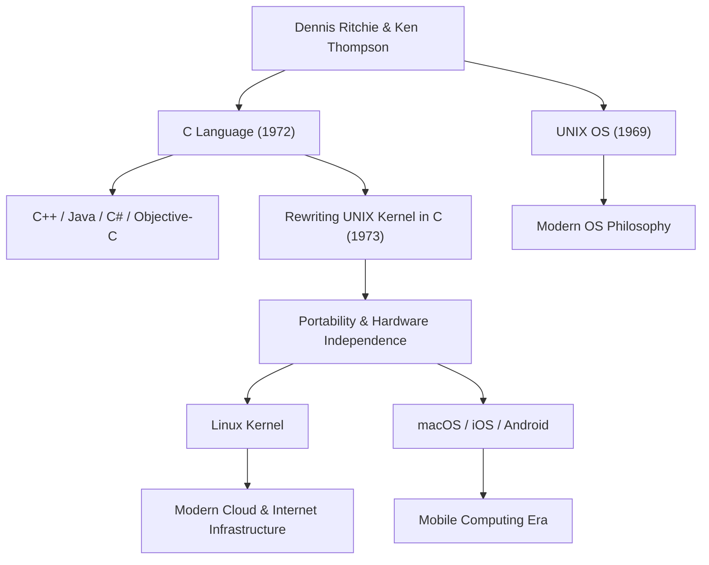

丹尼斯·麥卡利斯特·里奇（Dennis MacAlistair Ritchie，1941年9月9日 - 2011年10月12日）是現代計算機科學中最重要且最具影響力的人物之一。雖然他不像[史蒂夫·賈伯斯](/zh-tw/p/biography-steve-jobs/)（Steve Jobs）或比爾·蓋茲（Bill Gates）那樣頻繁地站在鎂光燈下，但他留下的遺產卻是我們今天所使用的所有科技的基石。他深度參與開發的「C語言」和「UNIX」作業系統，從網際網路伺服器到智慧型手機、超級電腦，甚至家電產品，在現代數位社會的各個角落中都生生不息地運作著。

## 早年生活與貝爾實驗室的歲月

丹尼斯·里奇出生於紐約州布朗克斯維爾（Bronxville），在紐澤西州長大。他的父親阿利斯泰爾·里奇（Alistair Ritchie）是一位在貝爾實驗室（Bell Labs）長期工作的科學家，也是開關電路理論的權威。自小在科學與科技的環境中長大的丹尼斯，進入哈佛大學就讀，並取得了物理學與應用數學學位。隨後，他在該校研究所進行了計算機科學萌芽期的研究，但他對構建實用的系統抱有更強烈的興趣，而非僅僅留在學術界。

1967年，他加入了與父親相同的貝爾實驗室。當時的貝爾實驗室是誕生了電晶體與資訊理論的世界頂尖創新搖籃，也是全球優秀頭腦匯聚之地。在那裡，他遇見了一生的盟友——肯·湯普遜（Ken Thompson）。這兩位天才的相遇，將從根本上且永遠地改變計算機的歷史。

## C語言與UNIX的誕生

1960年代後期，里奇與湯普遜參與了一個名為「Multics（Multiplexed Information and Computing Service）」的專案，這在當時是一個極具野心且複雜的作業系統開發計畫。然而，隨著專案的過度膨脹與一再延遲，貝爾實驗室決定退出 Multics 計畫。

失去了優秀開發環境的兩人，開始尋求一個更簡單、更易用，能讓他們舒適地編寫程式的系統。他們重新利用了實驗室角落裡佈滿灰塵、被廢棄的 PDP-7 電腦，開始開發屬於他們自己的輕量級系統。這就是後來被命名為「UNIX」的作業系統雛形。

起初，UNIX 是用組合語言（Assembly language）編寫的，因此完全依賴於特定的硬體架構。為了排解這個問題，並讓系統能夠移植到其他電腦上，里奇以湯普遜開發的「B語言」為基礎進行了多次改良，於 1972 年創造了「C語言」。

C語言最大的革命性在於，它既允許進行硬體的低階記憶體操作（如指標等），又完美平衡了人類易於邏輯性地閱讀與編寫的高階語言特性（如結構化程式設計等）。

1973年，里奇和湯普遜用C語言全面重寫了 UNIX 的核心部分（Kernel）。這種不使用依賴硬體的組合語言，而是使用高階語言來編寫作業系統的做法，在當時是打破常規的；藉由這個方法，UNIX 經歷了戲劇性的進化，成為了一個可移植到各種硬體上（具備高可移植性）的系統。

## 哲學：「Keep it simple」與對程式設計師的信任

丹尼斯·里奇的設計哲學核心始終是「簡潔（Simplicity）」與「優雅（Elegance）」。C語言的設計並非讓語言本身擁有龐大的功能，而是提供必要且最少的簡單功能，其餘的則交由程式設計師自行裁量。「C語言建立在一個前提之上：程式設計師準確地知道自己正在做什麼」，這是一把為專業人士量身打造、鋒利且具有高自由度的利刃。

他的這項哲學也深深地銘刻在 UNIX 的設計思想，也就是所謂的「[UNIX哲學](/zh-tw/p/philosophy-unix-modular-design/)」中。「讓一個程式做好一件事」、「透過管道（Pipe）將程式連接起來，並使用文字串流作為普遍的介面」等原則，其目的並非打造複雜的龐大系統，而是透過組合簡單且獨立的工具來解決複雜的問題，這可以說是模組化與協同運作的極致展現。

## 對後世的影響與沉默巨星的遺產

丹尼斯·里奇的貢獻不僅僅停留在創造了一種語言或一個作業系統。他所孕育的概念，已經成為了現代軟體產業整體的設計藍圖。

從C語言衍生出，或受到其強烈影響的程式語言，如 C++、Java、C#、Objective-C、Go、Rust 等，至今仍佔據著軟體開發的主流地位。此外，UNIX 的系譜也被開源的 Linux、Apple 的 macOS、iOS，甚至 Android 所繼承。無論是支撐網際網路的伺服器基礎設施，還是我們每天接觸的智慧型手機，如果沒有他留下的程式碼 DNA，都將不復存在。

憑藉其巨大的貢獻，他於 1983 年與肯·湯普遜共同獲得了被譽為計算機界諾貝爾獎的圖靈獎（Turing Award），並於 1999 年榮獲柯林頓總統頒發的美國國家技術獎（National Medal of Technology），獲得了無數最高榮譽。然而他本人卻非常低調，不喜歡在公開場合張揚自我，終其一生都保持著駭客氣質，是一位純粹的工程師。

2011年10月12日，在[史蒂夫·賈伯斯](/zh-tw/p/biography-steve-jobs/)逝世僅一週後，丹尼斯·里奇在紐澤西州的家中平靜地離開了人世。相比於賈伯斯的逝世在全世界被大肆報導，讓許多人為之落淚，里奇的離世在一般大眾社會中卻鮮少受到關注。然而，在全球的 IT 社群中，人們卻以無比深沉的感激與悲痛，靜靜地接受了這個事實。

「[史蒂夫·賈伯斯](/zh-tw/p/biography-steve-jobs/)給了我們一扇美麗的窗（產品），而丹尼斯·里奇則打造了建造那棟房子的地基與工具。」

這句話訴說了他在現代社會中實質貢獻的偉大程度。現代的數位世界，正是建立在他所構築的堅固且優雅的基石之上。丹尼斯·里奇那寧靜的豐功偉業，未來也不會褪色，將作為計算機科學的基礎永遠地存活下去。

## 貢獻與影響之關聯圖

下圖展示了丹尼斯·里奇的主要貢獻是如何與現代科技產生連結的。

