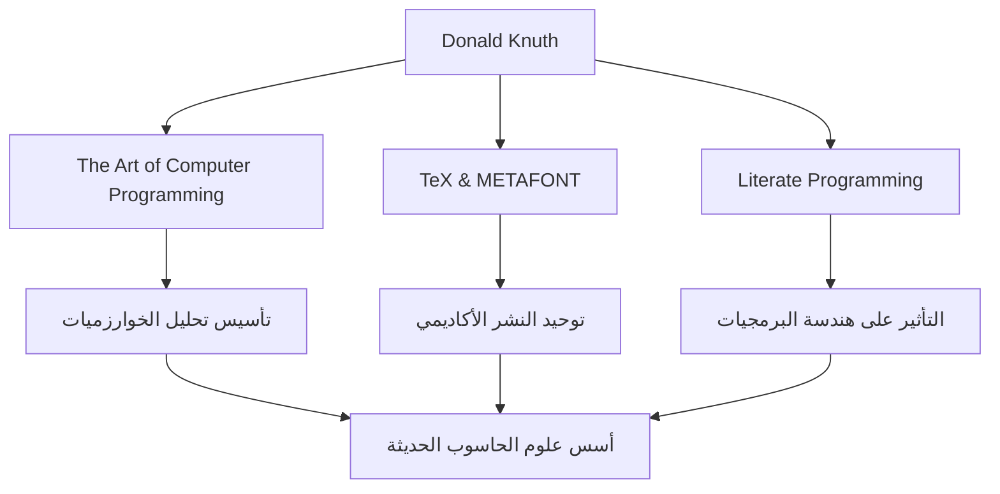

في عالم علوم الحاسوب، ربما لا يوجد أحد لا يعرف اسم دونالد إي. كانوث. يُعرف باسم "أبو تحليل الخوارزميات"، وهو شخصية عظيمة ارتقى بالبرمجة من مجرد تقنية إلى عالم "الفن". يتعمق هذا المقال في حياته، وفلسفته الفريدة، والتأثير الذي لا يقاس الذي أحدثه على الأجيال القادمة.

## الحياة المبكرة والإنجازات

وُلد كانوث في ميلووكي، ويسكونسن في عام 1938، وأظهر اهتمامًا قويًا بالموسيقى والرياضيات منذ صغره. التحق بمعهد كيس للتكنولوجيا (الآن جامعة كيس ويسترن ريزيرف)، حيث واجه أجهزة الحاسوب لأول مرة وأسره سحرها على الفور. والمثير للدهشة أن برنامجه الأول كان يهدف إلى تحليل إحصائيات فريق كرة السلة في مدرسته. تُظهر هذه القصة أن تفكيره التحليلي ونهجه العملي كانا حاضرين منذ البداية.

في عام 1968، في سن الثلاثين، أصبح كانوث أستاذًا في جامعة ستانفورد، وفي نفس العام، نشر المجلد الأول من تحفته الخالدة التي ارتبطت باسمه، "فن برمجة الحاسوب (TAOCP)". بدأ هذا المشروع في الأصل بفكرة كتابة كتاب واحد عن المترجمات، ولكن مع استمراره في الكتابة، تطور إلى هدف عظيم يتمثل في "تغطية أسس علوم الحاسوب بشكل شامل".

## الفلسفة القائلة بأن البرمجة هي "فن"

عند الحديث عن فلسفة كانوث، فإن مفهوم "البرمجة الأدبية" (Literate Programming) لا غنى عنه. وجادل بأن البرنامج لا ينبغي أن يكون مجرد إعطاء تعليمات لآلة، بل ينبغي أن يكون "أدبًا" يمكن للبشر قراءته وفهمه.

كان لهذا النهج المتمثل في دمج الكود والتوثيق وكتابة البرامج جنبًا إلى جنب مع عمليات التفكير البشري تأثير عميق على هندسة البرمجيات في ذلك الوقت. وكما يتضح من تضمين كلمة "فن" في عنوان كتابه، فإن البرمجة بالنسبة لكانوث هي نشاط إبداعي يرافقه الجمال والتعبير.

## البحث عن الجمال: ولادة TeX و METAFONT

في أواخر السبعينيات، أثناء إعداد الطبعة الثانية من TAOCP، شعر كانوث بالفزع من رداءة جودة تكنولوجيا التنضيد في ذلك الوقت. ولعدم قدرته على تحمل حقيقة أن كتابه لن يُطبع بشكل جميل، اتخذ إجراءً رائعًا. بدأ في تطوير نظام تنضيد بنفسه يجسد الجمال الرياضي.

كانت هذه لحظة ولادة "TeX"، والذي لا يزال يُستخدم حتى اليوم كمعيار في الأوساط الأكاديمية وصناعة النشر، ونظام تصميم الخطوط "METAFONT". أوقف كتابة كتابه وقضى حوالي 10 سنوات في إكمال هذا النظام. مدفوعًا بهوسه في السعي وراء "الجمال المثالي"، يُعرف TeX أيضًا بأنه قصة نجاح رائدة للبرمجيات مفتوحة المصدر.

## التأثير على الأجيال القادمة والأهمية اليوم

يذهب تأثير إنجازات كانوث على علوم الحاسوب إلى أبعد بكثير من مجرد إنشاء خوارزميات أو أدوات محددة. أسس بحثه مجالًا أكاديميًا جديدًا يسمى "تحليل الخوارزميات"، والذي يقيّم رياضيًا وقت التنفيذ واستخدام الذاكرة للخوارزميات.

يوضح المخطط أدناه إنجازات كانوث الرئيسية وكيفية ارتباطها بيومنا هذا.

علاوة على ذلك، فهو معروف بنظامه الفريد "شيكات مكافآت كانوث"، حيث يدفع مكافأة مقابل الأخطاء المطبعية الموجودة في كتبه. تُظهر هذه المبادرة الفكاهية مدى تقديره للصرامة والدقة، ومدى اعتزازه بالحوار مع قرائه.

## في الختام

حتى في عالم اليوم الذي يشهد تقدمًا تكنولوجيًا ملحوظًا، يعلمنا دونالد كانوث حقائق عالمية لا تتلاشى أبدًا. إنه الدليل على أن الصرامة الرياضية لحل المشكلات المعقدة والحساسية الفنية لكتابة كود جميل يمكن أن تنسجم تمامًا.

لا يزال عمل حياته، "فن برمجة الحاسوب"، قيد الكتابة حتى اليوم. ستستمر روح كانوث الاستقصائية وشغفه الذي لا ينضب في إلهام المبرمجين والباحثين في جميع أنحاء العالم.
