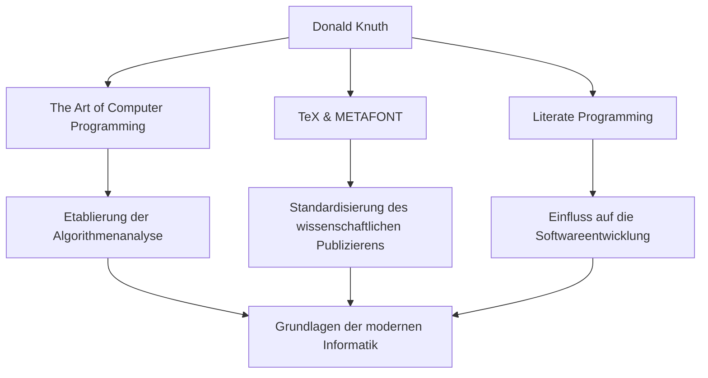

In der Welt der Informatik gibt es wohl niemanden, der den Namen Donald E. Knuth nicht kennt. Bekannt als "Vater der Algorithmenanalyse", ist er eine herausragende Persönlichkeit, die das Programmieren von einer bloßen Technik in den Bereich der "Kunst" erhoben hat. Dieser Artikel taucht tief in sein Leben, seine einzigartige Philosophie und seinen unermesslichen Einfluss auf zukünftige Generationen ein.

## Frühes Leben und Errungenschaften

Der 1938 in Milwaukee, Wisconsin, geborene Knuth zeigte schon in jungen Jahren ein starkes Interesse an Musik und Mathematik. Er schrieb sich am Case Institute of Technology (heute Case Western Reserve University) ein, wo er zum ersten Mal mit Computern in Berührung kam und sofort von ihrem Charme fasziniert war. Überraschenderweise war sein allererstes Programm die Analyse von Statistiken für die Basketballmannschaft seiner Schule. Diese Episode zeigt, dass sein analytisches Denken und sein praktischer Ansatz von Anfang an vorhanden waren.

Im Jahr 1968, im Alter von 30 Jahren, wurde Knuth Professor an der Stanford University und veröffentlichte im selben Jahr den ersten Band seines gleichnamigen, unsterblichen Meisterwerks "The Art of Computer Programming (TAOCP)". Dieses Projekt begann ursprünglich mit der Idee, ein einziges Buch über Compiler zu schreiben, aber während des Schreibens entwickelte es sich zu dem großen Ziel, "die Grundlagen der Informatik umfassend abzudecken".

## Die Philosophie, dass Programmieren eine "Kunst" ist

Wenn man über Knuths Philosophie spricht, ist das Konzept der "literarischen Programmierung" (Literate Programming) unverzichtbar. Er argumentierte, dass ein Programm nicht nur dazu dienen sollte, einer Maschine Anweisungen zu geben, sondern "Literatur" sein sollte, die Menschen lesen und verstehen können.

Dieser Ansatz, Code und Dokumentation zu integrieren und Programme entlang der menschlichen Denkprozesse zu schreiben, hatte damals tiefgreifende Auswirkungen auf die Softwareentwicklung. Wie die Aufnahme des Wortes "Kunst" in den Titel seines Buches zeigt, ist das Programmieren für Knuth eine kreative Aktivität, die mit Schönheit und Ausdruckskraft einhergeht.

## Die Suche nach Schönheit: Die Geburt von TeX und METAFONT

In den späten 1970er Jahren, als er die zweite Ausgabe von TAOCP vorbereitete, war Knuth von der schlechten Qualität der damaligen Schriftsatztechnik entsetzt. Da er nicht ertragen konnte, dass sein eigenes Buch nicht schön gedruckt werden würde, ergriff er bemerkenswerte Maßnahmen. Er begann selbst, ein Schriftsatzsystem zu entwickeln, das mathematische Schönheit verkörperte.

Dies war die Geburtsstunde von "TeX", das noch heute als Standard in der Wissenschaft und Verlagsbranche verwendet wird, und dem Schriftart-Designsystem "METAFONT". Er unterbrach das Schreiben seines Buches und verbrachte etwa 10 Jahre mit der Fertigstellung dieses Systems. Angetrieben von seiner Besessenheit, "perfekte Schönheit" zu erreichen, ist TeX auch als wegweisende Erfolgsgeschichte von Open-Source-Software bekannt.

## Einfluss auf künftige Generationen und heutige Bedeutung

Die Auswirkungen von Knuths Errungenschaften auf die Informatik gehen weit über die reine Schaffung spezifischer Algorithmen oder Werkzeuge hinaus. Seine Forschung begründete ein neues akademisches Feld namens "Algorithmenanalyse", das die Ausführungszeit und den Speicherbedarf von Algorithmen mathematisch bewertet.

Das folgende Diagramm zeigt Knuths wichtigste Errungenschaften und wie sie mit der heutigen Zeit verbunden sind.

Darüber hinaus ist er für sein einzigartiges System der "Knuth-Belohnungsschecks" bekannt, bei dem er ein Kopfgeld für Tippfehler zahlt, die in seinen Büchern gefunden werden. Diese humorvolle Initiative zeigt, wie sehr er Strenge und Genauigkeit schätzt und wie sehr er den Dialog mit seinen Lesern pflegt.

## Fazit

Selbst in unserer heutigen Welt der rasanten technologischen Entwicklung lehrt uns Donald Knuth universelle Wahrheiten, die niemals verblassen. Es ist der Beweis, dass die mathematische Strenge zur Lösung komplexer Probleme und die künstlerische Sensibilität, um schönen Code zu schreiben, perfekt miteinander harmonieren können.

Sein Lebenswerk "The Art of Computer Programming" wird noch heute geschrieben. Knuths unerschöpflicher Forschergeist und seine Leidenschaft werden weiterhin Programmierer und Forscher auf der ganzen Welt inspirieren.
