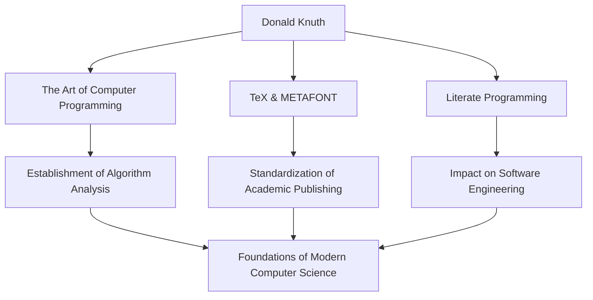

In the world of computer science, there is likely no one who does not know the name Donald E. Knuth. Known as the "father of algorithm analysis," he is a great figure who elevated programming from a mere technique to the realm of "art." This article delves deep into his life, his unique philosophy, and the immeasurable impact he has had on future generations.

## Early Life and Achievements

Born in Milwaukee, Wisconsin in 1938, Knuth showed a strong interest in music and mathematics from a young age. He entered the Case Institute of Technology (now Case Western Reserve University), where he first encountered computers and was instantly captivated by their charm. Surprisingly, his very first program was to analyze statistics for his school's basketball team. This episode shows that his analytical thinking and practical approach were present from the very beginning.

In 1968, at the age of 30, Knuth became a professor at Stanford University, and in the same year, he published the first volume of his synonymous, immortal masterpiece, "The Art of Computer Programming (TAOCP)". This project originally started with the idea of writing a single book about compilers, but as he continued writing, it evolved into a grand goal of "comprehensively covering the foundations of computer science."

## The Philosophy That Programming is an "Art"

When talking about Knuth's philosophy, the concept of "Literate Programming" is indispensable. He argued that a program should not merely be for giving instructions to a machine, but should be "literature" that humans can read and understand.

This approach of integrating code and documentation and writing programs along with human thought processes had a profound impact on software engineering at the time. As can be seen from the inclusion of the word "Art" in the title of his book, for Knuth, programming is a creative activity accompanied by beauty and expressiveness.

## The Quest for Beauty: The Birth of TeX and METAFONT

In the late 1970s, while preparing the second edition of TAOCP, Knuth was appalled by the poor quality of typesetting technology at the time. Unable to stand the fact that his own book would not be printed beautifully, he took remarkable action. He began developing a typesetting system himself that embodied mathematical beauty.

This was the moment of birth of "TeX", which is still used as a standard in academia and the publishing industry today, and the font design system "METAFONT". He suspended the writing of his book and spent about 10 years completing this system. Driven by his obsession with pursuing "perfect beauty", TeX is also known as a pioneering success story of open-source software.

## Impact on Future Generations and Significance Today

The impact of Knuth's achievements on computer science goes far beyond simply creating specific algorithms or tools. His research established a new academic field called "algorithm analysis", which mathematically evaluates the execution time and memory usage of algorithms.

The diagram below shows Knuth's major achievements and how they connect to the present day.

Furthermore, he is known for his unique system of "Knuth reward checks", where he pays a bounty for typos found in his books. This humorous initiative shows how much he values rigor and accuracy, and how much he cherishes dialogue with his readers.

## In Conclusion

Even in today's world of remarkable technological advancement, Donald Knuth teaches us universal truths that never fade. It is the proof that the mathematical rigor to unravel complex problems and the artistic sensibility to write beautiful code can perfectly harmonize.

His life's work, "The Art of Computer Programming", is still being written today. Knuth's inexhaustible spirit of inquiry and passion will continue to inspire programmers and researchers around the world.
