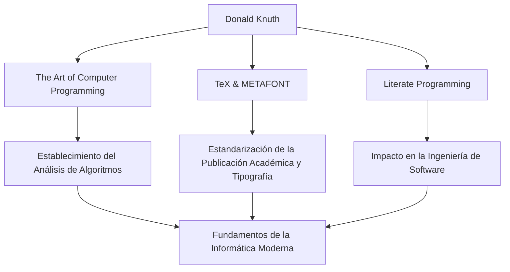

En el mundo de la informática, probablemente no haya nadie que no conozca el nombre de Donald E. Knuth. Conocido como el "padre del análisis de algoritmos", es una gran figura que elevó la programación de una simple técnica al ámbito del "arte". Este artículo profundiza en su vida, su filosofía única y el inmenso impacto que ha tenido en las generaciones futuras.

## Primeros Años y Logros

Nacido en Milwaukee, Wisconsin en 1938, Knuth mostró un gran interés por la música y las matemáticas desde una edad temprana. Ingresó en el Instituto de Tecnología Case (actualmente Universidad Case Western Reserve), donde entró en contacto por primera vez con los ordenadores y quedó cautivado al instante por su encanto. Sorprendentemente, su primer programa fue para analizar las estadísticas del equipo de baloncesto de su escuela. Esta anécdota demuestra que su pensamiento analítico y enfoque práctico estuvieron presentes desde el principio.

En 1968, a los 30 años, Knuth se convirtió en profesor de la Universidad de Stanford y, ese mismo año, publicó el primer volumen de su obra maestra inmortal y sinónimo de su nombre, "El Arte de Programar Ordenadores (TAOCP)". Este proyecto comenzó originalmente con la idea de escribir un libro sobre compiladores, pero a medida que avanzaba la escritura, evolucionó hasta convertirse en el gran objetivo de "abarcar de forma exhaustiva los fundamentos de la informática".

## La Filosofía de que la Programación es un "Arte"

Al hablar de la filosofía de Knuth, es indispensable mencionar el concepto de "Programación Literaria" (Literate Programming). Él sostenía que un programa no debía ser simplemente para dar instrucciones a una máquina, sino "literatura" que los humanos pudieran leer y entender.

Este enfoque de integrar código y documentación, escribiendo programas que siguen el proceso de pensamiento humano, tuvo un profundo impacto en la ingeniería de software de la época. Como puede verse por la inclusión de la palabra "Arte" en el título de su libro, para Knuth la programación es una actividad creativa acompañada de belleza y expresividad.

## La Búsqueda de la Belleza: El Nacimiento de TeX y METAFONT

A finales de la década de 1970, mientras preparaba la segunda edición de TAOCP, Knuth se sintió consternado por la baja calidad de la tecnología de composición tipográfica de la época. Incapaz de soportar el hecho de que su propio libro no se imprimiera bellamente, tomó medidas notables. Comenzó a desarrollar él mismo un sistema de composición tipográfica que encarnara la belleza matemática.

Este fue el momento del nacimiento de "TeX", que todavía se utiliza hoy como estándar en el mundo académico y la industria editorial, y del sistema de diseño de fuentes "METAFONT". Suspendió la escritura de su libro y dedicó unos 10 años a completar este sistema. Impulsado por su obsesión por perseguir la "belleza perfecta", TeX también es conocido como una historia de éxito pionera del software de código abierto.

## Impacto en Generaciones Futuras y Significado Actual

El impacto de los logros de Knuth en la informática va mucho más allá de la simple creación de algoritmos o herramientas específicas. Su investigación estableció un nuevo campo académico llamado "análisis de algoritmos", que evalúa matemáticamente el tiempo de ejecución y el uso de memoria de los algoritmos.

El siguiente diagrama muestra los principales logros de Knuth y cómo se conectan con el presente.

Además, es conocido por su singular sistema de "Cheques de recompensa de Knuth", mediante el cual paga una recompensa por los errores tipográficos que se encuentran en sus libros. Esta iniciativa humorística demuestra lo mucho que valora el rigor y la precisión, y lo mucho que aprecia el diálogo con sus lectores.

## Conclusión

Incluso en el mundo actual de notables avances tecnológicos, Donald Knuth nos enseña verdades universales que nunca se desvanecen. Es la prueba de que el rigor matemático para desentrañar problemas complejos y la sensibilidad artística para escribir un código hermoso pueden armonizar a la perfección.

Su obra de toda la vida, "El Arte de Programar Ordenadores", todavía se sigue escribiendo hoy en día. El inagotable espíritu de investigación y la pasión de Knuth seguirán inspirando a programadores e investigadores de todo el mundo.
