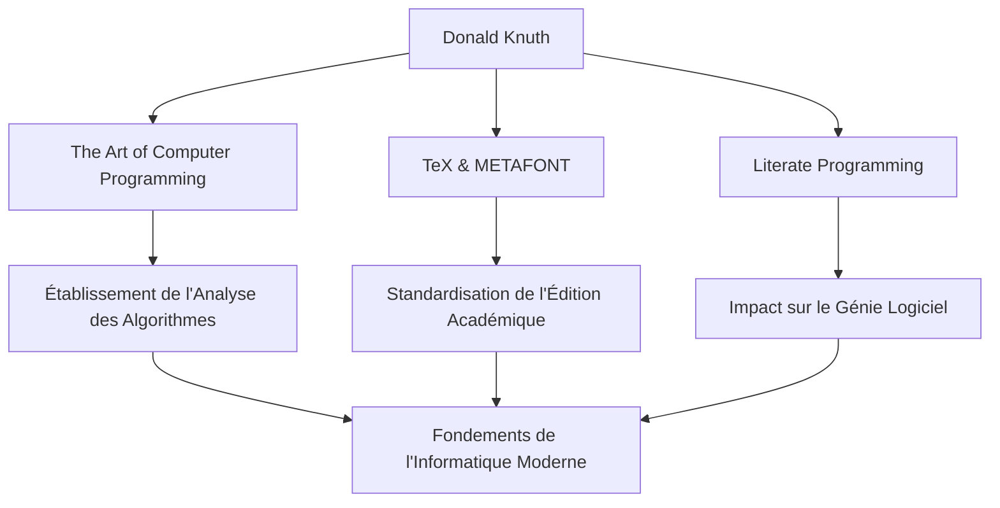

Dans le monde de l'informatique, il n'y a probablement personne qui ne connaisse pas le nom de Donald E. Knuth. Connu comme le "père de l'analyse des algorithmes", c'est une figure éminente qui a élevé la programmation d'une simple technique au rang d'"art". Cet article plonge au cœur de sa vie, de sa philosophie unique et de l'impact incommensurable qu'il a eu sur les générations futures.

## Jeunesse et Premières Réalisations

Né à Milwaukee, dans le Wisconsin, en 1938, Knuth a montré un fort intérêt pour la musique et les mathématiques dès son plus jeune âge. Il est entré au Case Institute of Technology (aujourd'hui Case Western Reserve University), où il a découvert les ordinateurs pour la première fois et a été instantanément captivé par leur charme. Étonnamment, son tout premier programme consistait à analyser les statistiques de l'équipe de basket-ball de son école. Cette anecdote montre que sa pensée analytique et son approche pratique étaient présentes dès le début.

En 1968, à l'âge de 30 ans, Knuth est devenu professeur à l'Université de Stanford, et la même année, il a publié le premier volume de son chef-d'œuvre immortel, "The Art of Computer Programming (TAOCP)". Ce projet a commencé à l'origine avec l'idée d'écrire un seul livre sur les compilateurs, mais au fur et à mesure qu'il avançait, il s'est transformé en un objectif grandiose consistant à "couvrir de manière exhaustive les fondements de l'informatique".

## La Philosophie selon laquelle la Programmation est un "Art"

Lorsque l'on parle de la philosophie de Knuth, le concept de "Programmation Littéraire" (Literate Programming) est indispensable. Il soutenait qu'un programme ne devait pas simplement servir à donner des instructions à une machine, mais devait être une "littérature" que les humains peuvent lire et comprendre.

Cette approche consistant à intégrer le code et la documentation et à écrire des programmes en suivant le processus de pensée humain a eu un impact profond sur le génie logiciel de l'époque. Comme le montre l'inclusion du mot "Art" dans le titre de son livre, pour Knuth, la programmation est une activité créative accompagnée de beauté et d'expressivité.

## La Quête de la Beauté : La Naissance de TeX et METAFONT

À la fin des années 1970, alors qu'il préparait la deuxième édition de TAOCP, Knuth fut consterné par la mauvaise qualité de la technologie de composition typographique de l'époque. Incapable de supporter le fait que son propre livre ne soit pas imprimé de manière magnifique, il a pris des mesures remarquables. Il a commencé à développer lui-même un système de composition incarnant la beauté mathématique.

C'est ainsi que sont nés "TeX", qui est toujours utilisé aujourd'hui comme norme dans le monde universitaire et l'industrie de l'édition, et le système de conception de polices "METAFONT". Il a suspendu l'écriture de son livre et a consacré environ 10 ans à l'achèvement de ce système. Poussé par son obsession d'atteindre la "beauté parfaite", TeX est également connu comme une réussite pionnière des logiciels open source.

## Impact sur les Générations Futures et Importance Actuelle

L'impact des réalisations de Knuth sur l'informatique va bien au-delà de la simple création d'algorithmes ou d'outils spécifiques. Ses recherches ont établi un nouveau domaine académique appelé "analyse des algorithmes", qui évalue mathématiquement le temps d'exécution et l'utilisation de la mémoire des algorithmes.

Le diagramme ci-dessous montre les principales réalisations de Knuth et comment elles sont liées à l'époque actuelle.

De plus, il est connu pour son système unique de "chèques de récompense Knuth", par lequel il verse une prime pour les fautes de frappe trouvées dans ses livres. Cette initiative humoristique montre à quel point il valorise la rigueur et l'exactitude, et à quel point il chérit le dialogue avec ses lecteurs.

## En Conclusion

Même dans notre monde actuel marqué par des avancées technologiques remarquables, Donald Knuth nous enseigne des vérités universelles qui ne s'estompent jamais. C'est la preuve que la rigueur mathématique pour résoudre des problèmes complexes et la sensibilité artistique pour écrire un code magnifique peuvent s'harmoniser parfaitement.

L'œuvre de sa vie, "The Art of Computer Programming", est toujours en cours d'écriture aujourd'hui. L'esprit d'investigation inépuisable et la passion de Knuth continueront d'inspirer les programmeurs et les chercheurs du monde entier.
