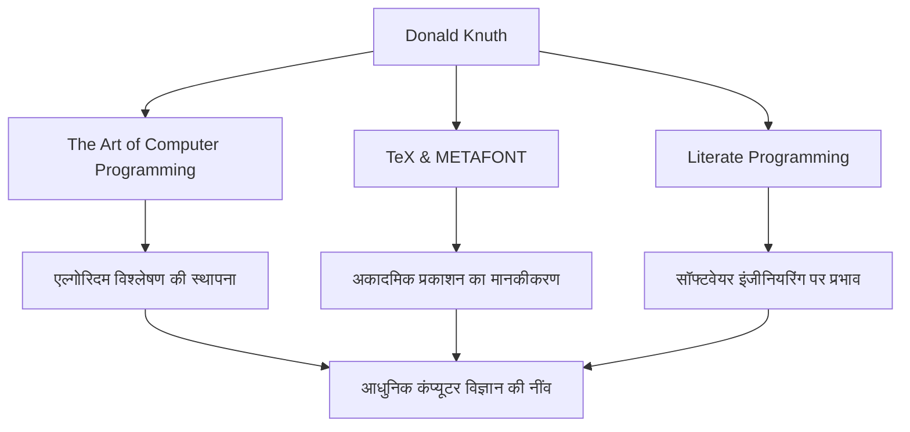

कंप्यूटर विज्ञान की दुनिया में, शायद ही कोई ऐसा हो जो डोनाल्ड ई. नुथ (Donald E. Knuth) का नाम न जानता हो। "एल्गोरिदम विश्लेषण के पिता" के रूप में जाने जाने वाले, वह एक महान व्यक्ति हैं जिन्होंने प्रोग्रामिंग को एक मात्र तकनीक से "कला" के दायरे तक पहुँचाया। यह लेख उनके जीवन, उनके अनूठे दर्शन और भविष्य की पीढ़ियों पर उनके द्वारा छोड़े गए अथाह प्रभाव पर गहराई से प्रकाश डालता है।

## प्रारंभिक जीवन और उपलब्धियां

1938 में मिल्वौकी, विस्कॉन्सिन में जन्मे, नुथ ने कम उम्र से ही संगीत और गणित में गहरी रुचि दिखाई। उन्होंने केस इंस्टीट्यूट ऑफ टेक्नोलॉजी (अब केस वेस्टर्न रिजर्व यूनिवर्सिटी) में प्रवेश लिया, जहाँ उनका पहली बार कंप्यूटर से सामना हुआ और वह तुरंत उनके आकर्षण से मोहित हो गए। आश्चर्यजनक रूप से, उनका पहला प्रोग्राम उनके स्कूल की बास्केटबॉल टीम के आंकड़ों का विश्लेषण करने के लिए था। यह किस्सा दर्शाता है कि उनकी विश्लेषणात्मक सोच और व्यावहारिक दृष्टिकोण शुरू से ही मौजूद थे।

1968 में, 30 वर्ष की आयु में, नुथ स्टैनफोर्ड विश्वविद्यालय में प्रोफेसर बने, और उसी वर्ष, उन्होंने अपनी अमर कृति, "द आर्ट ऑफ़ कंप्यूटर प्रोग्रामिंग (TAOCP)" का पहला खंड प्रकाशित किया। यह परियोजना मूल रूप से कंपाइलर्स के बारे में एक ही किताब लिखने के विचार के साथ शुरू हुई थी, लेकिन जैसे-जैसे वह लिखते गए, यह "कंप्यूटर विज्ञान की नींव को व्यापक रूप से कवर करने" के एक भव्य लक्ष्य में विकसित हो गई।

## दर्शन कि प्रोग्रामिंग एक "कला" है

नुथ के दर्शन के बारे में बात करते समय, "साक्षर प्रोग्रामिंग" (Literate Programming) की अवधारणा अपरिहार्य है। उनका तर्क था कि एक प्रोग्राम केवल एक मशीन को निर्देश देने के लिए नहीं होना चाहिए, बल्कि यह "साहित्य" होना चाहिए जिसे मनुष्य पढ़ और समझ सकें।

कोड और दस्तावेज़ीकरण को एकीकृत करने और मानव विचार प्रक्रियाओं के साथ-साथ प्रोग्राम लिखने के इस दृष्टिकोण का उस समय सॉफ्टवेयर इंजीनियरिंग पर गहरा प्रभाव पड़ा। जैसा कि उनकी पुस्तक के शीर्षक में "कला" शब्द को शामिल करने से देखा जा सकता है, नुथ के लिए, प्रोग्रामिंग सुंदरता और अभिव्यक्ति के साथ एक रचनात्मक गतिविधि है।

## सुंदरता की खोज: TeX और METAFONT का जन्म

1970 के दशक के अंत में, TAOCP के दूसरे संस्करण की तैयारी करते समय, नुथ उस समय की टाइपसेटिंग तकनीक की खराब गुणवत्ता से चकित थे। इस तथ्य को सहन करने में असमर्थ कि उनकी अपनी पुस्तक खूबसूरती से मुद्रित नहीं होगी, उन्होंने एक उल्लेखनीय कदम उठाया। उन्होंने खुद एक टाइपसेटिंग सिस्टम विकसित करना शुरू किया जो गणितीय सुंदरता का प्रतीक था।

यह "TeX" के जन्म का क्षण था, जो आज भी शिक्षा और प्रकाशन उद्योग में एक मानक के रूप में उपयोग किया जाता है, और फ़ॉन्ट डिज़ाइन सिस्टम "METAFONT" का। उन्होंने अपनी पुस्तक का लेखन निलंबित कर दिया और इस प्रणाली को पूरा करने में लगभग 10 वर्ष बिताए। "पूर्ण सुंदरता" को प्राप्त करने के उनके जुनून से प्रेरित, TeX को ओपन-सोर्स सॉफ्टवेयर की एक अग्रणी सफलता की कहानी के रूप में भी जाना जाता है।

## भविष्य की पीढ़ियों पर प्रभाव और आज का महत्व

कंप्यूटर विज्ञान पर नुथ की उपलब्धियों का प्रभाव केवल विशिष्ट एल्गोरिदम या उपकरण बनाने से कहीं अधिक है। उनके शोध ने "एल्गोरिदम विश्लेषण" नामक एक नया शैक्षणिक क्षेत्र स्थापित किया, जो एल्गोरिदम के निष्पादन समय और मेमोरी उपयोग का गणितीय मूल्यांकन करता है।

नीचे दिया गया आरेख नुथ की प्रमुख उपलब्धियों को दर्शाता है और यह भी कि वे वर्तमान दिन से कैसे जुड़ते हैं।

इसके अलावा, वह अपनी अनूठी प्रणाली "नुथ इनाम चेक" के लिए जाने जाते हैं, जहां वह अपनी पुस्तकों में पाई गई टाइपो त्रुटियों के लिए इनाम देते हैं। यह हास्यपूर्ण पहल दिखाती है कि वह कठोरता और सटीकता को कितना महत्व देते हैं, और वह अपने पाठकों के साथ संवाद को कितना संजोते हैं।

## निष्कर्ष

उल्लेखनीय तकनीकी प्रगति की आज की दुनिया में भी, डोनाल्ड नुथ हमें सार्वभौमिक सत्य सिखाते हैं जो कभी फीके नहीं पड़ते। यह इस बात का प्रमाण है कि जटिल समस्याओं को सुलझाने के लिए गणितीय कठोरता और सुंदर कोड लिखने के लिए कलात्मक संवेदनशीलता पूरी तरह से सुसंगत हो सकती है।

उनके जीवन का काम, "द आर्ट ऑफ़ कंप्यूटर प्रोग्रामिंग", आज भी लिखा जा रहा है। नुथ की अटूट जांच की भावना और जुनून दुनिया भर के प्रोग्रामर और शोधकर्ताओं को प्रेरित करता रहेगा।
