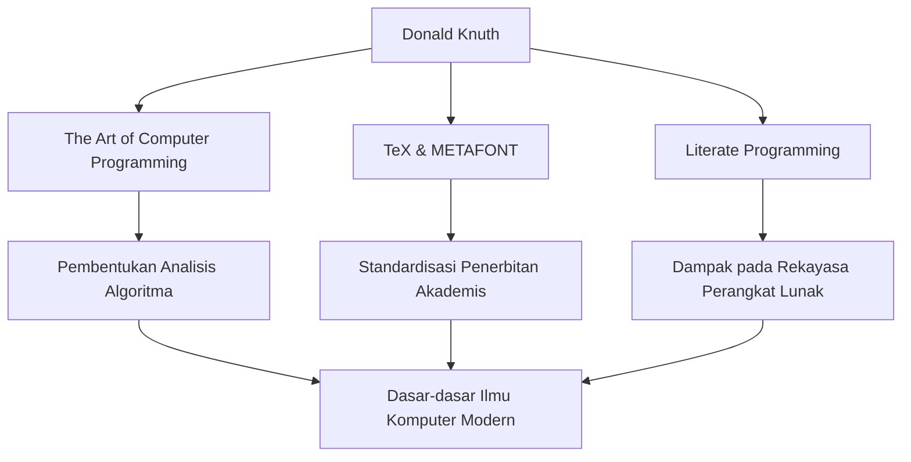

Dalam dunia ilmu komputer, mungkin tidak ada orang yang tidak mengenal nama Donald E. Knuth. Dikenal sebagai "bapak analisis algoritma," ia adalah sosok hebat yang mengangkat pemrograman dari sekadar teknik menjadi ranah "seni" (art). Artikel ini membahas secara mendalam tentang kehidupannya, filosofi uniknya, dan dampak tak terukur yang telah ia berikan kepada generasi mendatang.

## Kehidupan Awal dan Pencapaian

Lahir di Milwaukee, Wisconsin pada tahun 1938, Knuth menunjukkan minat yang kuat pada musik dan matematika sejak usia muda. Ia masuk ke Case Institute of Technology (sekarang Case Western Reserve University), di mana ia pertama kali bersentuhan dengan komputer dan langsung terpikat oleh pesonanya. Mengejutkannya, program pertamanya adalah menganalisis statistik untuk tim bola basket sekolahnya. Kisah ini menunjukkan bahwa pemikiran analitis dan pendekatan praktisnya telah ada sejak awal.

Pada tahun 1968, di usia 30 tahun, Knuth menjadi profesor di Universitas Stanford, dan pada tahun yang sama, ia menerbitkan volume pertama dari mahakarya abadinya yang identik dengan namanya, "The Art of Computer Programming (TAOCP)". Proyek ini awalnya dimulai dengan ide menulis satu buku tentang kompiler, namun seiring berjalannya penulisan, proyek ini berkembang menjadi tujuan besar untuk "secara komprehensif mencakup dasar-dasar ilmu komputer."

## Filosofi bahwa Pemrograman adalah "Seni"

Ketika berbicara tentang filosofi Knuth, konsep "Pemrograman Literasi" (Literate Programming) tidak dapat dipisahkan. Ia berpendapat bahwa sebuah program tidak seharusnya hanya untuk memberikan instruksi kepada mesin, tetapi harus menjadi "literatur" yang dapat dibaca dan dipahami oleh manusia.

Pendekatan untuk mengintegrasikan kode dan dokumentasi serta menulis program sejalan dengan proses pemikiran manusia ini memberikan dampak yang mendalam pada rekayasa perangkat lunak saat itu. Seperti yang dapat dilihat dari dimasukkannya kata "Art" (Seni) dalam judul bukunya, bagi Knuth, pemrograman adalah kegiatan kreatif yang disertai dengan keindahan dan ekspresi.

## Pencarian Keindahan: Kelahiran TeX dan METAFONT

Pada akhir 1970-an, saat mempersiapkan edisi kedua TAOCP, Knuth merasa ngeri dengan buruknya kualitas teknologi penyusunan huruf (typesetting) pada saat itu. Tidak dapat menahan kenyataan bahwa bukunya sendiri tidak akan dicetak dengan indah, ia mengambil tindakan luar biasa. Ia mulai mengembangkan sendiri sistem penyusunan huruf yang mewujudkan keindahan matematika.

Inilah momen kelahiran "TeX", yang masih digunakan hingga saat ini sebagai standar di dunia akademis dan industri penerbitan, serta sistem desain font "METAFONT". Ia menangguhkan penulisan bukunya dan menghabiskan sekitar 10 tahun untuk menyelesaikan sistem ini. Didorong oleh obsesinya untuk mengejar "keindahan yang sempurna," TeX juga dikenal sebagai kisah sukses perintis perangkat lunak sumber terbuka (open-source).

## Dampak pada Generasi Mendatang dan Signifikansinya Saat Ini

Dampak dari pencapaian Knuth pada ilmu komputer melampaui sekadar menciptakan algoritma atau alat tertentu. Penelitiannya mendirikan bidang akademik baru yang disebut "analisis algoritma," yang secara matematis mengevaluasi waktu eksekusi dan penggunaan memori algoritma.

Diagram di bawah ini menunjukkan pencapaian utama Knuth dan bagaimana semuanya terhubung hingga saat ini.

Selain itu, ia dikenal dengan sistem uniknya yaitu "Cek hadiah Knuth," di mana ia membayar hadiah untuk kesalahan ketik (typo) yang ditemukan di buku-bukunya. Inisiatif humoris ini menunjukkan betapa ia menghargai ketelitian dan keakuratan, serta betapa ia menghargai dialog dengan para pembacanya.

## Kesimpulan

Bahkan di dunia yang penuh dengan kemajuan teknologi yang luar biasa saat ini, Donald Knuth mengajarkan kita kebenaran universal yang tidak pernah pudar. Ini adalah bukti bahwa ketelitian matematis untuk mengurai masalah yang kompleks dan kepekaan artistik untuk menulis kode yang indah dapat selaras dengan sempurna.

Karya seumur hidupnya, "The Art of Computer Programming," masih terus ditulis hingga saat ini. Semangat penyelidikan dan hasrat Knuth yang tak habis-habisnya akan terus menginspirasi para pemrogram dan peneliti di seluruh dunia.
