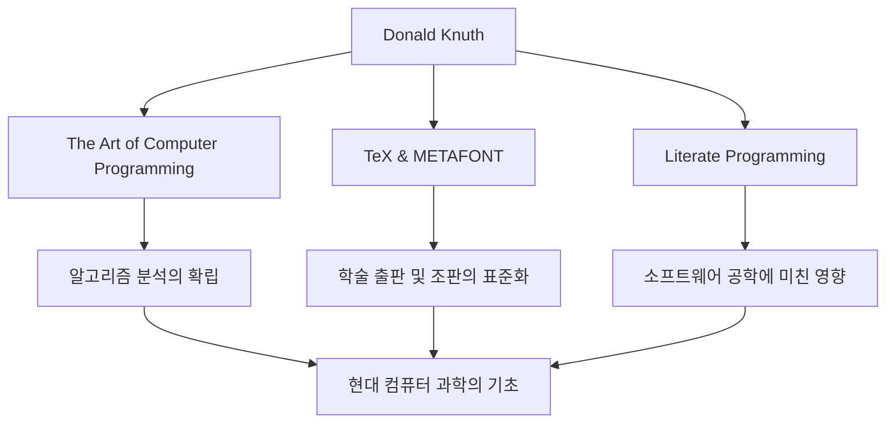

컴퓨터 과학의 세계에서 도널드 E. 크누스(Donald E. Knuth)의 이름을 모르는 사람은 없을 것입니다. 그는 '알고리즘 분석의 아버지'로 알려져 있으며, 프로그래밍을 단순한 기술에서 '예술(Art)'의 경지로 승화시킨 위대한 인물입니다. 본 기사에서는 그의 생애와 독자적인 철학, 그리고 후세에 미친 헤아릴 수 없는 영향에 대해 깊이 파헤쳐 봅니다.

## 생애와 업적의 시작

1938년 미국 위스콘신주 밀워키에서 태어난 크누스는 어릴 적부터 음악과 수학에 강한 관심을 보였습니다. 케이스 공과대학교(현 케이스 웨스턴 리저브 대학교)에 진학한 그는 그곳에서 처음으로 컴퓨터를 접하게 되고, 순식간에 그 매력에 빠져들게 됩니다. 놀랍게도 그가 처음 작성한 프로그램은 모교 농구팀의 통계를 분석하는 것이었습니다. 이 일화에서도 그의 분석적인 사고와 실천적인 접근 방식이 초기부터 갖추어져 있었음을 엿볼 수 있습니다.

1968년, 30세의 크누스는 스탠퍼드 대학교의 교수로 취임하고, 같은 해 그의 대명사라고도 할 수 있는 불후의 명저 『컴퓨터 프로그래밍의 예술(TAOCP)』 제1권을 출판합니다. 이 프로젝트는 원래 컴파일러에 관한 책 한 권을 쓰겠다는 구상에서 시작되었으나, 집필을 진행하면서 '컴퓨터 과학의 기초를 망라한다'는 장대한 목표로 발전해 나갔습니다.

## 프로그래밍은 '예술'이라는 철학

크누스의 철학을 논하는 데 있어 빼놓을 수 없는 것이 '문학적 프로그래밍(Literate Programming)'이라는 개념입니다. 그는 프로그램이란 단순히 기계에게 명령을 내리기 위한 것이 아니라, 인간이 읽고 이해할 수 있는 '문학'이어야 한다고 주장했습니다.

코드와 문서를 일체화시키고, 인간의 사고 과정에 따라 프로그램을 기술한다는 이 접근법은 당시 소프트웨어 공학에 큰 충격을 안겨주었습니다. 그의 저서 제목에 'Art'라는 단어가 포함되어 있는 것에서도 알 수 있듯이, 크누스에게 프로그래밍은 아름다움과 표현력을 수반하는 창조적인 활동인 것입니다.

## 아름다움에 대한 탐구: TeX와 METAFONT의 탄생

TAOCP 제2판을 준비하던 1970년대 후반, 크누스는 당시 조판 기술의 형편없는 품질에 경악했습니다. 자신의 저서가 아름답게 인쇄되지 않는 것을 참을 수 없었던 그는 놀라운 행동에 나섭니다. 수학적인 아름다움을 구현하는 조판 시스템을 직접 개발하기 시작한 것입니다.

이것이 현재까지도 학계와 출판계에서 표준으로 사용되고 있는 'TeX(텍)'과 폰트 설계 시스템 'METAFONT'가 탄생하는 순간이었습니다. 그는 자신의 책 집필을 일시 중단하면서까지 이 시스템을 완성하는 데 약 10년을 바쳤습니다. '완벽한 아름다움'을 추구하는 그의 집념이 만들어낸 TeX는 오픈 소스 소프트웨어의 선구적인 성공 사례로도 알려져 있습니다.

## 후세에 미친 영향과 현대적 의의

크누스의 공적이 컴퓨터 과학에 미친 영향은 단순히 특정한 알고리즘이나 도구를 만들어낸 것에 그치지 않습니다. 그의 연구는 알고리즘의 실행 시간과 메모리 사용량을 수학적으로 평가하는 '알고리즘 분석'이라는 새로운 학문 분야를 확립했습니다.

아래 그림은 크누스의 주요 공적과 그것들이 현대와 어떻게 이어지는지를 보여줍니다.

또한 그는 자신의 저작물에서 발견된 오탈자에 대해 상금을 지불하는 '크누스 수표'라는 독특한 제도로도 유명합니다. 이 유머 넘치는 노력은 그가 얼마나 엄밀함과 정확성을 중시하는지, 그리고 독자와의 대화를 얼마나 소중하게 여기는지를 보여줍니다.

## 맺음말

도널드 크누스는 기술의 발전이 눈부신 현대에 있어서도 퇴색하지 않는 보편적인 진리를 우리에게 가르쳐 줍니다. 그것은 복잡한 문제를 풀어내는 수학적인 엄밀함과 아름다운 코드를 작성한다는 예술적인 감성이 훌륭하게 조화될 수 있다는 증명입니다.

그의 필생의 역작인 『컴퓨터 프로그래밍의 예술』은 현재도 집필이 계속되고 있습니다. 크누스의 마르지 않는 탐구심과 열정은 앞으로도 전 세계의 프로그래머와 연구자들에게 끊임없이 영감을 줄 것입니다.
