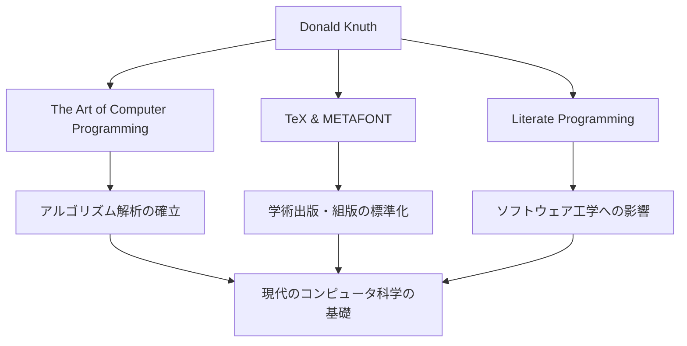

コンピュータ科学の世界において、ドナルド・クヌース（Donald E. Knuth）の名を知らない者はいないでしょう。彼は「アルゴリズム解析の父」として知られ、プログラミングを単なる技術から「芸術（アート）」の域へと昇華させた偉大な人物です。本記事では、彼の生涯、独自の哲学、そして後世に与えた計り知れない影響について深く掘り下げていきます。

## 生涯と業績の始まり

1938年、アメリカのウィスコンシン州ミルウォーキーに生まれたクヌースは、幼い頃から音楽と数学に強い関心を示していました。ケース工科大学（現在のケース・ウェスタン・リザーブ大学）に進学した彼は、そこで初めてコンピュータに触れ、瞬く間にその魅力の虜となります。彼が最初に書いたプログラムは、なんと自校のバスケットボールチームの統計を分析するものでした。このエピソードからも、彼の分析的な思考と実践的なアプローチが初期から備わっていたことが窺えます。

1968年、30歳のクヌースはスタンフォード大学の教授に就任し、同じ年に彼の代名詞とも言える不朽の名著『The Art of Computer Programming（TAOCP）』の第1巻を出版します。このプロジェクトは元々、コンパイラに関する1冊の本を書くという構想から始まりましたが、執筆を進めるうちに「コンピュータ科学の基礎を網羅する」という壮大な目標へと発展していきました。

## プログラミングは「芸術」であるという哲学

クヌースの哲学を語る上で欠かせないのが、「文芸的プログラミング（Literate Programming）」という概念です。彼は、プログラムとは単に機械に命令を与えるためのものではなく、人間が読んで理解できる「文学」であるべきだと主張しました。

コードとドキュメントを一体化させ、人間の思考プロセスに沿ってプログラムを記述するというこのアプローチは、当時のソフトウェア工学に大きな衝撃を与えました。彼の著書名に「Art」という言葉が含まれていることからも分かるように、クヌースにとってプログラミングは美しさと表現力を伴う創造的な活動なのです。

## 美への探求：TeXとMETAFONTの誕生

TAOCPの第2版を準備していた1970年代後半、クヌースは当時の組版技術の質の低さに愕然としました。自らの著書が美しく印刷されないことに我慢できなかった彼は、驚くべき行動に出ます。数学的な美しさを体現する組版システムを自ら開発し始めたのです。

これが、現在でも学術界や出版業界で標準として使われている「TeX（テック）」と、フォント設計システム「METAFONT」の誕生の瞬間でした。彼は自身の本の執筆を一時中断してまで、このシステムの完成に約10年を費やしました。「完璧な美しさ」を追求する彼の執念が生み出したTeXは、オープンソースソフトウェアの先駆的な成功例としても知られています。

## 後世への影響と現代における意義

クヌースの功績がコンピュータ科学に与えた影響は、単に特定のアルゴリズムやツールを生み出したことにとどまりません。彼の研究は、アルゴリズムの実行時間やメモリ使用量を数学的に評価する「アルゴリズム解析」という新たな学問分野を確立しました。

以下の図は、クヌースの主要な功績とそれらが現代にどう繋がっているかを示しています。

さらに、彼は自身の著作に見つかった誤植に対して賞金を支払う「クヌース小切手」というユニークな制度でも知られています。このユーモア溢れる取り組みは、彼がどれほど厳密さと正確さを重んじているか、そして読者との対話を大切にしているかを示しています。

## 結びにかえて

ドナルド・クヌースは、テクノロジーの進歩が目覚ましい現代においても、色褪せることのない普遍的な真理を私たちに教えてくれます。それは、複雑な問題を解き明かす数学的な厳密さと、美しいコードを書くという芸術的な感性が、見事に調和することの証明です。

彼のライフワークである『The Art of Computer Programming』は現在も執筆が続いています。クヌースの尽きることのない探求心と情熱は、これからも世界中のプログラマーや研究者をインスパイアし続けるでしょう。
