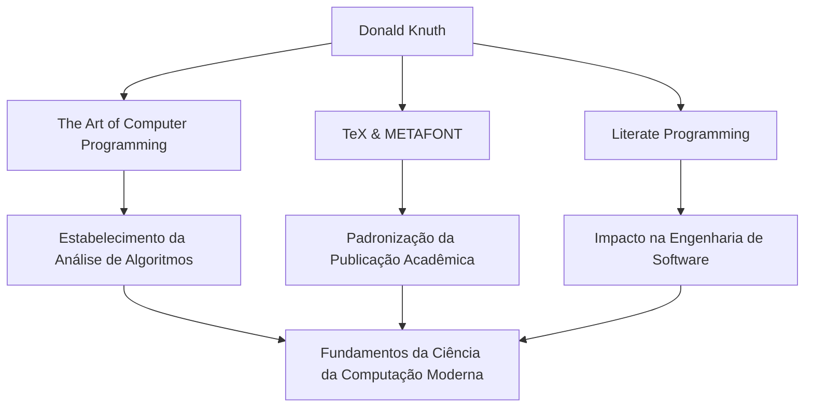

No mundo da ciência da computação, provavelmente não há ninguém que não conheça o nome Donald E. Knuth. Conhecido como o "pai da análise de algoritmos", ele é uma grande figura que elevou a programação de uma mera técnica ao reino da "arte". Este artigo aprofunda-se em sua vida, sua filosofia única e o impacto imensurável que ele teve nas gerações futuras.

## Início da Vida e Conquistas

Nascido em Milwaukee, Wisconsin, em 1938, Knuth mostrou um forte interesse por música e matemática desde tenra idade. Ele entrou no Case Institute of Technology (agora Case Western Reserve University), onde teve o seu primeiro contato com computadores e ficou instantaneamente cativado pelo seu charme. Surpreendentemente, seu primeiro programa foi para analisar estatísticas do time de basquete da sua escola. Este episódio mostra que seu pensamento analítico e abordagem prática estiveram presentes desde o início.

Em 1968, aos 30 anos, Knuth tornou-se professor na Universidade de Stanford, e no mesmo ano publicou o primeiro volume de sua obra-prima imortal, "The Art of Computer Programming (TAOCP)". Este projeto começou originalmente com a ideia de escrever um único livro sobre compiladores, mas à medida que continuou escrevendo, evoluiu para um grande objetivo de "cobrir de forma abrangente os fundamentos da ciência da computação".

## A Filosofia de que Programar é uma "Arte"

Ao falar sobre a filosofia de Knuth, o conceito de "Programação Literária" (Literate Programming) é indispensável. Ele argumentava que um programa não deveria ser apenas para dar instruções a uma máquina, mas deveria ser "literatura" que os humanos pudessem ler e entender.

Essa abordagem de integrar código e documentação e escrever programas acompanhando os processos de pensamento humano teve um impacto profundo na engenharia de software da época. Como pode ser visto pela inclusão da palavra "Arte" no título do seu livro, para Knuth, a programação é uma atividade criativa acompanhada de beleza e expressividade.

## A Busca pela Beleza: O Nascimento do TeX e METAFONT

No final da década de 1970, enquanto preparava a segunda edição do TAOCP, Knuth ficou consternado com a baixa qualidade da tecnologia de composição tipográfica da época. Incapaz de suportar o fato de que seu próprio livro não seria impresso de forma bela, ele tomou uma atitude notável. Ele começou a desenvolver ele mesmo um sistema de composição tipográfica que incorporasse a beleza matemática.

Este foi o momento do nascimento do "TeX", que ainda hoje é usado como padrão na academia e na indústria editorial, e do sistema de design de fontes "METAFONT". Ele suspendeu a redação do seu livro e passou cerca de 10 anos concluindo este sistema. Impulsionado por sua obsessão em buscar a "beleza perfeita", o TeX também é conhecido como uma história de sucesso pioneira de software de código aberto.

## Impacto nas Gerações Futuras e Importância Atual

O impacto das conquistas de Knuth na ciência da computação vai muito além da simples criação de algoritmos ou ferramentas específicas. A sua pesquisa estabeleceu um novo campo acadêmico chamado "análise de algoritmos", que avalia matematicamente o tempo de execução e o uso de memória dos algoritmos.

O diagrama abaixo mostra as principais conquistas de Knuth e como elas se conectam aos dias de hoje.

Além disso, ele é conhecido por seu sistema único de "cheques de recompensa Knuth", através do qual ele paga uma recompensa por erros de digitação encontrados em seus livros. Essa iniciativa bem-humorada mostra o quanto ele valoriza o rigor e a precisão, e o quanto valoriza o diálogo com seus leitores.

## Conclusão

Mesmo no mundo atual de notáveis avanços tecnológicos, Donald Knuth ensina-nos verdades universais que nunca desaparecem. É a prova de que o rigor matemático para desvendar problemas complexos e a sensibilidade artística para escrever códigos bonitos podem se harmonizar perfeitamente.

A obra de sua vida, "The Art of Computer Programming", continua a ser escrita hoje. O inesgotável espírito de investigação e a paixão de Knuth continuarão a inspirar programadores e investigadores em todo o mundo.
