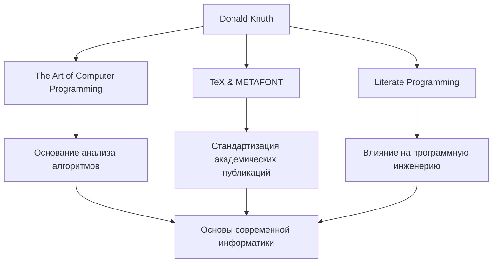

В мире информатики, пожалуй, нет никого, кто не знал бы имени Дональда Э. Кнута. Известный как «отец анализа алгоритмов», он является великой фигурой, которая возвысила программирование от простого ремесла до уровня «искусства». Эта статья глубоко погружается в его жизнь, уникальную философию и неизмеримое влияние, которое он оказал на будущие поколения.

## Ранние годы и достижения

Кнут родился в Милуоки, штат Висконсин, в 1938 году и с ранних лет проявлял сильный интерес к музыке и математике. Он поступил в Технологический институт Кейса (ныне Университет Кейс Вестерн Резерв), где впервые столкнулся с компьютерами и был мгновенно очарован ими. Удивительно, но его самой первой программой был анализ статистики для баскетбольной команды его школы. Этот эпизод показывает, что его аналитическое мышление и практический подход присутствовали с самого начала.

В 1968 году, в возрасте 30 лет, Кнут стал профессором Стэнфордского университета, и в том же году он опубликовал первый том своего бессмертного шедевра «Искусство программирования» (TAOCP). Этот проект изначально начинался с идеи написать одну книгу о компиляторах, но по мере написания он перерос в грандиозную цель «всесторонне охватить основы информатики».

## Философия: программирование как «искусство»

Говоря о философии Кнута, нельзя не упомянуть концепцию «Грамотного программирования» (Literate Programming). Он утверждал, что программа должна быть не просто набором инструкций для машины, а «литературой», которую люди могут читать и понимать.

Этот подход к интеграции кода и документации и написанию программ в соответствии с человеческим мыслительным процессом оказал глубокое влияние на разработку программного обеспечения того времени. Как видно из включения слова «Искусство» в название его книги, для Кнута программирование — это творческая деятельность, сопровождающаяся красотой и выразительностью.

## Поиск красоты: рождение TeX и METAFONT

В конце 1970-х годов, готовя второе издание TAOCP, Кнут был потрясен низким качеством типографских технологий того времени. Не в силах смириться с тем, что его собственная книга не будет напечатана красиво, он предпринял выдающиеся действия. Он начал сам разрабатывать систему компьютерной верстки, воплощающую математическую красоту.

Это был момент рождения «TeX», который и сегодня используется как стандарт в академических кругах и издательской индустрии, а также системы разработки шрифтов «METAFONT». Он приостановил написание своей книги и потратил около 10 лет на завершение этой системы. Движимый одержимостью достичь «идеальной красоты», TeX также известен как новаторская история успеха программного обеспечения с открытым исходным кодом.

## Влияние на будущие поколения и значение сегодня

Влияние достижений Кнута на информатику выходит далеко за рамки простого создания конкретных алгоритмов или инструментов. Его исследования основали новую академическую область под названием «анализ алгоритмов», которая математически оценивает время выполнения и использование памяти алгоритмами.

На диаграмме ниже показаны основные достижения Кнута и их связь с современностью.

Кроме того, он известен своей уникальной системой «вознаграждений Кнута», когда он выплачивает вознаграждение за опечатки, найденные в его книгах. Эта юмористическая инициатива показывает, насколько он ценит строгость и точность, и насколько он дорожит диалогом со своими читателями.

## В заключение

Даже в современном мире выдающихся технологических достижений Дональд Кнут учит нас универсальным истинам, которые никогда не меркнут. Это доказательство того, что математическая строгость при решении сложных проблем и художественная чувствительность при написании красивого кода могут идеально гармонировать.

Труд всей его жизни, «Искусство программирования», пишется и сегодня. Неиссякаемый дух исследователя и страсть Кнута будут продолжать вдохновлять программистов и исследователей по всему миру.
