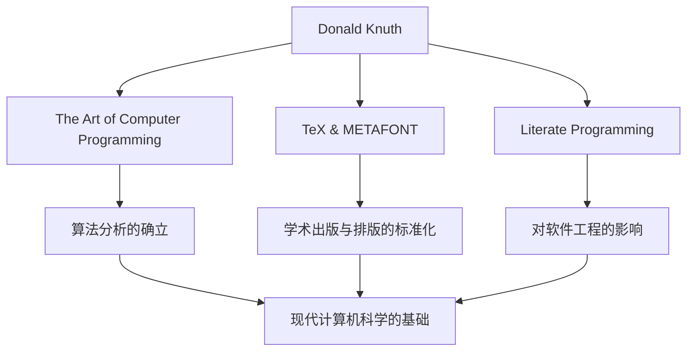

在计算机科学的世界里，唐纳德·克努斯（Donald E. Knuth，中文名高德纳）的名字无人不知。他被称为“算法分析之父”，是一位将编程从纯粹的技术升华为“艺术”的伟大人物。本文将深入探讨他的生平、独特的哲学以及对后世产生的不可估量的影响。

## 生平与成就的开端

克努斯1938年出生于美国威斯康星州密尔沃基，从小就对音乐和数学表现出浓厚的兴趣。进入凯斯理工学院（现凯斯西储大学）后，他首次接触到计算机，并瞬间被其魅力所折服。令人惊讶的是，他编写的第一个程序竟然是用来分析学校篮球队统计数据的。从这段轶事中可以看出，他从早期就具备了分析性思维和实践方法的特质。

1968年，30岁的克努斯就任斯坦福大学教授，并在同一年出版了他不朽的代表作《计算机程序设计艺术（TAOCP）》的第一卷。这个项目最初只是为了写一本关于编译器的书，但在写作过程中，它逐渐发展成为“全面涵盖计算机科学基础”的宏大目标。

## 编程是“艺术”的哲学

在谈论克努斯的哲学时，不可或缺的是“文学编程（Literate Programming）”的概念。他主张程序不应仅仅是为了向机器下达指令，而应该是人类可以阅读和理解的“文学”。

这种将代码与文档融为一体、顺应人类思维过程来编写程序的方法，给当时的软件工程带来了巨大的冲击。正如他书名中包含的“Art（艺术）”一词所体现的那样，对克努斯而言，编程是一项伴随着美感与表现力的创造性活动。

## 对美的追求：TeX与METAFONT的诞生

在20世纪70年代末准备TAOCP第二版时，克努斯对当时排版技术的低劣质量感到震惊。他无法忍受自己的书无法被精美地印刷出来，于是采取了惊人的行动：他开始亲自开发一个体现数学美的排版系统。

这就是至今仍被学术界和出版界作为标准使用的“TeX”以及字体设计系统“METAFONT”诞生的瞬间。他甚至暂时中断了自己书籍的写作，耗费了约10年时间来完成这个系统。正是出于对“完美之美”的执着追求而诞生的TeX，也被誉为开源软件先驱性的成功案例。

## 对后世的影响与现代意义

克努斯的功绩对计算机科学的影响，远不止于创造了特定的算法或工具。他的研究确立了一个名为“算法分析”的新学科领域，用于对算法的执行时间和内存使用量进行数学评估。

下图展示了克努斯的主要功绩及其与现代的联系。

此外，他还以“克努斯支票”这一独特的制度而闻名，即为在自己著作中发现错别字的人支付奖金。这一充满幽默感的举措，不仅展现了他对严谨和准确的极度重视，也体现了他对与读者交流的珍视。

## 结语

即使在技术日新月异的今天，唐纳德·克努斯依然向我们传授着永不褪色的普遍真理。那就是：解决复杂问题的数学严谨性与编写优美代码的艺术感性，是可以完美交融的。

他的毕生心血《计算机程序设计艺术》至今仍在撰写中。克努斯永不枯竭的探索精神和热情，必将继续激励世界各地的程序员和研究者。
