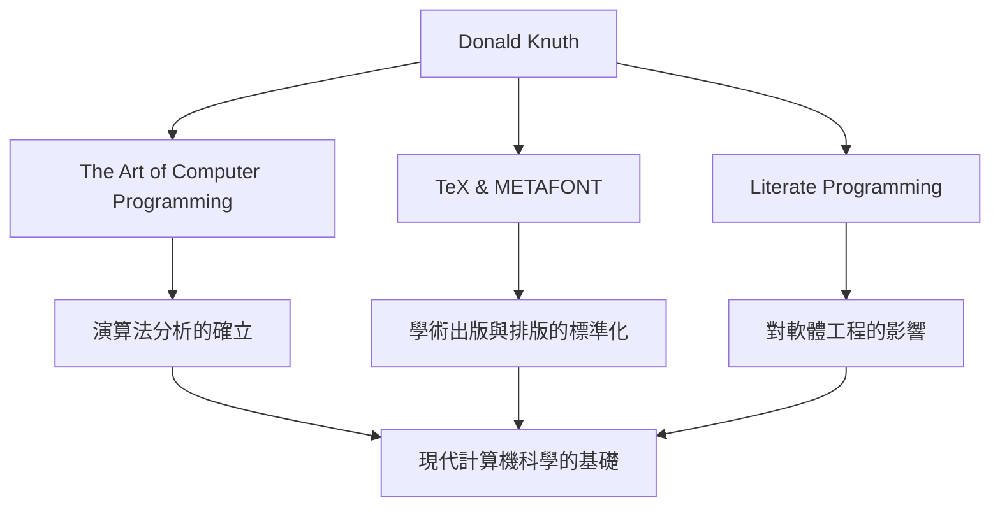

在計算機科學的世界裡，唐納德·克努斯（Donald E. Knuth，中文名高德納）的名字無人不知。他被稱為「演算法分析之父」，是一位將程式設計從純粹的技術昇華為「藝術」的偉大人物。本文將深入探討他的生平、獨特的哲學以及對後世產生的不可估量的影響。

## 生平與成就的開端

克努斯1938年出生於美國威斯康星州密爾沃基，從小就對音樂和數學表現出濃厚的興趣。進入凱斯理工學院（現凱斯西儲大學）後，他首次接觸到計算機，並瞬間被其魅力所折服。令人驚訝的是，他編寫的第一個程式竟然是用來分析學校籃球隊統計數據的。從這段軼事中可以看出，他從早期就具備了分析性思維和實踐方法的特質。

1968年，30歲的克努斯就任史丹佛大學教授，並在同一年出版了他不朽的代表作《計算機程式設計藝術（TAOCP）》的第一卷。這個專案最初只是為了寫一本關於編譯器的書，但在寫作過程中，它逐漸發展成為「全面涵蓋計算機科學基礎」的宏大目標。

## 程式設計是「藝術」的哲學

在談論克努斯的哲學時，不可或缺的是「文學程式設計（Literate Programming）」的概念。他主張程式不應僅僅是為了向機器下達指令，而應該是人類可以閱讀和理解的「文學」。

這種將程式碼與文件融為一體、順應人類思維過程來編寫程式的方法，給當時的軟體工程帶來了巨大的衝擊。正如他書名中包含的「Art（藝術）」一詞所體現的那樣，對克努斯而言，程式設計是一項伴隨著美感與表現力的創造性活動。

## 對美的追求：TeX與METAFONT的誕生

在20世紀70年代末準備TAOCP第二版時，克努斯對當時排版技術的低劣品質感到震驚。他無法忍受自己的書無法被精美地印刷出來，於是採取了驚人的行動：他開始親自開發一個體現數學美的排版系統。

這就是至今仍被學術界和出版界作為標準使用的「TeX」以及字體設計系統「METAFONT」誕生的瞬間。他甚至暫時中斷了自己書籍的寫作，耗費了約10年時間來完成這個系統。正是出於對「完美之美」的執著追求而誕生的TeX，也被譽為開源軟體先驅性的成功案例。

## 對後世的影響與現代意義

克努斯的功績對計算機科學的影響，遠不止於創造了特定的演算法或工具。他的研究確立了一個名為「演算法分析」的新學科領域，用於對演算法的執行時間和記憶體使用量進行數學評估。

下圖展示了克努斯的主要功績及其與現代的聯繫。

此外，他還以「克努斯支票」這一獨特的制度而聞名，即為在自己著作中發現錯別字的人支付獎金。這一充滿幽默感的舉措，不僅展現了他對嚴謹和準確的極度重視，也體現了他對與讀者交流的珍視。

## 結語

即使在技術日新月異的今天，唐納德·克努斯依然向我們傳授著永不褪色的普遍真理。那就是：解決複雜問題的數學嚴謹性與編寫優美程式碼的藝術感性，是可以完美交融的。

他的畢生心血《計算機程式設計藝術》至今仍在撰寫中。克努斯永不枯竭的探索精神和熱情，必將繼續激勵世界各地的程式設計師和研究者。
