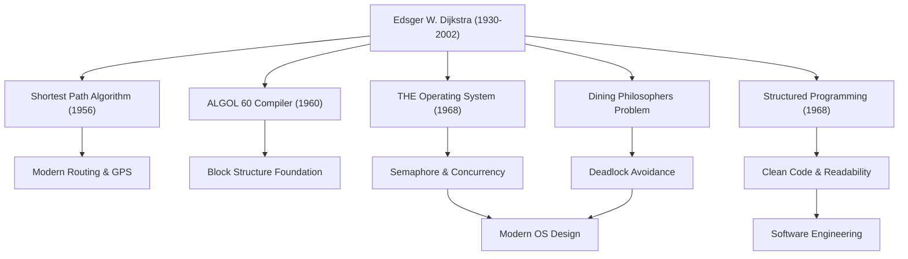

يُعد إدزجر و. ديجكسترا (Edsger W. Dijkstra, 1930 - 2002) واحداً من أعظم العقول التي أرست أسس هندسة البرمجيات وعلوم الحاسوب الحديثة. إن العديد من الخوارزميات ونماذج البرمجة التي تركها وراءه تنبض في صميم جميع التقنيات التي نستخدمها يومياً في عصرنا الحالي. في هذا المقال، سنتعمق في حياة ديجكسترا، وفلسفته الفريدة، والتأثير الهائل الذي تركه على الأجيال اللاحقة.

## التحول من الفيزياء إلى علوم الحاسوب: مسار شبابه

ولد ديجكسترا في روتردام بهولندا عام 1930، وتخصص في البداية في الفيزياء النظرية بجامعة لايدن. بالنسبة له في ذلك الوقت، كانت الفيزياء هي العلم الأسمى لكشف حقائق العالم الطبيعي. ومع ذلك، وبسبب انبهاره بالإمكانيات اللامحدودة التي توفرها أداة جديدة تسمى "الحاسوب"، بدأ تدريجياً في دخول عالم البرمجة.

في ذلك الوقت، كانت البرمجة أشبه بـ "الحرفة" أو "حل الألغاز" منها إلى الانضباط الأكاديمي، ولم تكن هناك نظريات أو أنظمة راسخة. لكن ديجكسترا كان مقتنعاً بأنه يجب إضفاء الدقة الرياضية والجمال على هذا المجال. في النهاية، تخلى عن مسيرته كفيزيائي وقرر أن يجعل البرمجة عمل حياته. القصة الشهيرة حول محاولته تسجيل مهنته كـ "مبرمج" في رخصة زواجه في هولندا، ورفض الدائرة الحكومية بحجة أن مثل هذه المهنة غير موجودة، توضح مدى كونه رائداً وسابقاً لعصره.

## الإنجاز العظيم في الارتقاء بالبرمجة إلى مستوى "العلم"

إنجازات ديجكسترا متنوعة للغاية. الحلول الأنيقة التي قدمها للعديد من التحديات التقنية التي واجهها تشكل اليوم أساساً مهماً في هندسة المعلومات.

### 1. خوارزمية ديجكسترا (خوارزمية المسار الأقصر)
في عام 1956، وأثناء احتسائه القهوة مع خطيبته في أحد مقاهي أمستردام، ابتكر هذه الخوارزمية في غضون 20 دقيقة فقط. كانت هذه الخوارزمية طريقة ثورية لإيجاد أقصر مسار بين نقطتين على الرسم البياني (Graph). من المدهش أن هذه الخوارزمية، التي تم إنشاؤها باستخدام الورقة والقلم فقط دون استخدام الحاسوب، لا تزال تستخدم كتقنية أساسية بعد أكثر من نصف قرن في أنظمة الملاحة بالسيارات، وبروتوكولات توجيه الإنترنت (مثل OSPF)، وحتى في تحسين شبكات النقل.

### 2. البرمجة المهيكلة و"جملة GOTO تعتبر ضارة"
تسببت رسالته القصيرة الأسطورية "Go To Statement Considered Harmful" (جملة GOTO تعتبر ضارة) التي نُشرت في عام 1968 في إحداث هزة في عالم البرمجة آنذاك وأثارت جدلاً واسعاً. لقد دعا إلى استبعاد جملة GOTO (السبب الرئيسي للشفرة المتشابكة Spaghetti Code) التي تتسبب في قفزات عشوائية في سير تنفيذ البرنامج، واقترح "البرمجة المهيكلة" التي تعتمد على كتابة الشفرة بشكل منطقي باستخدام ثلاث هياكل تحكم أساسية فقط: التسلسل، والاختيار، والتكرار. أدى ذلك إلى تحسين مقروئية البرمجيات وقابلية صيانتها وموثوقيتها بشكل كبير، وأثر على جميع لغات البرمجة الرئيسية اليوم.

### 3. البرمجة المتزامنة و"مشكلة الفلاسفة المتناولين للعشاء"
من خلال تطوير "نظام THE للبرمجة المتعددة"، ابتكر ديجكسترا آلية التزامن "سيمافور" (Semaphore) للسماح للعمليات المتعددة بالعمل بتنسيق دون التنافس على الموارد. علاوة على ذلك، ابتكر استعارة "مشكلة الفلاسفة المتناولين للعشاء" (Dining Philosophers Problem) لشرح خطر حالة الجمود (Deadlock) في المعالجة المتزامنة بطريقة سهلة الفهم. تُدرَّس هذه المفاهيم اليوم في فصول علوم الحاسوب في جميع أنحاء العالم كالمبادئ الأساسية للتحكم في التزامن في أنظمة التشغيل الحديثة وبرمجة المسارات المتعددة (Multithreading).

## فلسفة ديجكسترا ووثائق "EWD"

أكثر ما يعكس أفكاره العميقة وفلسفته بقوة هو سلسلة من الوثائق المكتوبة بخط اليد والمعروفة عموماً باسم "EWD" (وهي الأحرف الأولى من اسمه). طوال حياته، استخدم ديجكسترا قلم الحبر "مون بلان" المفضل لديه لكتابة أفكاره بخط متصل جميل ومقروء، ثم قام بنسخها ومشاركتها مع زملائه وطلابه.

يبلغ عدد وثائق EWD أكثر من 1300 وثيقة، وتناقش مجموعة واسعة من المواضيع، بدءاً من البراهين الرياضية للخوارزميات التقنية، إلى نظريات تعليم علوم الحاسوب، وانتقاد النزعة التجارية في الصناعة، والتحذير من أزمة البرمجيات. جادل ديجكسترا بشدة بأن "البرمجة يجب أن تكون نشاطاً رياضياً". مقولته الشهيرة، "اختبار البرنامج يمكن أن يُظهر وجود الأخطاء، لكن لا يمكنه أبداً إثبات غيابها"، تعبر عن إيمانه الراسخ بأنه لا يكفي أن يعمل البرنامج ببساطة؛ بل يجب أن يكون من الممكن إثبات صحته منطقياً.

## التأثير على الأجيال اللاحقة: إرث عملاق المعرفة

حصل ديجكسترا على جائزة تورينغ في عام 1972، وهي أعلى وسام في مجال علوم الحاسوب، وقام بالتدريس كأستاذ في جامعة تكساس في أوستن من عام 1984 حتى سنواته الأخيرة. لقد وضع معايير صارمة للغاية لطلابه، وطالبهم بالتفكير الواضح والمنطقي.

أكبر إرث تركه ديجكسترا لا يقتصر على خوارزميات محددة أو اختراعات تقنية، بل هو إطار التفكير نفسه حول "كيف يجب بناء البرمجيات". إن نهجه الرياضي الصارم وفلسفته التي لا تقبل المساومة، حتى في يومنا هذا حيث يزداد تطوير البرمجيات تعقيداً، لا يزال بمثابة بوصلة راسخة للإبحار في بحر الشفرات الفوضوي.

كانت حياة إدزجر ديجكسترا تاريخاً من البحث المستمر الذي جلب النظام وجمال المنطق إلى المجال الشاب الناشئ لعلوم الحاسوب، ورعايته ليصبح "علماً" حقيقياً. ستستمر تعاليمه وروحه في العيش في كل سطر من الشفرات التي نكتبها، وفي أساس الأنظمة غير المرئية التي تدعم مجتمع المعلومات.
