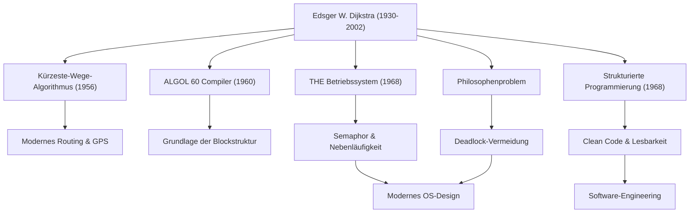

Edsger W. Dijkstra (1930 - 2002) ist einer der größten Intellektuellen, die den Grundstein für das moderne Software-Engineering und die Informatik gelegt haben. Viele der von ihm hinterlassenen Algorithmen und Programmierparadigmen bilden die Grundlage aller Technologien, die wir heute täglich nutzen. In diesem Artikel werden wir tiefer auf Dijkstras Leben, seine einzigartige Philosophie und seinen unermesslichen Einfluss auf nachfolgende Generationen eingehen.

## Der Übergang von der Physik zur Informatik: Die Spuren seiner Jugend

Dijkstra wurde 1930 in Rotterdam in den Niederlanden geboren und studierte zunächst theoretische Physik an der Universität Leiden. Für ihn war die Physik damals die höchste akademische Disziplin, um die Wahrheiten der Naturwissenschaften zu entschlüsseln. Fasziniert von den unendlichen Möglichkeiten des neuen Werkzeugs Computer trat er jedoch allmählich in die Welt der Programmierung ein.

Die damalige Programmierung glich eher einer "Handwerkskunst" oder dem "Lösen von Rätseln" als einer akademischen Disziplin, und es gab weder etablierte Theorien noch Systeme. Dijkstra war jedoch davon überzeugt, dass dort mathematische Strenge und Schönheit eingebracht werden sollten. Schließlich beschloss er, seine Karriere als Physiker aufzugeben und das Programmieren zu seiner Lebensaufgabe zu machen. Die berühmte Anekdote, wonach er in den Niederlanden von den Behörden abgewiesen wurde, als er bei der Beantragung einer Heiratsurkunde "Programmierer" als Beruf angeben wollte, mit der Begründung, ein solcher Beruf existiere nicht, zeigt, was für ein Pionier seiner Zeit er war.

## Die großartige Leistung, die Programmierung zu einer "Wissenschaft" erhob

Dijkstras Errungenschaften sind äußerst vielfältig. Die eleganten Lösungen, die er für die zahlreichen technischen Herausforderungen fand, mit denen er konfrontiert war, bilden eine wichtige Grundlage der heutigen Informationstechnik.

### 1. Dijkstra-Algorithmus (Kürzeste-Wege-Algorithmus)
Dieser Algorithmus, den er 1956 in nur etwa 20 Minuten erfunden haben soll, als er mit seiner Verlobten in einem Amsterdamer Café Kaffee trank, war bahnbrechend für die Berechnung des kürzesten Weges zwischen zwei Punkten in einem Graphen. Erstaunlicherweise wird dieser Algorithmus, der ohne Computer nur mit Stift und Papier entwickelt wurde, auch heute noch, mehr als ein halbes Jahrhundert später, als Kerntechnologie in Autonavigationssystemen, Internet-Routing-Protokollen (wie OSPF) und sogar bei der Optimierung von Verkehrsnetzen eingesetzt.

### 2. Strukturierte Programmierung und die "Schädlichkeit der GOTO-Anweisung"
Sein 1968 veröffentlichter legendärer kurzer Brief "Go To Statement Considered Harmful" (GOTO-Anweisung als schädlich erachtet) schickte Schockwellen durch die damalige Programmierwelt und löste heftige Debatten aus. Er schlug die "strukturierte Programmierung" vor, bei der der Code logisch nur mit den drei grundlegenden Kontrollstrukturen Sequenz, Selektion und Iteration geschrieben wird, und lehnte die GOTO-Anweisung (die Ursache für Spaghetti-Code) ab, die den Ausführungsfluss eines Programms unkontrolliert springen ließ. Dadurch wurden Lesbarkeit, Wartbarkeit und Zuverlässigkeit von Software drastisch verbessert, was alle wichtigen modernen Programmiersprachen beeinflusste.

### 3. Nebenläufige Programmierung und das "Philosophenproblem"
Durch die Entwicklung des "THE-Multiprogramming-Systems" entwickelte Dijkstra den Synchronisationsmechanismus "Semaphor", der es mehreren Prozessen ermöglicht, zusammenzuarbeiten, ohne um Ressourcen zu konkurrieren. Darüber hinaus erfand er die Metapher des "Philosophenproblems" (Dining Philosophers Problem), um die Gefahr von Verklemmungen (Deadlocks) bei der Nebenläufigkeit leicht verständlich zu erklären. Diese Konzepte werden in Informatikkursen auf der ganzen Welt als Grundprinzipien der Nebenläufigkeitskontrolle in heutigen Betriebssystemen und der Multithread-Programmierung gelehrt.

## Dijkstras Philosophie und die "EWD"-Dokumente

Was seine tiefgründigen Gedanken und seine Philosophie am stärksten widerspiegelt, ist eine Reihe handgeschriebener Dokumente, die allgemein als "EWD" (seine Initialen) bekannt sind. Zeitlebens schrieb Dijkstra seine Gedanken mit seinem geliebten Montblanc-Füllfederhalter in wunderschöner, lesbarer Kursivschrift auf, kopierte sie und teilte sie mit Kollegen und Studenten.

Die über 1300 EWDs behandeln ein breites Spektrum an Themen, das von mathematischen Beweisen technischer Algorithmen über die Pädagogik der Informatik, Kritik am Kommerzialismus der Industrie bis hin zu Warnungen vor der Softwarekrise reicht. Dijkstra vertrat nachdrücklich die Ansicht, dass "Programmieren eine mathematische Aktivität sein sollte". Sein berühmter Satz "Programmtests können das Vorhandensein von Fehlern zeigen, aber niemals deren Abwesenheit" steht für seine feste Überzeugung, dass ein Programm nicht einfach nur funktionieren darf, sondern seine Richtigkeit logisch beweisbar sein muss.

## Der Einfluss auf die Nachwelt: Das Erbe eines intellektuellen Giganten

Dijkstra, der 1972 mit dem Turing-Award die höchste Auszeichnung im Bereich der Informatik erhielt, lehrte von 1984 bis zu seinen letzten Lebensjahren als Professor an der University of Texas at Austin. Er legte sehr strenge Maßstäbe an seine Studenten an und forderte klares und logisches Denken.

Dijkstras größtes Erbe beschränkt sich nicht auf bestimmte Algorithmen oder technische Erfindungen, sondern ist vielmehr der gedankliche Rahmen dafür, "wie Software aufgebaut sein sollte". Sein strenger mathematischer Ansatz und seine kompromisslose Philosophie bleiben auch in der heutigen Zeit, in der die Softwareentwicklung immer komplexer wird, ein fester Kompass für die Navigation durch ein chaotisches Meer von Code.

Das Leben von Edsger Dijkstra war eine Geschichte unaufhörlicher Erforschung, die dem noch jungen Fachgebiet der Informatik Ordnung und die Schönheit der Logik verlieh und es zu einer wahren "Wissenschaft" erhob. Seine Lehren und sein Geist werden in jeder Zeile Code, die wir schreiben, und im Fundament der unsichtbaren Systeme, die unsere Informationsgesellschaft stützen, weiterleben.
