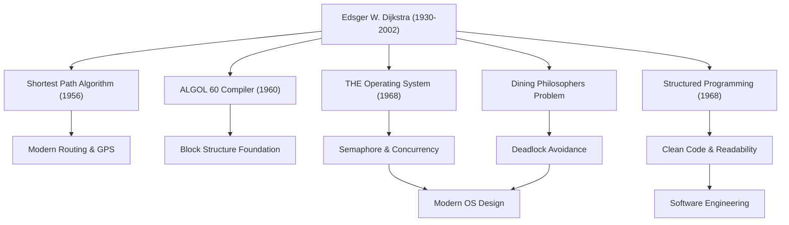

Edsger W. Dijkstra (1930 - 2002) is one of the greatest intellects who laid the foundations of modern software engineering and computer science. The numerous algorithms and programming paradigms he left behind breathe at the root of every technology we use on a daily basis today. In this article, we delve deep into Dijkstra's life, his unique philosophy, and his immeasurable impact on future generations.

## The Transition from Physics to Computer Science: The Trajectory of His Youth

Born in Rotterdam, Netherlands, in 1930, Dijkstra initially majored in theoretical physics at Leiden University. For him at the time, physics was the supreme academic discipline to unravel the truths of the natural world. However, fascinated by the infinite possibilities possessed by the new tool called the computer, he gradually stepped into the world of programming.

Programming in those days was akin to "craftsmanship" or "puzzle solving" rather than an academic discipline, and no established theories or systems existed. But Dijkstra was convinced that mathematical rigor and beauty should be brought to it. He eventually abandoned his career as a physicist and decided to make programming his life's work. The famous anecdote that when he tried to record his profession as "programmer" on his marriage license in the Netherlands, the authorities rejected it saying no such profession existed, speaks volumes about how much of a pioneer he was for his time.

## Great Achievements that Elevated Programming to a "Science"

Dijkstra's achievements span a very wide range. His elegant solutions to numerous technical challenges he faced serve as an important foundation in current information engineering.

### 1. Dijkstra's Algorithm (Shortest Path Algorithm)
Devised in 1956 in just about 20 minutes while he was drinking coffee with his fiancée at a cafe in Amsterdam, this algorithm was a revolutionary one for finding the shortest path between two points on a graph. Astonishingly, this algorithm, created with just paper and pencil without using a computer, is still used today, more than half a century later, as a core technology in car navigation systems, internet routing protocols (like OSPF), and even optimization of transportation networks.

### 2. Structured Programming and the "Harmfulness of the GOTO Statement"
His legendary short letter published in 1968, "Go To Statement Considered Harmful," sent shockwaves through the programming world at the time and caused intense controversy. He advocated "structured programming," which eliminates the GOTO statement that randomly leaps the execution flow of a program (the root cause of spaghetti code) and logically describes code using only three basic control structures: sequence, selection, and iteration. This dramatically improved the readability, maintainability, and reliability of software, and influenced all major modern programming languages.

### 3. Concurrent Programming and the "Dining Philosophers Problem"
Through the development of the "THE multiprogramming system," Dijkstra devised the "Semaphore," a synchronization mechanism for multiple processes to operate cooperatively without competing for resources. Furthermore, to explain the danger of deadlocks in concurrent processing in an easy-to-understand way, he devised the metaphor of the "Dining Philosophers Problem." These concepts are taught in computer science classes around the world as fundamental principles of concurrent control in modern operating systems and multithreaded programming.

## Dijkstra's Philosophy and the "EWD" Documents

Reflecting his deep thoughts and philosophy most strongly is a series of handwritten documents commonly known as "EWD" (his own initials). Throughout his life, Dijkstra beautifully penned his thoughts in readable cursive using his favorite Montblanc fountain pen, copied them, and shared them with his colleagues and students.

The EWDs span over 1,300 pieces and discuss a wide range of topics, from mathematical proofs of technical algorithms and theories on computer science education, to criticism of commercialism in the industry and warnings of a software crisis. Dijkstra strongly asserted that "programming should be a mathematical activity." His famous saying, "Program testing can be used to show the presence of bugs, but never to show their absence," represents his firm belief that a program should not just merely run, but its correctness must be logically provable.

## Impact on Future Generations: Legacy as a Giant of Intellect

Dijkstra, who received the Turing Award, the highest honor in the field of computer science, in 1972, taught as a professor at the University of Texas at Austin from 1984 until his later years. He set extremely rigorous standards for his students and demanded clear and logical thinking.

The greatest legacy Dijkstra left behind is not limited to specific algorithms or technical inventions, but the very framework of thinking on "how software should be built." His rigorous mathematical approach and uncompromising philosophy continue to serve as a steadfast compass for navigating the chaotic sea of code even in the modern era, where software development is becoming increasingly complex.

The life of Edsger Dijkstra was a history of relentless exploration that brought the beauty of order and logic to the nascent, young field of computer science, nurturing it into a true "science." His teachings and spirit will continue to live on in every line of code we write and at the root of the invisible systems supporting our information society.
