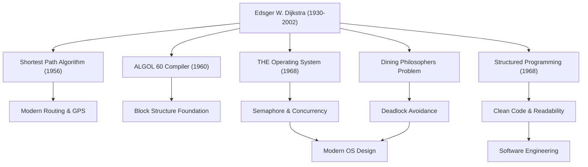

Edsger W. Dijkstra (1930 - 2002) es una de las mentes más brillantes que construyó los cimientos de la ingeniería de software y la informática modernas. Los numerosos algoritmos y paradigmas de programación que dejó atrás perduran en la base de casi todas las tecnologías que utilizamos a diario. En este artículo, profundizaremos en la vida de Dijkstra, su filosofía única y la incalculable influencia que ha tenido en las generaciones posteriores.

## Transición de la física a la informática: La trayectoria de su juventud

Nacido en Róterdam, Países Bajos, en 1930, Dijkstra inicialmente se especializó en física teórica en la Universidad de Leiden. Para él, en aquel entonces, la física era la disciplina suprema para desentrañar las verdades del mundo natural. Sin embargo, fascinado por las infinitas posibilidades que ofrecía una nueva herramienta llamada "computadora", poco a poco comenzó a adentrarse en el mundo de la programación.

En aquella época, la programación era más parecida a la "artesanía" o la "resolución de acertijos" que a una disciplina académica, y no existían teorías ni sistemas establecidos. No obstante, Dijkstra estaba convencido de que debía aportarse rigor matemático y belleza a este campo. Finalmente, abandonó su carrera como físico y decidió hacer de la programación el trabajo de su vida. La famosa anécdota de cuando intentó registrar su profesión como "programador" en su licencia de matrimonio en los Países Bajos y fue rechazado por la oficina gubernamental con el argumento de que tal profesión no existía, ilustra lo adelantado que estaba a su tiempo.

## El gran logro de elevar la programación a una "ciencia"

Los logros de Dijkstra son sumamente variados. Sus elegantes soluciones a los numerosos desafíos técnicos a los que se enfrentó constituyen hoy en día una base fundamental de la ingeniería informática.

### 1. El algoritmo de Dijkstra (Algoritmo de caminos más cortos)
Ideado en 1956, supuestamente en apenas 20 minutos mientras tomaba café con su prometida en una cafetería de Ámsterdam, este algoritmo revolucionario encontraba el camino más corto entre dos puntos en un grafo. Sorprendentemente, este algoritmo, creado únicamente con papel y lápiz sin utilizar una computadora, sigue siendo, más de medio siglo después, una tecnología central en los sistemas de navegación GPS, los protocolos de enrutamiento de Internet (como OSPF) y la optimización de redes de transporte.

### 2. Programación estructurada y "La declaración GOTO considerada perjudicial"
Su legendaria y breve carta publicada en 1968, "Go To Statement Considered Harmful" (La declaración GOTO es perjudicial), causó un terremoto en la comunidad de programación de la época y desató un acalorado debate. Propuso la "programación estructurada", que rechazaba la declaración GOTO (la causa principal del código espagueti) que hacía saltar el flujo de ejecución de los programas de forma caótica, y abogaba por escribir código de forma lógica utilizando únicamente tres estructuras de control básicas: secuencia, selección e iteración. Esto mejoró drásticamente la legibilidad, mantenibilidad y fiabilidad del software, influyendo en todos los lenguajes de programación principales de la actualidad.

### 3. Programación concurrente y el "Problema de los filósofos cenando"
A través del desarrollo del sistema de multiprogramación "THE", Dijkstra inventó el "Semáforo" (Semaphore), un mecanismo de sincronización para que múltiples procesos puedan operar coordinadamente sin competir por los recursos. Además, ideó la metáfora del "Problema de los filósofos cenando" para explicar de manera comprensible el peligro de los bloqueos mutuos (deadlocks) en el procesamiento concurrente. Estos conceptos se enseñan hoy en día en las clases de ciencias de la computación de todo el mundo como los principios fundamentales del control de concurrencia en los sistemas operativos modernos y la programación multihilo.

## La filosofía de Dijkstra y los documentos "EWD"

Lo que refleja con más fuerza su profundo pensamiento y filosofía es una serie de documentos manuscritos conocidos comúnmente como "EWD" (sus iniciales). A lo largo de su vida, Dijkstra utilizó su pluma estilográfica Montblanc favorita para escribir sus pensamientos en una hermosa y legible caligrafía cursiva, que luego copiaba y compartía con sus colegas y estudiantes.

Los EWD suman más de 1300 escritos, abordando una amplia gama de temas que van desde demostraciones matemáticas de algoritmos técnicos hasta teorías sobre la educación en ciencias de la computación, críticas al comercialismo de la industria y advertencias sobre la crisis del software. Dijkstra afirmaba con firmeza que "la programación debe ser una actividad matemática". Su famosa frase: "Las pruebas de los programas pueden demostrar la presencia de errores, pero nunca su ausencia", expresa su inquebrantable creencia de que no basta con que un programa simplemente funcione; su corrección debe poder demostrarse lógicamente.

## Su impacto en la posteridad: El legado de un gigante intelectual

Galardonado en 1972 con el Premio Turing, el más alto honor en el campo de la informática, Dijkstra enseñó como profesor en la Universidad de Texas en Austin desde 1984 hasta sus últimos años. Estableció estándares extremadamente estrictos para sus estudiantes, exigiéndoles un pensamiento claro y lógico.

El mayor legado que dejó Dijkstra no se limita a algoritmos específicos o invenciones técnicas, sino que es el propio marco de pensamiento sobre "cómo debe construirse el software". Su estricto enfoque matemático y su filosofía inquebrantable siguen siendo una brújula firme para navegar por el caótico mar de código, incluso en la actualidad, donde el desarrollo de software es cada vez más complejo.

La vida de Edsger Dijkstra fue una historia de búsqueda incesante que aportó orden y la belleza de la lógica al incipiente y joven campo de la informática, elevándolo a la categoría de verdadera "ciencia". Sus enseñanzas y su espíritu seguirán vivos en cada línea de código que escribamos y en los cimientos de los sistemas invisibles que sustentan nuestra sociedad de la información.
