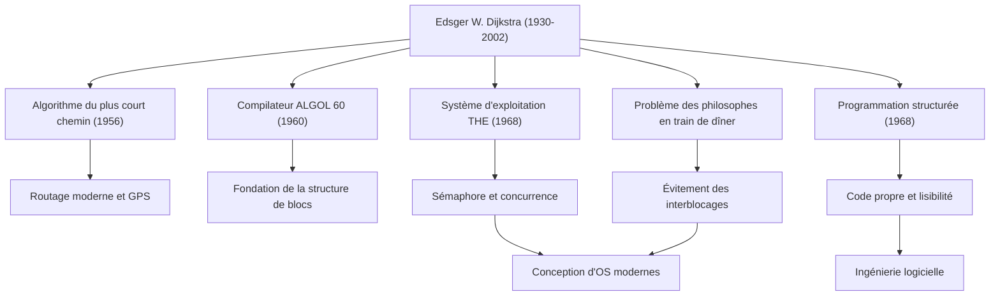

Edsger W. Dijkstra (1930 - 2002) est l'un des plus grands intellectuels ayant posé les fondations de l'ingénierie logicielle et de l'informatique modernes. De nombreux algorithmes et paradigmes de programmation qu'il a laissés derrière lui respirent à la base de toutes les technologies que nous utilisons quotidiennement aujourd'hui. Dans cet article, nous explorerons en profondeur la vie de Dijkstra, sa philosophie unique et l'influence incommensurable qu'il a eue sur les générations futures.

## De la physique à l'informatique : le parcours de sa jeunesse

Né à Rotterdam, aux Pays-Bas, en 1930, Dijkstra s'est d'abord spécialisé en physique théorique à l'Université de Leyde. Pour lui, à l'époque, la physique était la discipline suprême pour découvrir les vérités du monde naturel. Cependant, fasciné par les possibilités infinies d'un nouvel outil appelé ordinateur, il a progressivement fait ses premiers pas dans le monde de la programmation.

La programmation à l'époque s'apparentait plus à de "l'artisanat" ou à la "résolution d'énigmes" qu'à une discipline académique, et il n'existait ni théories ni systèmes établis. Pourtant, Dijkstra était convaincu qu'elle devait apporter une rigueur et une beauté mathématiques. Il a finalement abandonné sa carrière de physicien pour faire de la programmation l'œuvre de sa vie. Une anecdote célèbre raconte que lorsqu'il a voulu inscrire "programmeur" comme profession sur sa demande de mariage aux Pays-Bas, les autorités ont refusé, arguant qu'une telle profession n'existait pas, ce qui témoigne à quel point il était un pionnier de son époque.

## De grandes réalisations qui ont élevé la programmation au rang de "science"

Les réalisations de Dijkstra sont extrêmement vastes. Les solutions élégantes qu'il a apportées aux nombreux défis techniques auxquels il a été confronté constituent aujourd'hui une base importante de l'ingénierie informatique moderne.

### 1. L'algorithme de Dijkstra (algorithme du plus court chemin)
Conçu en 1956 en seulement 20 minutes environ alors qu'il prenait un café avec sa fiancée dans un café d'Amsterdam, cet algorithme était une méthode révolutionnaire pour trouver le chemin le plus court entre deux nœuds d'un graphe. Étonnamment, cet algorithme, créé avec un simple papier et un crayon sans l'aide d'un ordinateur, est toujours utilisé plus d'un demi-siècle plus tard comme technologie de base dans les systèmes de navigation automobile, les protocoles de routage Internet (tels qu'OSPF) et même l'optimisation des réseaux de transport.

### 2. La programmation structurée et la "nocivité de l'instruction GOTO"
Publiée en 1968, la légendaire et courte lettre "Go To Statement Considered Harmful" a provoqué une onde de choc dans le monde de la programmation de l'époque et suscité de vives controverses. Il a préconisé la "programmation structurée", qui élimine l'instruction GOTO (la cause du code spaghetti), laquelle fait sauter le flux d'exécution d'un programme de manière désordonnée, pour écrire le code de manière logique en utilisant uniquement trois structures de contrôle de base : séquence, sélection et itération. Cela a considérablement amélioré la lisibilité, la maintenabilité et la fiabilité des logiciels, et a influencé tous les principaux langages de programmation modernes.

### 3. Programmation concurrente et le "Problème des philosophes en train de dîner"
Lors du développement du "système de multiprogrammation THE", Dijkstra a conçu les "sémaphores (Semaphore)", un mécanisme de synchronisation permettant à plusieurs processus de fonctionner de manière coordonnée sans se disputer les ressources. De plus, pour expliquer simplement le danger d'interblocage (deadlock) dans le traitement concurrent, il a inventé la métaphore du "Problème des philosophes en train de dîner". Ces concepts sont enseignés dans les cours d'informatique du monde entier comme les principes fondamentaux du contrôle de la concurrence dans les systèmes d'exploitation d'aujourd'hui et la programmation multithread.

## La philosophie de Dijkstra et les documents "EWD"

La série de documents manuscrits, communément appelés "EWD" (ses propres initiales), reflète le plus fortement sa pensée et sa philosophie profondes. Tout au long de sa vie, Dijkstra a utilisé son stylo plume Montblanc préféré pour écrire ses pensées dans une écriture cursive magnifique et lisible, qu'il a ensuite copiée et partagée avec ses collègues et étudiants.

Il y a plus de 1300 EWD, couvrant un large éventail de sujets, allant des preuves mathématiques d'algorithmes techniques à ses théories sur l'enseignement de l'informatique, sa critique du mercantilisme de l'industrie, en passant par ses avertissements concernant la crise du logiciel. Dijkstra soutenait fermement que "la programmation devrait être une activité mathématique". Sa célèbre citation, "Les tests de programmes peuvent être utilisés pour montrer la présence de bugs, mais jamais pour montrer leur absence", exprime sa ferme conviction qu'un programme ne doit pas seulement fonctionner, mais que sa justesse doit pouvoir être prouvée logiquement.

## Héritage pour les générations futures : le legs d'un géant du savoir

Dijkstra, qui a reçu le prix Turing en 1972, la plus haute distinction en informatique, a enseigné en tant que professeur à l'Université du Texas à Austin de 1984 jusqu'à ses dernières années. Il fixait des normes très strictes pour ses étudiants, exigeant une pensée claire et logique.

Le plus grand héritage que Dijkstra a laissé n'est pas limité à des algorithmes spécifiques ou à des inventions techniques, mais constitue le cadre de pensée même de "comment les logiciels devraient être construits". Son approche mathématique rigoureuse et sa philosophie intransigeante continuent d'être une boussole inébranlable pour naviguer dans l'océan chaotique du code, même à notre époque où le développement logiciel devient de plus en plus complexe.

La vie d'Edsger Dijkstra a été une quête incessante qui a apporté l'ordre et la beauté de la logique au jeune domaine naissant de l'informatique, l'élevant en une véritable "science". Ses enseignements et son esprit continueront sans doute à vivre dans chaque ligne de code que nous écrivons et au fondement des systèmes invisibles qui soutiennent la société de l'information.
