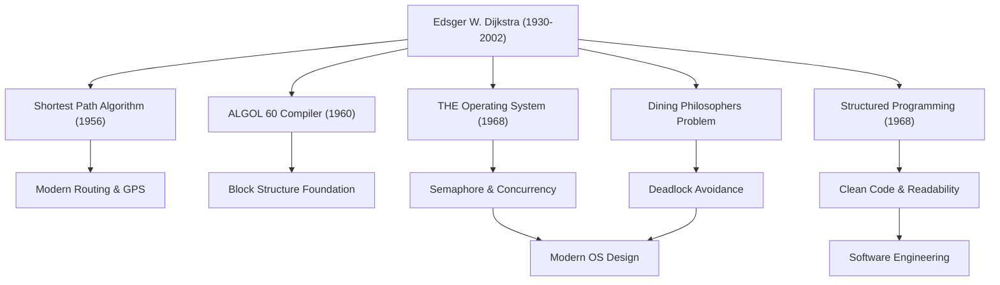

एड्सगर डब्ल्यू. डिजक्स्ट्रा (Edsger W. Dijkstra, 1930 - 2002) उन महानतम बुद्धिजीवियों में से एक हैं जिन्होंने आधुनिक सॉफ्टवेयर इंजीनियरिंग और कंप्यूटर विज्ञान की नींव रखी। उनके द्वारा छोड़े गए कई एल्गोरिदम और प्रोग्रामिंग प्रतिमान (paradigms) आज उन सभी तकनीकों के मूल में मौजूद हैं जिनका हम दैनिक उपयोग करते हैं। इस लेख में, हम डिजक्स्ट्रा के जीवन, उनके अद्वितीय दर्शन और आने वाली पीढ़ियों पर उनके द्वारा छोड़े गए अथाह प्रभाव पर गहराई से चर्चा करेंगे।

## भौतिकी से कंप्यूटर विज्ञान की ओर परिवर्तन: युवावस्था की यात्रा

1930 में नीदरलैंड के रॉटरडैम में जन्मे डिजक्स्ट्रा ने शुरू में लीडेन विश्वविद्यालय में सैद्धांतिक भौतिकी (theoretical physics) की पढ़ाई की थी। उस समय उनके लिए भौतिकी प्राकृतिक दुनिया की सच्चाइयों को उजागर करने वाला सर्वोच्च विषय था। हालाँकि, कंप्यूटर नामक एक नए उपकरण की असीम संभावनाओं से मंत्रमुग्ध होकर, उन्होंने धीरे-धीरे प्रोग्रामिंग की दुनिया में कदम रखा।

उस समय प्रोग्रामिंग किसी शैक्षणिक अनुशासन के बजाय "शिल्पकला" (craftsmanship) या "पहेली सुलझाने" जैसी अधिक थी, और इसमें स्थापित सिद्धांत या प्रणालियाँ मौजूद नहीं थीं। लेकिन डिजक्स्ट्रा को विश्वास था कि इसमें गणितीय कठोरता और सुंदरता लाई जानी चाहिए। अंततः उन्होंने एक भौतिक विज्ञानी के रूप में अपना करियर छोड़ दिया और प्रोग्रामिंग को अपना जीवन भर का काम बनाने का फैसला किया। एक प्रसिद्ध किस्सा है कि जब उन्होंने नीदरलैंड में अपने विवाह लाइसेंस पर अपना पेशा "प्रोग्रामर" दर्ज कराने की कोशिश की, तो सरकारी कार्यालय ने यह कहते हुए इनकार कर दिया कि ऐसा कोई पेशा अस्तित्व में नहीं है। यह किस्सा बताता है कि वह अपने समय से कितने आगे थे।

## प्रोग्रामिंग को "विज्ञान" के स्तर तक ले जाने की महान उपलब्धि

डिजक्स्ट्रा की उपलब्धियाँ बेहद विविध हैं। उनके सामने आने वाली कई तकनीकी चुनौतियों के लिए उनके सुरुचिपूर्ण समाधान वर्तमान कंप्यूटर इंजीनियरिंग में एक महत्वपूर्ण आधार बनाते हैं।

### 1. डिजक्स्ट्रा का एल्गोरिदम (सबसे छोटा रास्ता एल्गोरिदम)
1956 में, ऐसा माना जाता है कि एम्स्टर्डम के एक कैफे में अपनी मंगेतर के साथ कॉफी पीते समय, उन्होंने मात्र 20 मिनट में इस एल्गोरिदम का आविष्कार किया था। यह ग्राफ पर दो बिंदुओं के बीच सबसे छोटा रास्ता खोजने के लिए एक क्रांतिकारी तरीका था। आश्चर्य की बात यह है कि कंप्यूटर के बिना केवल कागज और पेंसिल से बनाया गया यह एल्गोरिदम, आधी सदी से अधिक समय बीत जाने के बाद भी, कार नेविगेशन सिस्टम, इंटरनेट के रूटिंग प्रोटोकॉल (जैसे OSPF), और परिवहन नेटवर्क के अनुकूलन में एक मुख्य तकनीक के रूप में उपयोग किया जाता है।

### 2. संरचित प्रोग्रामिंग (Structured Programming) और "GOTO स्टेटमेंट हानिकारक है"
1968 में प्रकाशित उनका प्रसिद्ध लघु पत्र 'Go To Statement Considered Harmful' (GOTO स्टेटमेंट हानिकारक माना जाता है) ने उस समय प्रोग्रामिंग की दुनिया में सदमे की लहर भेज दी और एक भयंकर बहस छेड़ दी। उन्होंने प्रोग्राम के निष्पादन प्रवाह (execution flow) को अव्यवस्थित ढंग से जंप कराने वाले GOTO स्टेटमेंट (जो कि स्पेगेटी कोड का मुख्य कारण था) को हटाने की वकालत की। इसके बजाय उन्होंने "संरचित प्रोग्रामिंग" का प्रस्ताव रखा, जिसमें अनुक्रम (sequence), चयन (selection), और पुनरावृत्ति (iteration) की केवल 3 बुनियादी नियंत्रण संरचनाओं का उपयोग करके तार्किक रूप से कोड लिखा जाता है। इससे सॉफ्टवेयर की पठनीयता (readability), रखरखाव (maintainability), और विश्वसनीयता (reliability) में नाटकीय रूप से सुधार हुआ, जिसने आज की सभी प्रमुख प्रोग्रामिंग भाषाओं को प्रभावित किया।

### 3. समवर्ती प्रोग्रामिंग (Concurrent Programming) और "भोजन करने वाले दार्शनिकों की समस्या"
"THE मल्टीप्रोग्रामिंग सिस्टम" के विकास के माध्यम से, डिजक्स्ट्रा ने एक सिंक्रोनाइज़ेशन तंत्र "सेमाफोर" (Semaphore) का आविष्कार किया, जो कई प्रक्रियाओं को संसाधनों के लिए प्रतिस्पर्धा किए बिना समन्वय में संचालित करने की अनुमति देता है। इसके अलावा, समवर्ती प्रसंस्करण (concurrent processing) में डेडलॉक (deadlock) के खतरे को आसानी से समझाने के लिए उन्होंने "भोजन करने वाले दार्शनिकों की समस्या" (Dining Philosophers Problem) का रूपक गढ़ा। इन अवधारणाओं को आज दुनिया भर में कंप्यूटर विज्ञान की कक्षाओं में आधुनिक ऑपरेटिंग सिस्टम और मल्टीथ्रेडिंग प्रोग्रामिंग में समवर्ती नियंत्रण के मौलिक सिद्धांतों के रूप में पढ़ाया जाता है।

## डिजक्स्ट्रा का दर्शन और "EWD" दस्तावेज़

उनके गहरे विचारों और दर्शन को सबसे दृढ़ता से दर्शाने वाले हस्तलिखित दस्तावेजों की एक श्रृंखला है, जिसे आमतौर पर "EWD" (उनके खुद के आद्याक्षर) के रूप में जाना जाता है। जीवन भर, डिजक्स्ट्रा ने सुंदर और पठनीय कर्सिव लिखावट में अपने विचारों को लिखने के लिए अपने पसंदीदा मोंटब्लैंक फाउंटेन पेन का इस्तेमाल किया, और फिर उन्हें कॉपी करके अपने सहयोगियों और छात्रों साझा किया।

EWD 1300 से अधिक संस्करणों में फैला है, जिसमें तकनीकी एल्गोरिदम के गणितीय प्रमाण से लेकर कंप्यूटर विज्ञान शिक्षा सिद्धांतों, उद्योग के व्यावसायीकरण (commercialism) की आलोचना, और सॉफ्टवेयर संकट की चेतावनियों तक विषयों की एक विस्तृत श्रृंखला शामिल है। डिजक्स्ट्रा ने दृढ़ता से तर्क दिया कि "प्रोग्रामिंग एक गणितीय गतिविधि होनी चाहिए।" उनका प्रसिद्ध कथन, "प्रोग्राम परीक्षण बग की उपस्थिति दिखा सकता है, लेकिन उनकी अनुपस्थिति कभी नहीं", उनके दृढ़ विश्वास को व्यक्त करता है कि यह पर्याप्त नहीं है कि एक प्रोग्राम सिर्फ काम करे; इसे तार्किक रूप से सही साबित करने योग्य होना चाहिए।

## आने वाली पीढ़ियों पर प्रभाव: ज्ञान के एक दिग्गज की विरासत

1972 में कंप्यूटर विज्ञान के क्षेत्र में सर्वोच्च सम्मान ट्यूरिंग अवार्ड से सम्मानित, डिजक्स्ट्रा ने 1984 से अपने अंतिम वर्षों तक ऑस्टिन में टेक्सास विश्वविद्यालय में एक प्रोफेसर के रूप में पढ़ाया। उन्होंने अपने छात्रों के लिए बहुत सख्त मानक निर्धारित किए, और स्पष्ट और तार्किक सोच की मांग की।

डिजक्स्ट्रा द्वारा छोड़ी गई सबसे बड़ी विरासत किसी विशिष्ट एल्गोरिदम या तकनीकी आविष्कार तक सीमित नहीं है, बल्कि यह स्वयं विचारों का एक ढांचा है कि "सॉफ्टवेयर का निर्माण कैसे किया जाना चाहिए।" उनका सख्त गणितीय दृष्टिकोण और समझौता न करने वाला दर्शन, आज भी, जब सॉफ्टवेयर विकास तेजी से जटिल होता जा रहा है, कोड के अराजक समुद्र को पार करने के लिए एक दृढ़ कम्पास बना हुआ है।

एड्सगर डिजक्स्ट्रा का जीवन कंप्यूटर विज्ञान के नवजात क्षेत्र में व्यवस्था और तर्क की सुंदरता लाने, और इसे एक सच्चे "विज्ञान" में विकसित करने की निरंतर खोज का इतिहास था। उनकी शिक्षाएँ और भावना हमारे द्वारा लिखी जाने वाली कोड की हर पंक्ति में, और सूचना समाज का समर्थन करने वाली अदृश्य प्रणालियों की नींव में जीवित रहेंगी।
