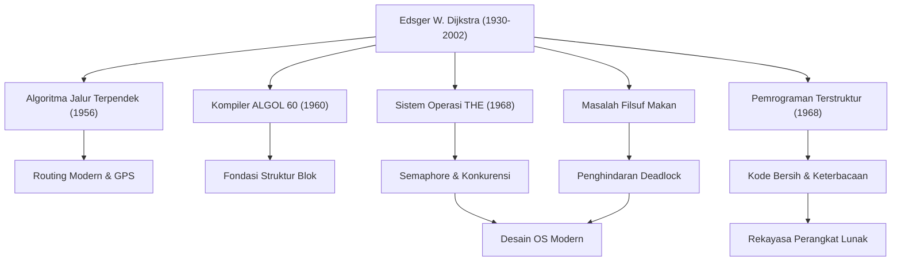

Edsger W. Dijkstra (1930 - 2002) adalah salah satu intelektual terbesar yang membangun fondasi rekayasa perangkat lunak dan ilmu komputer modern. Berbagai algoritma dan paradigma pemrograman yang ia tinggalkan hidup di dasar semua teknologi yang kita gunakan sehari-hari saat ini. Dalam artikel ini, kita akan menggali lebih dalam tentang kehidupan Dijkstra, filosofinya yang unik, dan pengaruhnya yang tak terukur pada generasi-generasi berikutnya.

## Transisi dari Fisika ke Ilmu Komputer: Jejak Masa Muda

Lahir di Rotterdam, Belanda pada tahun 1930, Dijkstra awalnya mengambil jurusan fisika teoritis di Universitas Leiden. Baginya saat itu, fisika adalah disiplin ilmu tertinggi untuk mengungkap kebenaran alam. Namun, terpesona oleh kemungkinan tak terbatas dari alat baru yang disebut komputer, ia perlahan-lahan melangkah ke dunia pemrograman.

Pemrograman pada saat itu lebih mirip dengan "keterampilan teknis" atau "memecahkan teka-teki" daripada sebuah disiplin akademis, dan tidak ada teori atau sistem yang mapan. Namun, Dijkstra yakin bahwa keakuratan dan keindahan matematis harus dibawa ke dalamnya. Ia akhirnya memutuskan untuk melepaskan karirnya sebagai fisikawan dan menjadikan pemrograman sebagai pekerjaan seumur hidupnya. Anekdot terkenal tentang dirinya yang ditolak oleh catatan sipil saat mencoba menulis "programmer" sebagai profesinya dalam surat izin menikah di Belanda, karena profesi semacam itu dianggap tidak ada, menunjukkan betapa ia adalah seorang pelopor pada masanya.

## Pencapaian Besar yang Mengangkat Pemrograman Menjadi "Sains"

Pencapaian Dijkstra sangat beragam. Solusi elegan untuk berbagai tantangan teknis yang ia hadapi telah menjadi dasar penting dalam rekayasa informasi saat ini.

### 1. Algoritma Dijkstra (Algoritma Jalur Terpendek)
Algoritma ini, yang konon ia temukan hanya dalam waktu sekitar 20 menit saat minum kopi bersama tunangannya di sebuah kafe di Amsterdam pada tahun 1956, adalah sebuah terobosan untuk menemukan jalur terpendek antara dua titik pada sebuah graf. Hebatnya, algoritma yang diciptakan hanya dengan kertas dan pensil tanpa menggunakan komputer ini, masih digunakan lebih dari setengah abad kemudian sebagai teknologi inti dalam sistem navigasi mobil, protokol routing internet (seperti OSPF), dan bahkan dalam optimalisasi jaringan transportasi.

### 2. Pemrograman Terstruktur dan "Bahaya Pernyataan GOTO"
Surat singkat legendaris yang diterbitkan pada tahun 1968, "Go To Statement Considered Harmful" (Pernyataan Go To Dianggap Berbahaya), mengirimkan gelombang kejut ke dunia pemrograman pada saat itu dan memicu perdebatan sengit. Ia mengusulkan "pemrograman terstruktur", yang secara logis menulis kode menggunakan hanya tiga struktur kontrol dasar: sekuensial, seleksi, dan iterasi, dengan menghilangkan pernyataan GOTO (penyebab kode spageti) yang membuat alur eksekusi program melompat secara sembarangan. Hal ini secara dramatis meningkatkan keterbacaan, kemampuan pemeliharaan, dan keandalan perangkat lunak, serta memengaruhi semua bahasa pemrograman utama modern.

### 3. Pemrograman Konkuren dan "Masalah Filsuf Makan"
Melalui pengembangan "THE Multiprogramming System", Dijkstra merancang mekanisme sinkronisasi yang disebut "Semaphore", agar beberapa proses dapat bekerja sama tanpa bersaing untuk mendapatkan sumber daya. Lebih lanjut, ia merancang metafora "Masalah Filsuf Makan" (Dining Philosophers Problem) untuk menjelaskan secara sederhana bahaya kebuntuan (deadlock) dalam pemrosesan konkuren. Konsep-konsep ini diajarkan di kelas ilmu komputer di seluruh dunia sebagai prinsip dasar pengendalian pemrosesan konkuren dalam sistem operasi dan pemrograman multi-thread saat ini.

## Filosofi Dijkstra dan Dokumen "EWD"

Hal yang paling mencerminkan pemikiran dan filosofinya yang mendalam adalah serangkaian dokumen tulisan tangan yang dikenal sebagai "EWD" (inisialnya sendiri). Sepanjang hidupnya, Dijkstra menuliskan pemikirannya menggunakan pena mesin Montblanc kesayangannya dalam tulisan kursif yang indah dan mudah dibaca, kemudian menyalin dan membagikannya kepada kolega dan mahasiswanya.

EWD berjumlah lebih dari 1300 tulisan, membahas berbagai tema mulai dari pembuktian matematis algoritma teknis, teori pendidikan ilmu komputer, kritik terhadap komersialisme industri, hingga peringatan tentang krisis perangkat lunak. Dijkstra dengan tegas berpendapat bahwa "pemrograman harus menjadi kegiatan matematis". Kutipan terkenalnya, "Pengujian program dapat digunakan untuk menunjukkan keberadaan bug, tetapi tidak pernah untuk menunjukkan ketiadaannya", mewakili keyakinannya yang teguh bahwa program tidak hanya sekadar bisa berjalan, tetapi juga kebenarannya harus dapat dibuktikan secara logis.

## Pengaruh pada Generasi Berikutnya: Warisan Raksasa Intelektual

Dijkstra, yang memenangkan Penghargaan Turing, penghargaan tertinggi dalam ilmu komputer, pada tahun 1972, mengajar sebagai profesor di Universitas Texas di Austin dari tahun 1984 hingga akhir hayatnya. Ia menetapkan standar yang sangat ketat bagi para mahasiswanya dan menuntut pemikiran yang jernih dan logis.

Warisan terbesar yang ditinggalkan Dijkstra tidak terbatas pada algoritma tertentu atau penemuan teknis, melainkan kerangka berpikir itu sendiri tentang "bagaimana perangkat lunak harus dibangun". Pendekatan matematisnya yang ketat dan filosofinya yang tak kenal kompromi terus menjadi kompas yang kuat untuk menavigasi lautan kode yang kacau, bahkan di era modern di mana pengembangan perangkat lunak menjadi semakin kompleks.

Kehidupan Edsger Dijkstra adalah sejarah eksplorasi terus-menerus yang memberikan tatanan dan keindahan logika pada bidang ilmu komputer yang baru lahir, dan membesarkannya menjadi "sains" sejati. Ajaran dan semangatnya akan terus hidup dalam setiap baris kode yang kita tulis, dan di dasar sistem-sistem tak terlihat yang menopang masyarakat informasi.
