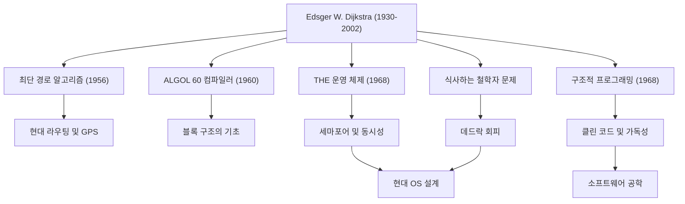

에츠허르 W. 다익스트라(Edsger W. Dijkstra, 1930 - 2002)는 현대 소프트웨어 공학 및 컴퓨터 과학의 기반을 다진 가장 위대한 지성 중 한 명입니다. 그가 남긴 수많은 알고리즘과 프로그래밍 패러다임은 오늘날 우리가 일상적으로 사용하는 모든 기술의 밑바탕에 숨 쉬고 있습니다. 본 기사에서는 다익스트라의 생애, 그의 독특한 철학, 그리고 후세에 미친 헤아릴 수 없는 영향에 대해 깊이 파헤쳐 봅니다.

## 물리학에서 컴퓨터 과학으로의 전환: 젊은 시절의 궤적

1930년 네덜란드 로테르담에서 태어난 다익스트라는 처음에는 라이덴 대학교에서 이론 물리학을 전공했습니다. 당시 그에게 물리학은 자연계의 진리를 밝혀내기 위한 최고의 학문이었습니다. 하지만 컴퓨터라는 새로운 도구가 가진 무한한 가능성에 매료된 그는 점차 프로그래밍의 세계로 발을 들여놓게 됩니다.

당시의 프로그래밍은 학문이라기보다는 '장인 정신'이나 '퍼즐 풀이'에 가까웠고 확립된 이론이나 체계는 존재하지 않았습니다. 그러나 다익스트라는 그곳에 수학적인 엄밀함과 아름다움을 가져와야 한다고 확신했습니다. 그는 결국 물리학자로서의 커리어를 포기하고 프로그래밍을 자신의 평생 직업으로 삼기로 결심합니다. 네덜란드에서 결혼 허가서에 자신의 직업을 '프로그래머'로 적으려 했을 때, 그런 직업은 존재하지 않는다고 관공서에서 거절당했다는 유명한 일화는 그가 얼마나 시대의 선구자였는지를 말해줍니다.

## 프로그래밍을 '과학'으로 승화시킨 위대한 업적

다익스트라의 업적은 매우 다양합니다. 그가 직면한 수많은 기술적 과제에 대한 우아한 해법은 현재 정보 공학에 있어 중요한 기초가 되고 있습니다.

### 1. 다익스트라 알고리즘(최단 경로 알고리즘)
1956년, 그가 암스테르담의 한 카페에서 약혼자와 커피를 마시던 중 불과 20분 만에 고안해 낸 것으로 알려진 이 알고리즘은 그래프 상의 두 점 사이의 최단 경로를 구하는 획기적인 것이었습니다. 놀랍게도 컴퓨터를 사용하지 않고 종이와 연필만으로 만들어진 이 알고리즘은 반세기가 지난 현재에도 자동차 내비게이션 시스템이나 인터넷 라우팅 프로토콜(OSPF 등), 나아가 교통망 최적화에서 핵심 기술로 이용되고 있습니다.

### 2. 구조적 프로그래밍과 'GOTO문의 유해성'
1968년에 발표된 전설적인 짧은 서한 'Go To Statement Considered Harmful(GOTO문은 유해하다)'은 당시 프로그래밍계에 큰 충격을 주며 격렬한 논쟁을 불러일으켰습니다. 그는 프로그램의 실행 흐름을 무질서하게 건너뛰게 만드는 GOTO문(스파게티 코드의 원흉)을 배제하고, 순차, 선택, 반복이라는 세 가지 기본적인 제어 구조만을 사용하여 코드를 논리적으로 작성하는 '구조적 프로그래밍'을 제창했습니다. 이로 인해 소프트웨어의 가독성, 유지보수성, 신뢰성은 비약적으로 향상되었고, 현대의 모든 주요 프로그래밍 언어에 영향을 미쳤습니다.

### 3. 동시성 프로그래밍과 '식사하는 철학자 문제'
다익스트라는 'THE 멀티프로그래밍 시스템'의 개발을 통해 여러 프로세스가 자원을 두고 경쟁하지 않고 협력하여 동작하기 위한 동기화 메커니즘 '세마포어(Semaphore)'를 고안했습니다. 게다가 동시 처리에서 데드락(교착 상태)의 위험성을 알기 쉽게 설명하기 위해 '식사하는 철학자 문제'라는 비유를 고안했습니다. 이러한 개념은 오늘날 운영 체제 및 멀티스레드 프로그래밍의 동시 처리 제어의 근본 원리로서 전 세계 컴퓨터 과학 수업에서 가르쳐지고 있습니다.

## 다익스트라의 철학과 'EWD' 문서

그의 깊은 사상과 철학을 가장 짙게 반영하고 있는 것은 통칭 'EWD(그 자신의 이니셜)'로 불리는 일련의 육필 문서들입니다. 다익스트라는 평생 동안 애용하는 몽블랑 만년필을 사용하여 자신의 생각을 아름답고 읽기 쉬운 필기체로 썼고, 이를 복사하여 동료 및 학생들과 공유했습니다.

EWD는 1300편 이상에 달하며, 기술적인 알고리즘의 수학적 증명부터 컴퓨터 과학 교육론, 업계의 상업주의에 대한 비판, 소프트웨어 위기에 대한 경고에 이르기까지 폭넓은 주제를 다루고 있습니다. 다익스트라는 "프로그래밍은 수학적인 활동이어야 한다"고 강력하게 주장했습니다. "프로그램 테스트는 버그의 존재를 보여줄 수는 있어도 부재를 보여줄 수는 없다"는 그의 유명한 말은 프로그램이 단순히 작동하기만 하면 되는 것이 아니라 논리적으로 정당성이 증명 가능해야 한다는 확고한 신념을 나타냅니다.

## 후세에 미친 영향: 지식의 거인으로서의 유산

1972년 컴퓨터 과학 분야에서 최고의 영예인 튜링상을 수상한 다익스트라는 1984년부터 말년에 이르기까지 텍사스 대학교 오스틴 캠퍼스에서 교수로 재직했습니다. 그는 학생들에게 매우 엄격한 기준을 제시하고 명확하고 논리적인 사고를 요구했습니다.

다익스트라가 남긴 가장 큰 유산은 특정 알고리즘이나 기술적 발명에 그치지 않고, '소프트웨어를 어떻게 구축해야 하는가'라는 사고의 틀 그 자체입니다. 그의 엄격한 수학적 접근 방식과 타협하지 않는 철학은 소프트웨어 개발이 갈수록 복잡해지는 현대에 있어서도 혼돈스러운 코드의 바다를 항해하기 위한 확고한 나침반이 되고 있습니다.

에츠허르 다익스트라의 생애는 이제 막 탄생한 젊은 분야인 컴퓨터 과학에 질서와 논리의 아름다움을 부여하고 이를 진정한 '과학'으로 키워낸 끊임없는 탐구의 역사였습니다. 그의 가르침과 정신은 앞으로도 우리가 작성하는 코드의 한 줄 한 줄에, 그리고 정보화 사회를 지탱하는 보이지 않는 시스템의 근저에 계속 살아 숨 쉴 것입니다.
