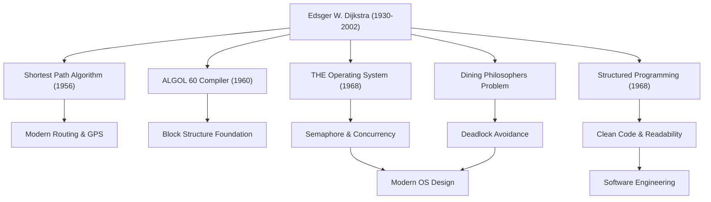

エドガー・W・ダイクストラ（Edsger W. Dijkstra, 1930 - 2002）は、現代のソフトウェア工学および計算機科学の基盤を築き上げた最も偉大な知性の一人です。彼が残した数々のアルゴリズムやプログラミングパラダイムは、今日私たちが日常的に利用しているあらゆるテクノロジーの根底に息づいています。本記事では、ダイクストラの生涯、彼のユニークな哲学、そして後世に与えた計り知れない影響について深く掘り下げます。

## 物理学から計算機科学への転換：若き日の軌跡

1930年、オランダのロッテルダムで生まれたダイクストラは、当初ライデン大学で理論物理学を専攻していました。当時の彼にとって、物理学こそが自然界の真理を解き明かすための至高の学問でした。しかし、計算機という新たな道具の持つ無限の可能性に魅了された彼は、次第にプログラミングの世界へと足を踏み入れることになります。

当時のプログラミングは学問というよりも「職人芸」や「パズル解き」に近いものであり、確立された理論や体系は存在しませんでした。しかしダイクストラは、そこに数学的な厳密さと美しさをもたらすべきだと確信していました。彼は最終的に物理学者としてのキャリアを捨て、プログラミングを自らの生涯の仕事とすることを決意します。オランダで結婚許可書に自らの職業を「プログラマ」と記そうとした際、そのような職業は存在しないと役所に拒絶されたという有名な逸話は、彼がどれほど時代の先駆者であったかを物語っています。

## プログラミングを「科学」へと昇華させた偉大なる功績

ダイクストラの業績は極めて多岐にわたります。彼が直面した数々の技術的課題に対する優雅な解法は、現在の情報工学における重要な基礎となっています。

### 1. ダイクストラ法（最短経路アルゴリズム）
1956年、彼がアムステルダムのカフェで婚約者とコーヒーを飲んでいる最中に、わずか20分ほどで考案したとされるこのアルゴリズムは、グラフ上の2点間の最短経路を求める画期的なものでした。驚くべきことに、計算機を使わず紙と鉛筆だけで生み出されたこのアルゴリズムは、半世紀以上が経過した現在でも、カーナビゲーションシステムやインターネットのルーティングプロトコル（OSPFなど）、さらには交通網の最適化において中核技術として利用されています。

### 2. 構造化プログラミングと「GOTO文の有害性」
1968年に発表された伝説的な短い書簡『Go To Statement Considered Harmful（GOTO文は有害である）』は、当時のプログラミング界に激震を走らせ、激しい論争を巻き起こしました。プログラムの実行フローを無秩序に飛躍させるGOTO文（スパゲティコードの元凶）を排し、順次・選択・反復という3つの基本的な制御構造のみを用いてコードを論理的に記述する「構造化プログラミング」を提唱しました。これにより、ソフトウェアの可読性、保守性、信頼性は飛躍的に向上し、現代のすべての主要なプログラミング言語に影響を与えました。

### 3. 並行プログラミングと「食事する哲学者問題」
ダイクストラは、「THEマルチプログラミングシステム」の開発を通じて、複数のプロセスが資源を競合せずに協調して動作するための同期機構「セマフォ（Semaphore）」を考案しました。さらに、並行処理におけるデッドロック（膠着状態）の危険性を分かりやすく説明するために「食事する哲学者問題」という比喩を考案しました。これらの概念は、今日のオペレーティングシステムやマルチスレッドプログラミングにおける並行処理制御の根本原理として、世界中のコンピュータサイエンスの授業で教えられています。

## ダイクストラの哲学と「EWD」文書

彼の深い思想と哲学を最も色濃く反映しているのが、通称「EWD（彼自身のイニシャル）」と呼ばれる一連の手書きの文書群です。ダイクストラは生涯を通じて、愛用のモンブランの万年筆を用いて自らの思考を美しく読みやすい筆記体で綴り、それをコピーして同僚や学生たちと共有しました。

EWDは1300編以上にも及び、技術的なアルゴリズムの数学的証明から、コンピュータサイエンスの教育論、業界の商業主義への批判、ソフトウェア危機の警鐘に至るまで、幅広いテーマが論じられています。ダイクストラは「プログラミングは数学的な活動であるべきだ」と強く主張しました。「プログラムのテストはバグの存在を示すことはできても、不在を示すことはできない」という彼の有名な言葉は、プログラムは単に動けばよいというものではなく、論理的に正当性が証明可能でなければならないという確固たる信念を表しています。

## 後世への影響：知の巨人としての遺産

1972年に計算機科学分野における最高の栄誉であるチューリング賞を受賞したダイクストラは、1984年から晩年に至るまでテキサス大学オースティン校の教授として教鞭をとりました。彼は学生たちに対して非常に厳格な基準を設け、明確で論理的な思考を求めました。

ダイクストラが残した最大の遺産は、特定のアルゴリズムや技術的発明にとどまらず、「ソフトウェアをいかに構築すべきか」という思考の枠組みそのものです。彼の厳格な数学的アプローチと妥協なき哲学は、ソフトウェア開発がますます複雑化する現代においても、混沌としたコードの海を航海するための確固たる羅針盤であり続けています。

エドガー・ダイクストラの生涯は、計算機科学という誕生したばかりの若い分野に秩序と論理の美しさを与え、それを真の「科学」へと育て上げた絶え間ない探求の歴史でした。彼の教えと精神は、これからも私たちが書くコードの一行一行の中に、そして情報化社会を支える不可視のシステムの根底に生き続けることでしょう。
