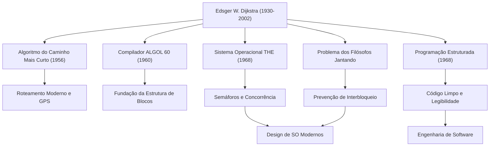

Edsger W. Dijkstra (1930 - 2002) é um dos maiores intelectuais que lançaram as bases da engenharia de software moderna e da ciência da computação. Numerosos algoritmos e paradigmas de programação que ele deixou para trás respiram na base de todas as tecnologias que usamos diariamente hoje. Neste artigo, vamos explorar profundamente a vida de Dijkstra, sua filosofia única e a imensa influência que ele teve nas gerações futuras.

## Da física à ciência da computação: a jornada da juventude

Nascido em Roterdã, nos Países Baixos, em 1930, Dijkstra inicialmente se especializou em física teórica na Universidade de Leiden. Para ele, na época, a física era a disciplina suprema para desvendar as verdades do mundo natural. No entanto, fascinado pelas infinitas possibilidades de uma nova ferramenta chamada computador, ele gradualmente entrou no mundo da programação.

A programação naquela época era mais uma "arte" ou "resolução de quebra-cabeças" do que uma disciplina acadêmica, e não existiam teorias ou sistemas estabelecidos. No entanto, Dijkstra estava convencido de que ela deveria trazer rigor e beleza matemática. Ele finalmente decidiu abandonar sua carreira como físico e fazer da programação o trabalho de sua vida. Uma famosa anedota diz que, quando ele tentou registrar sua profissão como "programador" em sua certidão de casamento nos Países Baixos, as autoridades recusaram, alegando que tal profissão não existia, o que mostra o quão à frente de seu tempo ele estava.

## Grandes conquistas que elevaram a programação a uma "ciência"

As realizações de Dijkstra são extremamente vastas. As soluções elegantes que ele forneceu para muitos dos desafios técnicos que enfrentou formam hoje uma importante base da engenharia da informação.

### 1. Algoritmo de Dijkstra (Algoritmo do caminho mais curto)
Concebido em 1956 em apenas 20 minutos, enquanto tomava café com sua noiva em um café em Amsterdã, esse algoritmo foi um método revolucionário para encontrar o caminho mais curto entre dois pontos em um grafo. Surpreendentemente, esse algoritmo, criado apenas com papel e lápis, sem o uso de um computador, continua a ser usado mais de meio século depois como tecnologia principal em sistemas de navegação automotiva, protocolos de roteamento de Internet (como OSPF) e até na otimização de redes de transporte.

### 2. Programação estruturada e o "Mal do comando GOTO"
Publicada em 1968, a lendária e curta carta "Go To Statement Considered Harmful" causou um choque no mundo da programação da época e gerou intensas controvérsias. Ele defendeu a "programação estruturada", que elimina a instrução GOTO (a causa do código espaguete) que faz o fluxo de execução de um programa pular desordenadamente, para escrever código logicamente usando apenas três estruturas de controle básicas: sequência, seleção e iteração. Isso melhorou drasticamente a legibilidade, facilidade de manutenção e confiabilidade do software, e influenciou todas as principais linguagens de programação modernas.

### 3. Programação concorrente e o "Problema dos filósofos jantando"
Durante o desenvolvimento do "sistema de multiprogramação THE", Dijkstra concebeu os "semáforos (Semaphore)", um mecanismo de sincronização que permite que vários processos operem coordenadamente sem competir por recursos. Além disso, para explicar de forma simples o perigo de interbloqueio (deadlock) no processamento concorrente, ele inventou a metáfora do "Problema dos filósofos jantando". Esses conceitos são ensinados em aulas de ciência da computação em todo o mundo como os princípios fundamentais do controle de concorrência nos sistemas operacionais e na programação multithread de hoje.

## A filosofia de Dijkstra e os documentos "EWD"

O conjunto de documentos manuscritos, comumente chamados de "EWD" (suas próprias iniciais), reflete fortemente seu profundo pensamento e filosofia. Ao longo de sua vida, Dijkstra usou sua caneta-tinteiro Montblanc favorita para escrever seus pensamentos em uma caligrafia cursiva bonita e legível, que ele copiou e compartilhou com seus colegas e alunos.

Existem mais de 1300 EWDs, cobrindo uma ampla gama de tópicos, desde provas matemáticas de algoritmos técnicos até suas teorias sobre a educação em ciência da computação, sua crítica ao comercialismo da indústria e seus avisos sobre a crise do software. Dijkstra argumentou fortemente que "a programação deveria ser uma atividade matemática". Sua famosa citação: "O teste de programa pode ser usado para mostrar a presença de bugs, mas nunca para mostrar sua ausência", expressa sua firme convicção de que um programa não deve apenas funcionar, mas sua correção deve ser logicamente demonstrável.

## Impacto nas gerações futuras: o legado de um gigante do conhecimento

Dijkstra, que recebeu o Prêmio Turing em 1972, a maior honraria da ciência da computação, lecionou como professor na Universidade do Texas em Austin desde 1984 até seus últimos anos. Ele estabeleceu padrões muito rígidos para seus alunos, exigindo um pensamento claro e lógico.

O maior legado que Dijkstra deixou não se limita a algoritmos específicos ou invenções técnicas, mas é a própria estrutura de pensamento de "como o software deve ser construído". Sua rigorosa abordagem matemática e filosofia intransigente continuam a ser uma bússola inabalável para navegar no caótico mar de código, mesmo nesta era em que o desenvolvimento de software se torna cada vez mais complexo.

A vida de Edsger Dijkstra foi uma busca incessante que trouxe ordem e a beleza da lógica ao recém-nascido e jovem campo da ciência da computação, elevando-o a uma verdadeira "ciência". Seus ensinamentos e espírito, sem dúvida, continuarão vivos em cada linha de código que escrevemos e na base dos sistemas invisíveis que sustentam a sociedade da informação.
