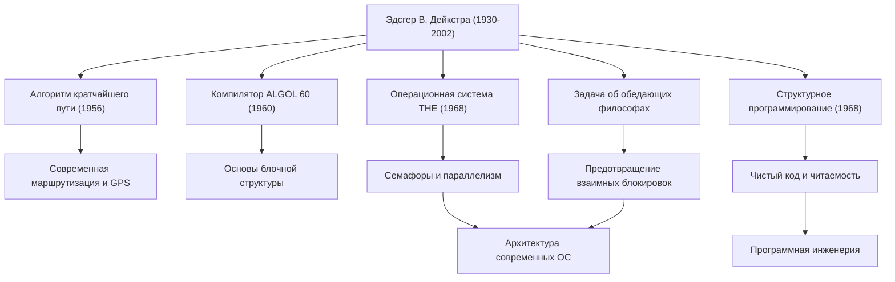

Эдсгер В. Дейкстра (Edsger W. Dijkstra, 1930 - 2002) — один из величайших мыслителей, заложивший основы современной программной инженерии и информатики. Множество алгоритмов и парадигм программирования, которые он оставил после себя, лежат в основе всех технологий, которыми мы повседневно пользуемся сегодня. В этой статье мы подробно рассмотрим жизнь Дейкстры, его уникальную философию и неизмеримое влияние на будущие поколения.

## От физики к информатике: путь молодости

Родившийся в Роттердаме, Нидерланды, в 1930 году, Дейкстра изначально специализировался на теоретической физике в Лейденском университете. В то время для него физика была высшей наукой для раскрытия истин природного мира. Однако, будучи очарованным бесконечными возможностями нового инструмента, называемого компьютером, он постепенно шаг за шагом вошел в мир программирования.

В то время программирование было скорее "ремеслом" или "разгадыванием головоломок", нежели академической дисциплиной, и никаких устоявшихся теорий или систем не существовало. Однако Дейкстра был убежден, что в него следует привнести математическую строгость и красоту. В конце концов он решил отказаться от карьеры физика и сделать программирование делом всей своей жизни. Известна история о том, как, подавая заявление на получение разрешения на брак в Нидерландах, он попытался указать свою профессию как "программист", но власти отказали ему, заявив, что такой профессии не существует, что красноречиво свидетельствует о том, насколько он опередил свое время.

## Великие достижения, превратившие программирование в "науку"

Достижения Дейкстры чрезвычайно разнообразны. Изящные решения множества технических проблем, с которыми он столкнулся, стали важной основой современной информатики.

### 1. Алгоритм Дейкстры (Алгоритм поиска кратчайшего пути)
Созданный в 1956 году всего за 20 минут, когда он пил кофе со своей невестой в кафе в Амстердаме, этот алгоритм стал революционным методом поиска кратчайшего пути между двумя узлами в графе. Удивительно, но этот алгоритм, созданный лишь с помощью бумаги и карандаша, без использования компьютера, по прошествии более полувека продолжает использоваться в качестве ключевой технологии в автомобильных навигационных системах, протоколах интернет-маршрутизации (таких как OSPF) и даже при оптимизации транспортных сетей.

### 2. Структурное программирование и "О вреде оператора GOTO"
Опубликованное в 1968 году легендарное короткое письмо "О вреде оператора GOTO" вызвало шок в мире программирования того времени и породило ожесточенные споры. Он выступил за "структурное программирование", исключающее оператор GOTO (первопричину спагетти-кода), который беспорядочно перебрасывает поток выполнения программы, и предложил логически описывать код, используя только три основные управляющие структуры: последовательность, ветвление и цикл. Это резко повысило читаемость, удобство сопровождения и надежность программного обеспечения и повлияло на все основные современные языки программирования.

### 3. Параллельное программирование и "Задача об обедающих философах"
В ходе разработки "Мультипрограммной системы THE" Дейкстра придумал "семафоры (Semaphore)" — механизм синхронизации, позволяющий нескольким процессам работать скоординировано, не конкурируя за ресурсы. Более того, чтобы в доступной форме объяснить опасность взаимных блокировок (deadlock) при параллельной обработке, он придумал метафору "Задача об обедающих философах". Эти концепции преподаются на курсах информатики по всему миру как фундаментальные принципы управления параллелизмом в современных операционных системах и многопоточном программировании.

## Философия Дейкстры и документы "EWD"

Серия рукописных документов, широко известных как "EWD" (его собственные инициалы), наиболее ярко отражает его глубокие мысли и философию. На протяжении всей своей жизни Дейкстра использовал свою любимую перьевую ручку Montblanc, чтобы записывать свои мысли красивым и разборчивым курсивом, который он затем копировал и делился с коллегами и студентами.

Насчитывается более 1300 EWD, в которых обсуждается широкий круг тем: от математических доказательств технических алгоритмов до теорий образования в области информатики, критики коммерциализации отрасли и предупреждений о кризисе программного обеспечения. Дейкстра твердо утверждал, что "программирование должно быть математической деятельностью". Его знаменитое высказывание "Тестирование программы может показать наличие ошибок, но никогда не покажет их отсутствие" выражает его твердое убеждение, что программа не должна просто работать, а её правильность должна быть логически доказуема.

## Влияние на будущие поколения: наследие интеллектуального гиганта

Получив в 1972 году премию Тьюринга, высшую награду в области информатики, Дейкстра преподавал в качестве профессора в Техасском университете в Остине с 1984 года до последних лет своей жизни. Он устанавливал очень строгие стандарты для своих студентов, требуя от них ясного и логического мышления.

Величайшее наследие, которое оставил после себя Дейкстра, не ограничивается конкретными алгоритмами или техническими изобретениями, а представляет собой саму систему мышления о том, "как следует создавать программное обеспечение". Его строгий математический подход и бескомпромиссная философия продолжают служить надежным компасом для навигации в хаотичном море кода, даже в нашу эпоху все более усложняющейся разработки программного обеспечения.

Жизнь Эдсгера Дейкстры была непрерывным поиском, который привнес порядок и логическую красоту в новорожденную молодую область информатики, превратив её в настоящую "науку". Его учения и дух, несомненно, будут продолжать жить в каждой строчке кода, который мы пишем, и в основе невидимых систем, поддерживающих информационное общество.
