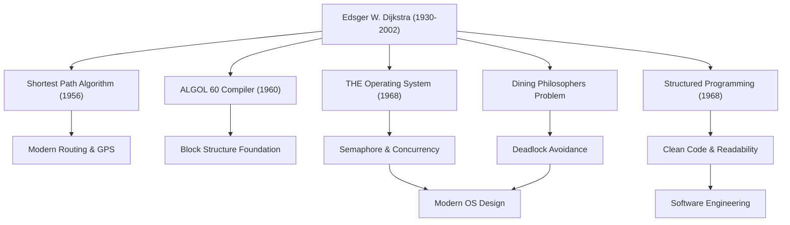

艾兹赫尔·W·戴克斯特拉（Edsger W. Dijkstra, 1930 - 2002）是奠定现代软件工程和计算机科学基础的最伟大的智者之一。他留下的众多算法和编程范式，如今活跃在我们日常使用的各种技术的底层。本文将深入探讨戴克斯特拉的生平、他独特的哲学，以及他对后世产生的不可估量的影响。

## 从物理学到计算机科学的转变：早年的轨迹

1930年出生于荷兰鹿特丹的戴克斯特拉，最初在莱顿大学主修理论物理学。对当时的探寻自然界真理而言，物理学是他心中的至高学问。然而，被计算机这一新工具所具有的无限可能性所吸引，他逐渐踏入了编程的世界。

当时的编程与其说是一门学问，不如说更接近于“手工艺”或“解谜”，并不存在确立的理论或体系。但戴克斯特拉坚信，应该将数学的严谨性与美感引入其中。最终他放弃了作为物理学家的职业生涯，决定将编程作为自己一生的事业。有一个著名的轶事：当他在荷兰的结婚登记申请上试图将自己的职业填为“程序员”时，政府部门以不存在该职业为由拒绝了他，这充分说明了他是何等超前于时代的先驱。

## 将编程升华为“科学”的伟大成就

戴克斯特拉的成就是极其多方面的。他对所面临的众多技术挑战提出的优雅解法，构成了当前信息工程中重要的基础。

### 1. 戴克斯特拉算法（最短路径算法）
1956年，在阿姆斯特丹的一家咖啡馆与未婚妻喝咖啡时，他仅花了大约20分钟就构思出了这个算法，这是用于求图中两点间最短路径的突破性算法。令人惊叹的是，这个仅仅使用纸和笔（未使用计算机）创造出来的算法，在过去半个多世纪后的今天，依然作为核心技术被应用于车载导航系统、互联网路由协议（如OSPF）以及交通网络的优化中。

### 2. 结构化编程与“GOTO语句有害论”
1968年发表的极具传奇色彩的短文《GOTO语句有害论》（Go To Statement Considered Harmful），在当时的编程界引发了震动和激烈的争论。他提倡“结构化编程”，主张废除让程序执行流无序跳转的GOTO语句（意大利面条式代码的罪魁祸首），仅使用顺序、选择和循环这三种基本的控制结构来逻辑性地编写代码。这使得软件的可读性、可维护性和可靠性得到了飞跃性的提升，并影响了现代所有主流编程语言。

### 3. 并发编程与“哲学家就餐问题”
通过“THE多道程序系统”的开发，戴克斯特拉设计了“信号量（Semaphore）”，这是一种同步机制，能让多个进程在不竞争资源的情况下协同运行。此外，为了通俗易懂地解释并发处理中死锁（僵局）的危险性，他构思了“哲学家就餐问题”的隐喻。这些概念作为当今操作系统和多线程编程中并发处理控制的根本原理，在全世界的计算机科学课程中被教授。

## 戴克斯特拉的哲学与“EWD”文档

最能浓墨重彩地反映他深刻思想与哲学的，是一系列通常被称为“EWD（他自己名字的首字母缩写）”的手稿。戴克斯特拉一生都使用他心爱的万宝龙钢笔，以优美易读的草书记录下自己的思考，然后复印并与同事和学生分享。

EWD的数量多达1300篇以上，探讨的主题非常广泛，从技术算法的数学证明、计算机科学的教育论、对业界商业主义的批判，到对软件危机的警示等。戴克斯特拉强烈主张“编程应该是一项数学活动”。他有一句名言：“程序测试只能用于证明缺陷的存在，而不能证明缺陷的缺失”，这表达了他坚定的信念：程序不能仅仅满足于能运行，它的正确性必须在逻辑上是可证明的。

## 对后世的影响：作为智慧巨人的遗产

1972年荣获计算机科学领域最高荣誉图灵奖的戴克斯特拉，从1984年到晚年一直在德克萨斯大学奥斯汀分校担任教授。他对学生设定了极其严格的标准，要求他们具备清晰且有逻辑的思考能力。

戴克斯特拉留下的最大遗产，不仅限于特定的算法或技术发明，而是“应该如何构建软件”这一思考框架本身。在软件开发日益复杂的今天，他严谨的数学方法和毫不妥协的哲学，依然是在混乱的代码之海中航行的坚定指南针。

艾兹赫尔·戴克斯特拉的一生，是一部为刚刚诞生的年轻领域——计算机科学——赋予秩序与逻辑之美的历史，也是一段将其培育为真正的“科学”的不断探索的历史。他的教诲与精神，必将继续存活在我们编写的每一行代码中，存活在支撑信息社会的无形系统的底层。
