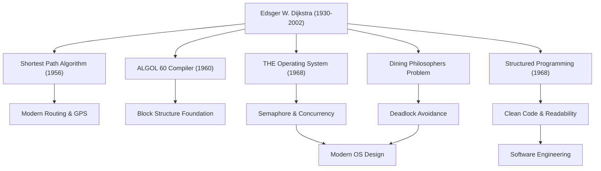

艾茲赫爾·W·戴克斯特拉（Edsger W. Dijkstra, 1930 - 2002）是奠定現代軟體工程和電腦科學基礎的最偉大智者之一。他留下的眾多演算法和程式設計範式，如今活躍在我們日常使用的各種技術的底層。本文將深入探討戴克斯特拉的生平、他獨特的哲學，以及他對後世產生的不可估量之影響。

## 從物理學到電腦科學的轉變：早年的軌跡

1930年出生於荷蘭鹿特丹的戴克斯特拉，最初在萊頓大學主修理論物理學。對當時的探尋自然界真理而言，物理學是他心中的至高學問。然而，被電腦這個新工具所具有的無限可能性所吸引，他逐漸踏入了程式設計的世界。

當時的程式設計與其說是一門學問，不如說更接近於「手工藝」或「解謎」，並不存在確立的理論或體系。但戴克斯特拉堅信，應該將數學的嚴謹性與美感引入其中。最終他放棄了作為物理學家的職業生涯，決定將程式設計作為自己一生的事業。有一個著名的軼事：當他在荷蘭的結婚登記申請上試圖將自己的職業填為「程式設計師」時，政府部門以不存在該職業為由拒絕了他，這充分說明了他是何等超前於時代的先驅。

## 將程式設計昇華為「科學」的偉大成就

戴克斯特拉的成就是極其多方面的。他對所面臨的眾多技術挑戰提出的優雅解法，構成了當前資訊工程中重要的基礎。

### 1. 戴克斯特拉演算法（最短路徑演算法）
1956年，在阿姆斯特丹的一家咖啡館與未婚妻喝咖啡時，他僅花了約20分鐘就構思出了這個演算法，這是用於求圖中兩點間最短路徑的突破性演算法。令人驚嘆的是，這個僅僅使用紙和筆（未使用電腦）創造出來的演算法，在過去半個多世紀後的今天，依然作為核心技術被應用於車載導航系統、網際網路路由協定（如OSPF）以及交通網路的優化中。

### 2. 結構化程式設計與「GOTO語句有害論」
1968年發表的極具傳奇色彩的短文《GOTO語句有害論》（Go To Statement Considered Harmful），在當時的程式設計界引發了震動和激烈的爭論。他提倡「結構化程式設計」，主張廢除讓程式執行流無序跳轉的GOTO語句（義大利麵條式程式碼的罪魁禍首），僅使用循序、選擇和重複這三種基本的控制結構來邏輯性地撰寫程式碼。這使得軟體的可讀性、可維護性和可靠性得到了飛躍性的提升，並影響了現代所有主流程式語言。

### 3. 併發程式設計與「哲學家就餐問題」
透過「THE多道程式系統」的開發，戴克斯特拉設計了「號誌（Semaphore）」，這是一種同步機制，能讓多個行程在不競爭資源的情況下協同運作。此外，為了通俗易懂地解釋併發處理中死結（僵局）的危險性，他構思了「哲學家就餐問題」的隱喻。這些概念作為當今作業系統和多執行緒程式設計中併發處理控制的根本原理，在全世界的電腦科學課程中被教授。

## 戴克斯特拉的哲學與「EWD」文件

最能濃墨重彩地反映他深刻思想與哲學的，是一系列通常被稱為「EWD（他自己名字的縮寫）」的手稿。戴克斯特拉一生都使用他心愛的萬寶龍鋼筆，以優美易讀的草書記錄下自己的思考，然後影印並與同事和學生分享。

EWD的數量多達1300篇以上，探討的主題非常廣泛，從技術演算法的數學證明、電腦科學的教育論、對業界商業主義的批判，到對軟體危機的警示等。戴克斯特拉強烈主張「程式設計應該是一項數學活動」。他有一句名言：「程式測試只能用於證明缺陷的存在，而不能證明缺陷的缺失」，這表達了他堅定的信念：程式不能僅僅滿足於能運作，它的正確性必須在邏輯上是可證明的。

## 對後世的影響：作為智慧巨人的遺產

1972年榮獲電腦科學領域最高榮譽圖靈獎的戴克斯特拉，從1984年到晚年一直在德州大學奧斯汀分校擔任教授。他對學生設定了極其嚴格的標準，要求他們具備清晰且有邏輯的思考能力。

戴克斯特拉留下的最大遺產，不僅限於特定的演算法或技術發明，而是「應該如何建構軟體」這個思考框架本身。在軟體開發日益複雜的今天，他嚴謹的數學方法和毫不妥協的哲學，依然是在混亂的程式碼之海中航行的堅定指南針。

艾茲赫爾·戴克斯特拉的一生，是一部為剛剛誕生的年輕領域——電腦科學——賦予秩序與邏輯之美的歷史，也是一段將其培育為真正的「科學」的不斷探索的歷史。他的教誨與精神，必將繼續存活在我們撰寫的每一行程式碼中，存活在支撐資訊社會的無形系統的底層。
