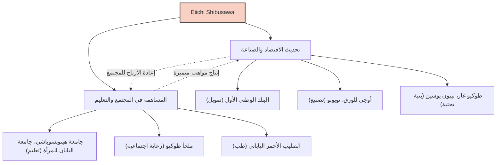

يعد إييتشي شيبوساوا (Eiichi Shibusawa) أحد أبرز الشخصيات التي لعبت الدور الأكثر أهمية في تحديث اليابان. يُعرف باسم "أبو الرأسمالية اليابانية"، وخلال حياته شارك في تأسيس وتطوير حوالي 500 شركة، وفي الوقت نفسه دعم ما يقرب من 600 مشروع اجتماعي وعام بالإضافة إلى المؤسسات التعليمية. لم تقتصر حياته وفلسفته على السعي وراء الربح فحسب، بل سعت إلى إيجاد تناغم بين الأخلاق والاقتصاد تحت مفهوم "المختارات الفلسفية والمعداد" (The Analects and the Abacus)، وهو ما لا يزال يقدم إلهاماً كبيراً لمحترفي الأعمال اليوم.

## من اضطرابات نهاية الشوغونية إلى استعراش مييجي: رؤية صقلتها تجارب متنوعة

وُلد إييتشي شيبوساوا عام 1840 في عائلة مزارعة ثرية في مدينة فوكايا الحالية بمحافظة سايتاما. منذ طفولته، ساعد في تجارة العائلة في إنتاج وبيع النيلة، بالإضافة إلى تربية دودة القز، مما جعله يطور حساً تجارياً عملياً. في الوقت نفسه، تعلم من ابن عمه، أتسوتادا أوداكا، كتاب "المختارات" لكونفوشيوس وتخصصات أكاديمية أخرى، مما أرسى أسس قيمه الأخلاقية.

في شبابه، مال نحو فكر احترام الإمبراطور وطرد الأجانب (Sonnō Jōi)، بل وفكر في أنشطة راديكالية مثل التآمر لإسقاط حكومة الشوغون. ومع ذلك، بعد السفر إلى كيوتو، تغير مساره وانتهى به الأمر في خدمة يوشينوبو هيتوتسوباشي (الذي أصبح لاحقاً الشوغون الخامس عشر والأخير لشوغونية إيدو). غيّر هذا التحول مصيره بشكل كبير. في عام 1867، سافر إلى أوروبا كجزء من حاشية أكيتاكي توكوغاوا (الأخ الأصغر ليوشينوبو) لحضور المعرض العالمي في باريس. خلال إقامته في باريس، تأثر بشدة بالتكنولوجيا الصناعية الغربية المتقدمة، وقبل كل شيء، بالنظام الاقتصادي الحديث المتمثل في "الشركة المساهمة" والبنية الاجتماعية التي يعمل فيها القطاعان العام والخاص على قدم المساواة.

## "المختارات والمعداد": فلسفة توحيد الأخلاق والاقتصاد

بعد عودته إلى اليابان، بدأ العمل في وزارة المالية في حكومة مييجي الجديدة وكرس نفسه لإرساء أسس الدولة، مثل إنشاء نظام نقدي حديث وقانون البنوك الوطنية. ومع ذلك، وبشعوره بحدود كونه بيروقراطياً، انتقل إلى عالم الأعمال في سن الثالثة والثلاثين. ومن هنا بدأ نجاحه الحقيقي.

جوهر فكر إييتشي شيبوساوا هو "نظرية توحيد الأخلاق والاقتصاد". في كتابه "المختارات والمعداد"، جادل بأنه في حين أن هدف الشركة هو السعي وراء الربح (المعداد)، إلا أن هذا يجب ألا يكون أنانياً أبداً، بل يجب أن يرتكز على الأخلاق والقيم (المختارات) التي تؤدي إلى ازدهار المجتمع بأكمله.

- **السعي وراء المصلحة العامة**: بدلاً من احتكار الثروة من قبل عدد قليل من الرأسماليين، يجب جمع الأموال على نطاق واسع وإعادتها إلى المجتمع من خلال الأعمال التجارية.
- **أهمية الثقة**: أهم شيء في التجارة هو الثقة، والتي لا تُبنى إلا من خلال السلوك الصادق.
- **الانسجام بين القطاعين العام والخاص**: تعظيم حيوية القطاع الخاص مع التوفيق بين التنمية الوطنية والمصلحة الشخصية.

كانت هذه الفلسفة مبتكرة ويمكن اعتبارها مقدمة لما يجذب الانتباه اليوم مثل أهداف التنمية المستدامة (SDGs)، واستثمارات الحوكمة البيئية والاجتماعية وحوكمة الشركات (ESG)، ورأسمالية أصحاب المصلحة.

## 500 شركة و 600 مشروع اجتماعي: الرأسمالية الشاملة في الممارسة العملية

الشيء الأكثر بروزاً في إييتشي شيبوساوا هو أنه وضع مُثُله موضع التنفيذ بقدرة عمل مذهلة. بدءاً من منصبه كرئيس للبنك الوطني الأول (حالياً بنك ميزوهو)، شارك في تأسيس العديد من الشركات التي تدعم الاقتصاد الياباني الحالي، مثل شركة أوجي للورق، وشركة أوساكا للغزل والنسيج (تويوبو)، وطوكيو غاز، ونيبون يوسين، وبورصة طوكيو.

الجدير بالذكر أنه لم يحاول إنشاء "زايباتسو شيبوساوا" (تكتل شركات) لاحتكار أسهم هذه الشركات. بمجرد أن يسير العمل على المسار الصحيح، كان يسلم الإدارة إلى الجيل التالي ويركز على تطوير أعمال جديدة ومشاريع اجتماعية وعامة. بالإضافة إلى عمله كمدير لملجأ طوكيو (منشأة تحمي الأطفال والمسنين بلا عائلات) لأكثر من نصف قرن، كرس نفسه لتأسيس جمعية الصليب الأحمر الياباني ودعم المؤسسات التعليمية مثل جامعة هيتوتسوباشي وجامعة اليابان للمرأة. كان هذا مبنياً على إيمانه بأن "الأثرياء عليهم التزام باستخدام ثروتهم من أجل خير المجتمع".

## التأثير على الأجيال القادمة: كوجه ورقة العشرة آلاف ين النقدية الجديدة

حتى وفاته عام 1931 عن عمر يناهز 91 عاماً، عمل إييتشي شيبوساوا بلا كلل من أجل تحديث اليابان. إن روح "المختارات والمعداد" التي تركها وراءه تحظى بتقدير كبير من قبل علماء الإدارة الأجانب مثل بيتر دراكر، ويُعترف به كـ "الشخص الذي بشر بالمسؤولية الاجتماعية للشركات (CSR) قبل أي شخص آخر".

إن اختياره كوجه لورقة العشرة آلاف ين النقدية الجديدة التي صدرت في عام 2024 ليس مجرد إعادة تقييم لشخصية عظيمة من الماضي. في العصر الحديث حيث يتم الإشارة إلى الآثار السلبية للرأسمالية المفرطة، مثل عدم المساواة الاجتماعية والمشاكل البيئية، فإن هذا دليل على أن رسالته حول "التناغم بين الأخلاق والاقتصاد" أصبحت مطلوبة بشدة مرة أخرى.

الدرس الأكبر الذي يمكننا استخلاصه من حياة إييتشي شيبوساوا هو الأمل في أن المصلحة الذاتية والمصلحة الاجتماعية لا تتعارضان، بل يمكن التوفيق بينهما من خلال حس أخلاقي عالٍ. ومن المؤكد أن تعاليمه العالمية ستستمر في التألق كضوء مرشد للأعمال التجارية في اليابان وحول العالم.
