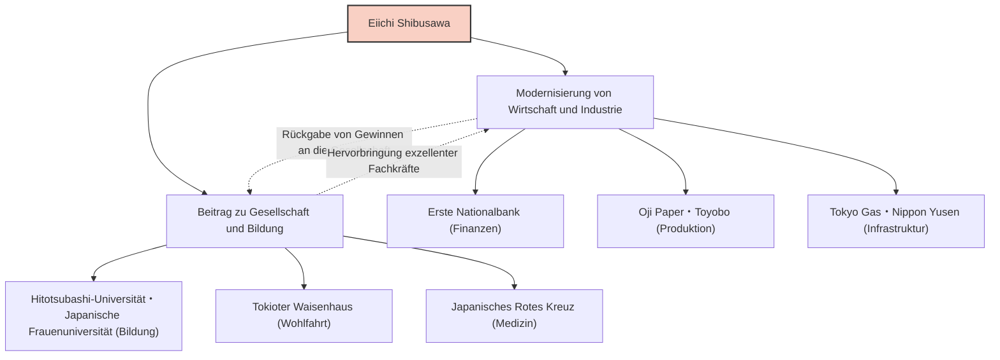

Eiichi Shibusawa ist eine der Persönlichkeiten, die bei der Modernisierung Japans die wichtigste Rolle spielten. Er wird als "Vater des japanischen Kapitalismus" bezeichnet und war zeitlebens an der Gründung und Entwicklung von rund 500 Unternehmen beteiligt, während er sich gleichzeitig für die Unterstützung von etwa 600 sozialen, öffentlichen Projekten und Bildungseinrichtungen einsetzte. Sein Leben und seine Philosophie, die sich nicht nur auf die bloße Gewinnstrebigkeit beschränkten, sondern eine Harmonie zwischen Moral und Wirtschaft unter der Philosophie von "Analekten und Abakus" anstrebten, bieten auch für moderne Geschäftsleute noch viele Anregungen.

## Vom turbulenten Ende der Edo-Zeit zur Meiji-Restauration: Eine durch vielfältige Erfahrungen gewachsene Perspektive

Eiichi Shibusawa wurde 1840 in eine reiche Bauernfamilie in der heutigen Stadt Fukaya, Präfektur Saitama, geboren. Von Kindheit an entwickelte er durch die Mithilfe im Familienbetrieb, der Herstellung und dem Verkauf von Indigofarbstoffen sowie der Seidenraupenzucht, einen praktischen Geschäftssinn. Gleichzeitig lernte er von seinem Cousin Junchu Odaka die konfuzianischen Schriften, allen voran die "Analekten", und andere akademische Fächer, was die Grundlage seiner moralischen Werte bildete.

In seiner Jugendzeit neigte er der Sonno-Joi-Ideologie (Verehrt den Kaiser, vertreibt die Barbaren) zu und dachte zeitweise sogar an radikale Aktivitäten wie den Sturz des Shogunats. Doch nachdem er nach Kyoto gegangen war, änderte er seine Meinung völlig und trat in die Dienste von Yoshinobu Hitotsubashi (dem späteren 15. Shogun des Edo-Shogunats). Dieser Wendepunkt veränderte sein Schicksal grundlegend. 1867 reiste er als Begleiter von Akitake Tokugawa (Yoshinobus jüngerem Bruder) zur Weltausstellung in Paris nach Europa. Während seines Aufenthaltes in Paris war er tief beeindruckt von der fortschrittlichen industriellen Technologie des Westens, vor allem aber vom modernen Wirtschaftssystem der "Aktiengesellschaft" und einer Gesellschaftsstruktur, in der der öffentliche und der private Sektor auf Augenhöhe funktionierten.

## "Analekten und Abakus": Philosophie der Einheit von Moral und Wirtschaft

Nach seiner Rückkehr trat er in das Finanzministerium der neuen Meiji-Regierung ein und arbeitete hart an der Schaffung der staatlichen Strukturen, wie der Einführung eines modernen Währungssystems und der Nationalbankverordnung. Er spürte jedoch die Grenzen als Bürokrat und wechselte im Alter von 33 Jahren in die Geschäftswelt. Hier begann sein wahrer Erfolg.

Der Kern von Eiichi Shibusawas Denken ist die "Theorie der Einheit von Moral und Wirtschaft". In seinem Buch "Analekten und Abakus" vertrat er die Auffassung, dass das Ziel eines Unternehmens zwar das Streben nach Profit (Abakus) sei, dies jedoch niemals egoistisch sein dürfe, sondern auf Ethik und Moral (Analekten) basieren müsse, die zum Wohlstand der gesamten Gesellschaft beitragen.

- **Streben nach öffentlichem Interesse**: Anstatt dass einige wenige Kapitalisten den Reichtum monopolisieren, sollten Gelder auf breiter Basis gesammelt (Aktienkapitalismus) und durch geschäftliche Aktivitäten an die Gesellschaft zurückgegeben werden.
- **Bedeutung von Vertrauen**: Das Wichtigste im Handel ist Vertrauen, das nur durch aufrichtiges Handeln aufgebaut werden kann.
- **Harmonie zwischen Öffentlichkeit und Privatsektor**: Die Entwicklung des Staates und der Profit des Einzelnen in Einklang bringen und gleichzeitig die Vitalität des privaten Sektors fördern.

Diese Philosophie war so innovativ, dass man sie als Vorläufer der heute vieldiskutierten SDGs (Ziele für nachhaltige Entwicklung), ESG-Investitionen und des Stakeholder-Kapitalismus bezeichnen kann.

## 500 Unternehmen und 600 soziale Projekte: Gelebter Stakeholder-Kapitalismus

Das Bemerkenswerteste an Eiichi Shibusawa ist, dass er seine Philosophie mit überwältigender Tatkraft in die Praxis umsetzte. Ausgehend von seiner Tätigkeit als Direktor der Ersten Nationalbank (heute Mizuho Bank) war er an der Gründung zahlreicher Unternehmen beteiligt, die die heutige japanische Wirtschaft stützen, darunter Shoshi Kaisha (Oji Paper), Osaka Boseki (Toyobo), Tokyo Gas, Nippon Yusen und die Tokioter Börse.

Besonders erwähnenswert ist, dass er nicht versuchte, ein "Shibusawa-Zaibatsu" zu schaffen, indem er die Anteile an diesen Unternehmen monopolisierte. Sobald ein Unternehmen auf dem richtigen Weg war, übergab er die Leitung an die nachfolgende Generation und konzentrierte sich auf die Erschließung neuer Geschäftsfelder und sozialer, öffentlicher Projekte. Er fungierte über ein halbes Jahrhundert lang als Direktor des Tokioter Waisenhauses (einer Einrichtung für Waisenkinder und alte Menschen) und engagierte sich unter anderem für die Gründung des Japanischen Roten Kreuzes und die Unterstützung von Bildungseinrichtungen wie der Hitotsubashi-Universität und der Japanischen Frauenuniversität. Dies basierte auf seiner Überzeugung, dass "Reiche die Pflicht haben, ihren Reichtum für die Gesellschaft einzusetzen".

## Einfluss auf die Nachwelt: Als Gesicht der neuen 10.000-Yen-Note

Bis zu seinem Tod im Alter von 91 Jahren im Jahr 1931 setzte sich Eiichi Shibusawa unermüdlich für die Modernisierung Japans ein. Sein hinterlassener Geist von "Analekten und Abakus" wird von ausländischen Managementexperten wie Peter Drucker hoch geschätzt, und er wird als "Person anerkannt, die sich früher als jeder andere für die soziale Verantwortung von Unternehmen (CSR) aussprach".

Die Tatsache, dass sein Porträt für die neue 10.000-Yen-Banknote ausgewählt wurde, die ab 2024 ausgegeben wird, ist mehr als nur eine Neubewertung einer großen Persönlichkeit aus der Vergangenheit. In der heutigen Zeit, in der die negativen Auswirkungen eines exzessiven Kapitalismus wie soziale Ungleichheit und Umweltprobleme hervorgehoben werden, ist dies ein Beweis dafür, dass seine Botschaft der "Harmonie zwischen Moral und Wirtschaft" wieder dringend benötigt wird.

Die größte Lehre, die wir aus dem Leben Eiichi Shibusawas ziehen können, ist die Hoffnung, dass Eigeninteresse und gesellschaftliches Interesse nicht im Widerspruch stehen, sondern durch hohe ethische Standards miteinander vereinbar sind. Seine universellen Lehren werden sicherlich auch in Zukunft als Wegweiser für die Geschäftswelt in Japan und auf der ganzen Welt leuchten.
