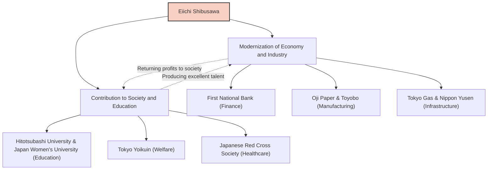

Eiichi Shibusawa is one of the most important figures who played a role in the modernization of Japan. Known as the "Father of Japanese Capitalism," he was involved in the founding and development of approximately 500 companies throughout his life, while also dedicating his efforts to supporting around 600 social public works and educational institutions. Going beyond mere profit-seeking, his life and philosophy, which pursued the harmony of morality and economy under the ideal of "The Analects and the Abacus," provide many insights for modern business professionals.

## From the Tumultuous End of the Edo Period to the Meiji Restoration: A Perspective Cultivated by Diverse Experiences

Eiichi Shibusawa was born in 1840 into a wealthy farming family in present-day Fukaya City, Saitama Prefecture. By helping with the family business of manufacturing and selling indigo balls and sericulture from a young age, he developed a sense of commerce as practical learning. At the same time, he studied academics, including "The Analects," from his cousin Junchu Odaka, building the foundation of his moral values.

During his youth, he leaned towards the ideology of Revere the Emperor and Expel the Barbarians (Sonno Joi), and at one point even considered radical activities such as plotting to overthrow the Shogunate. However, after moving to Kyoto, he abruptly changed course and ended up serving Yoshinobu Hitotsubashi (later the 15th Shogun of the Edo Shogunate). This turning point dramatically changed his fate. In 1867, he traveled to Europe as an attendant to Akitake Tokugawa (Yoshinobu's younger brother) who was attending the Paris Exposition. During his stay in Paris, he was deeply impacted by the advanced industrial technology of the West, and above all, by the modern economic system of the "joint-stock company" and the social structure where the public and private sectors functioned on equal footing.

## "The Analects and the Abacus": The Philosophy of Unifying Morality and Economy

After returning to Japan, he served in the Ministry of Finance of the new Meiji government, where he worked tirelessly to build the framework of the nation, including the establishment of a modern monetary system and the National Bank Act. However, feeling the limits of being a bureaucrat, he transitioned to the business world at the age of 33. This is where his true active career began.

The core of Eiichi Shibusawa's ideology is the "Theory of the Unification of Morality and Economy." In his book "The Analects and the Abacus," he preached that while the purpose of a company is to pursue profit (the abacus), it must never be self-centered and should be based on ethics and morality (the Analects) that lead to the wealth of society as a whole.

- **Pursuit of the Public Interest**: Rather than a few capitalists monopolizing wealth, funds should be collected widely (Gapponshugi or joint-stock capitalism), and returned to society through business.
- **Emphasis on Trust**: The most important thing in commerce is trust, which can only be built through sincere actions.
- **Harmony of Public and Private Sectors**: Drawing out the vitality of the private sector while aligning the development of the nation with individual profit.

This philosophy was innovative, arguably a precursor to the currently trending SDGs (Sustainable Development Goals), ESG investing, and stakeholder capitalism.

## 500 Companies and 600 Social Enterprises: Gapponshugi Put into Practice

What is remarkable about Eiichi Shibusawa is that he put his ideals into practice with overwhelming action. Starting with the presidency of the First National Bank (currently Mizuho Bank), he was involved in the establishment of numerous companies that support the modern Japanese economy, such as the Shoshi Kaisha (Oji Paper), Osaka Spinning (Toyobo), Tokyo Gas, Nippon Yusen, and the Tokyo Stock Exchange.

It is worth noting that he did not attempt to monopolize the shares of these companies to create a "Shibusawa Zaibatsu" (conglomerate). Once a business was on track, he handed over management to his successors and focused on pioneering new businesses and social public works himself. He served as the director of the Tokyo Yoikuin (a facility protecting orphans and the elderly) for over half a century, and also dedicated himself to the establishment of the Japanese Red Cross Society and the support of educational institutions such as Hitotsubashi University and Japan Women's University. This was based on his belief that "the wealthy have a duty to use their wealth for society."

## Impact on Future Generations: As the Face of the New 10,000 Yen Note

Until his death in 1931 at the age of 91, Eiichi Shibusawa ran through life for the modernization of Japan. The spirit of "The Analects and the Abacus" he left behind is highly praised by overseas management scholars such as Peter Drucker, and he is recognized as "the person who preached corporate social responsibility (CSR) earlier than anyone else."

Being chosen for the portrait of the new 10,000 yen note issued from 2024 is not merely a re-evaluation as a historical great man. In an age where the negative effects of excessive capitalism, such as economic inequality and environmental issues, are pointed out, it can be said to be proof that his message of "the harmony of morality and economy" is once again strongly needed.

The greatest lesson we can learn from Eiichi Shibusawa's life is the hope that self-interest and societal interest are not in conflict, but can be reconciled through a high sense of ethics. His universal teachings will surely continue to shine as a guiding principle for business in Japan and the world.
