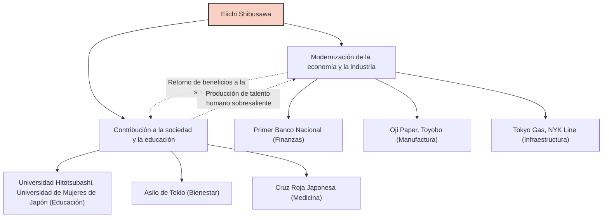

Eiichi Shibusawa es una de las figuras que desempeñó el papel más importante en la modernización de Japón. Conocido como el "padre del capitalismo japonés", durante su vida participó en la fundación y desarrollo de unas 500 empresas, y al mismo tiempo, apoyó cerca de 600 proyectos sociales y obras públicas, así como instituciones educativas. Su vida y filosofía, que no se limitaron a la mera búsqueda de beneficios, sino que buscaron la armonía entre la moral y la economía bajo el concepto de "El Analectas y el Ábaco", continúan ofreciendo gran inspiración a los profesionales de negocios de hoy.

## De la turbulenta era del fin del shogunato a la Restauración Meiji: Una visión cultivada por diversas experiencias

Eiichi Shibusawa nació en 1840 en el seno de una familia de agricultores ricos en la actual ciudad de Fukaya, prefectura de Saitama. Desde su infancia, al ayudar en el negocio familiar de producción y venta de índigo, así como en la sericultura, cultivó su sentido comercial práctico. Al mismo tiempo, aprendió de su primo, Atsutada Odaka, las "Analectas" y otras disciplinas académicas, estableciendo la base de sus valores morales.

En su juventud, se inclinó hacia el pensamiento de reverenciar al Emperador y expulsar a los extranjeros (Sonnō Jōi), e incluso consideró actividades radicales como conspirar para derrocar al shogunato. Sin embargo, tras viajar a Kioto, su rumbo cambió y terminó sirviendo a Yoshinobu Hitotsubashi (quien más tarde sería el decimoquinto y último shogun del shogunato de Edo). Este punto de inflexión cambió drásticamente su destino. En 1867, viajó a Europa como parte del séquito de Akitake Tokugawa (hermano menor de Yoshinobu) para asistir a la Exposición Universal de París. Durante su estancia en París, quedó profundamente impresionado por la avanzada tecnología industrial occidental y, sobre todo, por el sistema económico moderno de la "sociedad anónima" y la estructura social en la que los sectores público y privado funcionaban de igual a igual.

## "Las Analectas y el Ábaco": La filosofía de la unión entre moral y economía

A su regreso a Japón, comenzó a trabajar en el Ministerio de Finanzas del nuevo gobierno Meiji y se dedicó a establecer las bases del Estado, como la creación de un sistema monetario moderno y la Ley de Bancos Nacionales. Sin embargo, sintiendo los límites de ser un burócrata, se pasó al mundo de los negocios a la edad de 33 años. A partir de aquí comenzó su verdadero éxito.

El núcleo del pensamiento de Eiichi Shibusawa es la "teoría de la unión de la moral y la economía". En su libro "Las Analectas y el Ábaco", argumentó que si bien el propósito de una empresa es buscar beneficios (el ábaco), esto nunca debe ser egoísta, sino que debe basarse en la ética y la moral (las Analectas) que conducen a la prosperidad de toda la sociedad.

- **Búsqueda del interés público**: En lugar de que unos pocos capitalistas monopolicen la riqueza, los fondos deben recaudarse ampliamente (Gapponshugi o capitalismo de las partes interesadas) y devolverse a la sociedad a través del negocio.
- **Importancia de la confianza**: En el comercio, lo más importante es la confianza, que solo se construye mediante un comportamiento honesto.
- **Armonía entre lo público y lo privado**: Maximizar la vitalidad del sector privado mientras se alinean el desarrollo nacional y el beneficio personal.

Esta filosofía fue innovadora y puede considerarse como un precursor de lo que hoy en día llama la atención como ODS (Objetivos de Desarrollo Sostenible), la inversión ESG y el capitalismo de partes interesadas.

## 500 empresas y 600 proyectos sociales: Gapponshugi en la práctica

Lo más notable de Eiichi Shibusawa es que puso en práctica sus ideales con una capacidad de acción abrumadora. Comenzando como presidente del Primer Banco Nacional (actualmente Mizuho Bank), participó en el establecimiento de muchas empresas que sostienen la actual economía japonesa, como la Compañía de Fabricación de Papel (Oji Paper), la Hilandería de Osaka (Toyobo), Tokyo Gas, Nippon Yusen (NYK Line) y la Bolsa de Tokio.

Cabe destacar que no intentó crear un "zaibatsu Shibusawa" (conglomerado) monopolizando las acciones de estas empresas. Una vez que un negocio iba por buen camino, cedía la gestión a la siguiente generación y se centraba en el desarrollo de nuevos negocios y en proyectos sociales y de obras públicas. Además de desempeñarse como director del Asilo de Tokio (una instalación que protege a niños y ancianos sin familia) durante más de medio siglo, se dedicó al establecimiento de la Sociedad de la Cruz Roja Japonesa y al apoyo de instituciones educativas como la Universidad Hitotsubashi y la Universidad de Mujeres de Japón. Esto se basó en su creencia de que "los ricos tienen la obligación de utilizar su riqueza por el bien de la sociedad".

## Impacto en la posteridad: Como el rostro del nuevo billete de 10.000 yenes

Hasta su fallecimiento en 1931 a los 91 años, Eiichi Shibusawa corrió incansablemente por la modernización de Japón. El espíritu de "Las Analectas y el Ábaco" que dejó atrás es altamente valorado por académicos de la gestión extranjeros como Peter Drucker, y se le reconoce como "la persona que predicó la responsabilidad social corporativa (RSC) antes que nadie".

Su elección como el rostro del nuevo billete de 10.000 yenes emitido en 2024 no es simplemente una reevaluación como gran figura del pasado. En una época moderna en la que se señalan los efectos negativos de un capitalismo excesivo, como la desigualdad social y los problemas ambientales, es una prueba de que su mensaje de "armonía entre moral y economía" se necesita fuertemente una vez más.

La mayor lección que podemos aprender de la vida de Eiichi Shibusawa es la esperanza de que el interés propio y el interés social no están en conflicto, sino que pueden ser compatibles a través de un alto sentido ético. Sus enseñanzas universales seguramente continuarán brillando como un faro para los negocios tanto en Japón como en el mundo.
