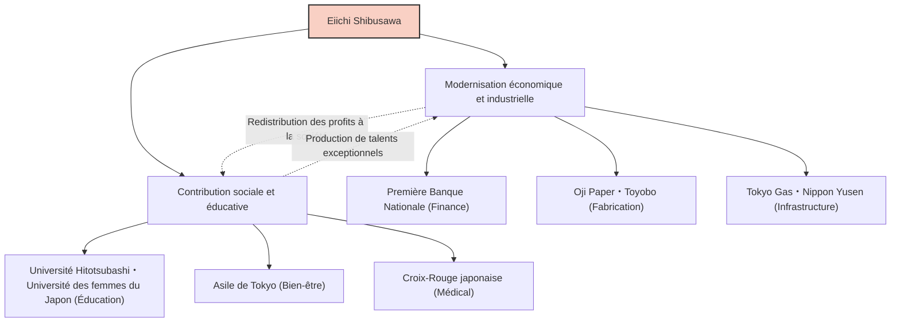

Eiichi Shibusawa, l'une des figures les plus importantes de la modernisation du Japon, est surnommé le « père du capitalisme japonais ». Au cours de sa vie, il a participé à la création et au développement d'environ 500 entreprises, tout en soutenant près de 600 projets sociaux et d'utilité publique, ainsi que des établissements d'enseignement. Ne se limitant pas à la simple recherche de profit, sa vie et sa philosophie, guidées par le principe des « Analectes et de l'Abaque », visaient l'harmonie entre la morale et l'économie, offrant encore aujourd'hui de nombreuses leçons aux professionnels des affaires.

## De la fin tumultueuse du shogunat à la restauration de Meiji : une vision nourrie par des expériences diverses

Eiichi Shibusawa est né en 1840 dans une famille d'agriculteurs aisés dans l'actuelle ville de Fukaya, préfecture de Saitama. Dès son enfance, en aidant à l'entreprise familiale de fabrication et de vente de boules d'indigo et de sériciculture, il a cultivé un sens des affaires axé sur l'apprentissage pratique. En même temps, il a étudié les classiques, dont les « Analectes » de Confucius, avec son cousin Junchu Odaka, forgeant ainsi les bases de ses valeurs morales.

Dans sa jeunesse, il a été attiré par l'idéologie "Sonnō jōi" (révérer l'empereur, expulser les barbares), allant jusqu'à envisager des actions radicales pour renverser le shogunat. Cependant, après s'être rendu à Kyoto, il a changé de cap pour servir Yoshinobu Hitotsubashi (le futur 15e et dernier shogun du shogunat Tokugawa). Ce tournant a changé son destin de manière décisive. En 1867, il a voyagé en Europe en tant que membre de la suite d'Akitake Tokugawa (le frère cadet de Yoshinobu) pour l'Exposition universelle de Paris. Lors de ce séjour, il a été profondément impressionné par la technologie industrielle avancée de l'Occident, et surtout par le système économique moderne de la « société par actions », ainsi que par une structure sociale où les secteurs public et privé interagissent sur un pied d'égalité.

## « Les Analectes et l'Abaque » : la philosophie de l'unification de la morale et de l'économie

À son retour au Japon, il a rejoint le ministère des Finances du nouveau gouvernement de Meiji, où il a travaillé sans relâche pour bâtir les fondations de l'État, notamment en instaurant un système monétaire moderne et la loi sur les banques nationales. Toutefois, se heurtant aux limites du statut de bureaucrate, il s'est tourné vers le monde des affaires à l'âge de 33 ans. C'est là que ses véritables accomplissements ont commencé.

Le cœur de la pensée d'Eiichi Shibusawa réside dans la « théorie de l'unification de la morale et de l'économie ». Dans son livre « Les Analectes et l'Abaque », il a soutenu que bien que l'objectif d'une entreprise soit de rechercher le profit (l'abaque), celui-ci ne doit jamais être égocentrique et doit reposer sur l'éthique et la morale (les Analectes) pour contribuer à la prospérité de la société dans son ensemble.

- **Recherche de l'intérêt public** : Au lieu que quelques capitalistes monopolisent la richesse, il faut rassembler des fonds de manière large (capitalisme des parties prenantes ou "Gapponshugi") et redonner à la société à travers les affaires.
- **Importance de la confiance** : Dans le commerce, l'élément le plus crucial est la confiance, qui ne peut être bâtie que par des actions sincères.
- **Harmonie entre public et privé** : Aligner le développement de la nation avec les intérêts individuels tout en stimulant la vitalité du secteur privé.

Cette philosophie était novatrice et peut être considérée comme un précurseur des concepts contemporains tels que les ODD (Objectifs de développement durable), les investissements ESG et le capitalisme des parties prenantes.

## 500 entreprises et 600 œuvres sociales : le « Gapponshugi » mis en pratique

Ce qui est remarquable chez Eiichi Shibusawa, c'est l'énergie débordante avec laquelle il a mis ses idéaux en pratique. En commençant par devenir le président de la Première Banque Nationale (aujourd'hui Mizuho Bank), il a participé à la création de nombreuses entreprises qui soutiennent encore aujourd'hui l'économie japonaise, telles que la Shoshi Kaisha (Oji Paper), l'Osaka Spinning Company (Toyobo), Tokyo Gas, Nippon Yusen et la Bourse de Tokyo.

Il convient de noter qu'il n'a pas cherché à monopoliser les actions de ces entreprises pour créer un « zaibatsu Shibusawa » (conglomérat). Une fois qu'une entreprise était sur les rails, il en cédait la direction à la génération suivante et se concentrait sur le développement de nouvelles activités et sur les œuvres d'utilité publique. Il a dirigé l'Asile de Tokyo (un établissement pour les orphelins et les personnes âgées isolées) pendant plus d'un demi-siècle, et s'est consacré à la création de la Croix-Rouge japonaise et au soutien d'institutions éducatives comme l'Université Hitotsubashi et l'Université des femmes du Japon. Cela découlait de sa conviction que « les riches ont le devoir d'utiliser leur richesse pour la société ».

## L'impact sur les générations futures : le visage du nouveau billet de 10 000 yens

Jusqu'à sa mort en 1931 à l'âge de 91 ans, Eiichi Shibusawa a œuvré sans relâche pour la modernisation du Japon. L'esprit de ses « Analectes et l'Abaque » est très apprécié par des experts en gestion internationaux comme Peter Drucker, qui le reconnaît comme « celui qui a enseigné la responsabilité sociale des entreprises (RSE) avant tout le monde ».

Son choix comme visage du nouveau billet de 10 000 yens émis à partir de 2024 n'est pas seulement une réévaluation d'une grande figure du passé. À notre époque moderne, où les méfaits du capitalisme excessif, tels que les inégalités sociales et les problèmes environnementaux, sont soulignés, c'est la preuve que son message sur « l'harmonie entre la morale et l'économie » est de nouveau ardemment souhaité.

La plus grande leçon que nous pouvons tirer de la vie d'Eiichi Shibusawa est l'espoir que l'intérêt personnel et l'intérêt de la société ne s'opposent pas, mais peuvent coexister grâce à de grandes exigences éthiques. Cet enseignement universel continuera sans aucun doute à briller comme un guide pour les affaires au Japon et dans le monde.
