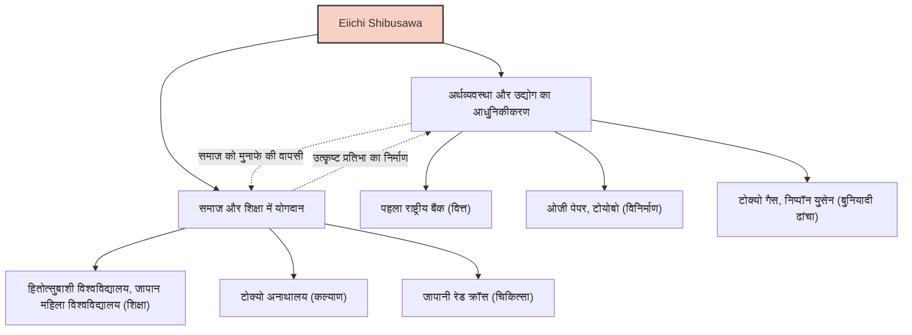

आइची शिबुसावा (Eiichi Shibusawa) जापान के आधुनिकीकरण में सबसे महत्वपूर्ण भूमिका निभाने वाले व्यक्तियों में से एक हैं। उन्हें "जापानी पूंजीवाद के पिता" के रूप में जाना जाता है। अपने जीवनकाल में, वे लगभग 500 कंपनियों की स्थापना और विकास में शामिल थे, और साथ ही लगभग 600 सामाजिक और सार्वजनिक परियोजनाओं और शैक्षणिक संस्थानों का समर्थन किया। उनका जीवन और दर्शन सिर्फ लाभ कमाने तक सीमित नहीं था, बल्कि "द एनालेक्ट्स और एबैकस" (The Analects and the Abacus) की अवधारणा के तहत नैतिकता और अर्थशास्त्र के बीच सामंजस्य स्थापित करने पर केंद्रित था, जो आज के व्यापारिक पेशेवरों को बहुत प्रेरणा देता है।

## उथल-पुथल वाले बकुमात्सु से मीजी पुनर्स्थापना तक: विविध अनुभवों द्वारा विकसित दृष्टिकोण

आइची शिबुसावा का जन्म 1840 में वर्तमान सैतामा प्रान्त के फुकया शहर में एक धनी किसान परिवार में हुआ था। बचपन से ही इंडिगो (नील) बनाने और बेचने के साथ-साथ रेशम उत्पादन के अपने पारिवारिक व्यवसाय में मदद करते हुए, उन्होंने एक व्यावहारिक व्यावसायिक समझ विकसित की। उसी समय, उन्होंने अपने चचेरे भाई, अत्सुतादा ओडाका से "द एनालेक्ट्स" (कन्फ्यूशियस के उपदेश) और अन्य शैक्षणिक विषयों को सीखा, जिससे उनके नैतिक मूल्यों की नींव पड़ी।

अपनी युवावस्था में, वे सम्राट का सम्मान करने और विदेशियों को खदेड़ने (Sonnō Jōi) के विचारों की ओर झुक गए, और शोगुनेट को उखाड़ फेंकने जैसी कट्टरपंथी गतिविधियों पर भी विचार किया। हालाँकि, क्योटो की यात्रा के बाद उनका मार्ग बदल गया और उन्होंने योशिनोबु हितोत्सुबाशी (जो बाद में ईदो शोगुनेट के 15वें और अंतिम शोगुन बने) की सेवा करना शुरू किया। इस महत्वपूर्ण मोड़ ने उनके भाग्य को काफी बदल दिया। 1867 में, उन्होंने पेरिस विश्व मेले में भाग लेने के लिए अकिताके तोकुगावा (योशिनोबु के छोटे भाई) के दल के सदस्य के रूप में यूरोप की यात्रा की। पेरिस में अपने प्रवास के दौरान, वे उन्नत पश्चिमी औद्योगिक तकनीक से और विशेष रूप से "ज्वाइंट-स्टॉक कंपनी" की आधुनिक आर्थिक प्रणाली और ऐसी सामाजिक संरचना से गहरे प्रभावित हुए जहाँ सार्वजनिक और निजी क्षेत्र समान स्तर पर कार्य करते थे।

## "द एनालेक्ट्स एंड द एबैकस": नैतिकता और अर्थशास्त्र के मिलन का दर्शन

जापान लौटने के बाद, उन्होंने नई मीजी सरकार के वित्त मंत्रालय में काम करना शुरू किया और राज्य की नींव स्थापित करने के लिए खुद को समर्पित कर दिया, जैसे कि एक आधुनिक मौद्रिक प्रणाली और राष्ट्रीय बैंक अधिनियम का निर्माण। हालांकि, एक नौकरशाह होने की सीमाओं को महसूस करते हुए, 33 वर्ष की आयु में उन्होंने व्यापारिक दुनिया में कदम रखा। यहीं से उनकी असली सफलता शुरू हुई।

आइची शिबुसावा के विचारों का मूल "नैतिकता और अर्थशास्त्र के मिलन का सिद्धांत" है। अपनी पुस्तक "द एनालेक्ट्स एंड द एबैकस" में, उन्होंने तर्क दिया कि हालाँकि एक कंपनी का उद्देश्य लाभ (एबैकस) की तलाश करना है, लेकिन इसे कभी भी स्वार्थी नहीं होना चाहिए, बल्कि इसे उन नैतिकता और मूल्यों (एनालेक्ट्स) पर आधारित होना चाहिए जो पूरे समाज की समृद्धि की ओर ले जाते हैं।

- **सार्वजनिक हित की खोज**: कुछ पूंजीपतियों द्वारा धन पर एकाधिकार करने के बजाय, धन को व्यापक रूप से एकत्र किया जाना चाहिए (Gapponshugi) और व्यवसाय के माध्यम से समाज को वापस दिया जाना चाहिए।
- **विश्वास का महत्व**: वाणिज्य में सबसे महत्वपूर्ण चीज विश्वास है, जो केवल ईमानदार व्यवहार के माध्यम से ही बनता है।
- **सार्वजनिक और निजी क्षेत्र में सामंजस्य**: निजी क्षेत्र की जीवंतता को अधिकतम करते हुए राष्ट्रीय विकास और व्यक्तिगत हित को संरेखित करना।

यह दर्शन अभिनव था और इसे एसडीजी (सतत विकास लक्ष्य), ईएसजी निवेश, और हितधारक पूंजीवाद के अग्रदूत के रूप में देखा जा सकता है, जो आज ध्यान आकर्षित कर रहे हैं।

## 500 कंपनियाँ और 600 सामाजिक परियोजनाएँ: व्यवहार में गप्पोनशुगी

आइची शिबुसावा के बारे में सबसे उल्लेखनीय बात यह है कि उन्होंने असाधारण कार्रवाई के साथ अपने आदर्शों को व्यवहार में लाया। पहले नेशनल बैंक (वर्तमान में मिज़ुहो बैंक) के अध्यक्ष के रूप में शुरू होकर, उन्होंने ओजी पेपर, ओसाका स्पिनिंग (टोयोबो), टोक्यो गैस, निप्पॉन युसेन (NYK लाइन), और टोक्यो स्टॉक एक्सचेंज जैसी कई कंपनियों की स्थापना में भाग लिया, जो वर्तमान जापानी अर्थव्यवस्था का समर्थन करती हैं।

उल्लेखनीय बात यह है कि उन्होंने इन कंपनियों के शेयरों पर एकाधिकार करके "शिबुसावा ज़ैबात्सु" (समूह) बनाने का प्रयास नहीं किया। एक बार जब कोई व्यवसाय पटरी पर आ जाता, तो वे प्रबंधन अगली पीढ़ी को सौंप देते और नए व्यवसायों के विकास और सामाजिक और सार्वजनिक परियोजनाओं पर ध्यान केंद्रित करते। आधी सदी से अधिक समय तक टोक्यो अनाथालय (बिना परिवार के बच्चों और बुजुर्गों की रक्षा करने वाली एक सुविधा) के निदेशक के रूप में कार्य करने के अलावा, उन्होंने जापानी रेड क्रॉस सोसाइटी की स्थापना और हितोत्सुबाशी विश्वविद्यालय और जापान महिला विश्वविद्यालय जैसे शैक्षणिक संस्थानों के समर्थन के लिए खुद को समर्पित कर दिया। यह उनके इस विश्वास पर आधारित था कि "अमीरों का यह दायित्व है कि वे अपनी संपत्ति का उपयोग समाज की भलाई के लिए करें।"

## आने वाली पीढ़ियों पर प्रभाव: नए 10,000 येन बैंकनोट के चेहरे के रूप में

1931 में 91 वर्ष की आयु में अपने निधन तक, आइची शिबुसावा ने जापान के आधुनिकीकरण के लिए अथक प्रयास किया। "द एनालेक्ट्स एंड द एबैकस" की जो भावना वे पीछे छोड़ गए, उसकी पीटर ड्रकर जैसे विदेशी प्रबंधन विद्वानों द्वारा अत्यधिक प्रशंसा की जाती है, और उन्हें "वह व्यक्ति जिसने किसी और से पहले कॉर्पोरेट सामाजिक उत्तरदायित्व (CSR) का प्रचार किया" के रूप में पहचाना जाता है।

2024 में जारी किए गए नए 10,000 येन के बैंकनोट के चेहरे के रूप में उनका चयन अतीत के एक महान व्यक्ति के रूप में सिर्फ एक पुनर्मूल्यांकन नहीं है। आधुनिक युग में जहां अत्यधिक पूंजीवाद के नकारात्मक प्रभावों, जैसे सामाजिक असमानता और पर्यावरणीय समस्याओं को इंगित किया जा रहा है, यह इस बात का प्रमाण है कि "नैतिकता और अर्थशास्त्र के बीच सामंजस्य" के उनके संदेश की एक बार फिर से बहुत आवश्यकता है।

आइची शिबुसावा के जीवन से हम जो सबसे बड़ा सबक सीख सकते हैं, वह यह आशा है कि स्वार्थ और सामाजिक हित टकराव में नहीं हैं, बल्कि उन्हें उच्च नैतिक भावना के माध्यम से संगत बनाया जा सकता है। उनकी सार्वभौमिक शिक्षाएं निश्चित रूप से जापान और दुनिया भर में व्यापार के लिए एक मार्गदर्शक प्रकाश के रूप में चमकती रहेंगी।
