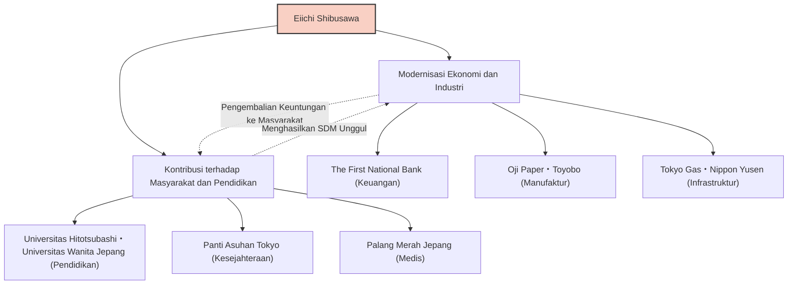

Eiichi Shibusawa, salah satu tokoh yang memainkan peran paling penting dalam modernisasi Jepang. Dikenal sebagai "Bapak Kapitalisme Jepang", ia terlibat dalam pendirian dan pengembangan sekitar 500 perusahaan sepanjang hidupnya, sekaligus mengabdikan dirinya untuk mendukung sekitar 600 proyek pekerjaan umum dan lembaga pendidikan. Kehidupannya dan filosofinya, yang tidak hanya berfokus pada pencarian keuntungan belaka tetapi juga mencari harmoni antara moralitas dan ekonomi di bawah filosofi "Analek dan Sempoa", terus memberikan banyak pelajaran bagi para profesional bisnis modern.

## Dari Akhir Periode Edo yang Bergejolak Menuju Restorasi Meiji: Wawasan yang Dipupuk oleh Berbagai Pengalaman

Eiichi Shibusawa lahir pada tahun 1840 dari keluarga petani kaya di tempat yang kini menjadi Kota Fukaya, Prefektur Saitama. Sejak masa kanak-kanak, ia mengembangkan ketajaman komersial praktis melalui keterlibatannya dalam bisnis keluarga memproduksi dan menjual pewarna nila serta budidaya ulat sutra. Pada saat yang sama, ia belajar dari sepupunya, Junchu Odaka, mempelajari "Analek Konfusius" dan pelajaran akademis lainnya, yang meletakkan dasar bagi nilai-nilai moralnya.

Di masa mudanya, ia menganut ideologi Sonno Joi (menghormati Kaisar dan mengusir kaum barbar) dan bahkan merenungkan tindakan radikal seperti menggulingkan Keshogunan, namun setelah pergi ke Kyoto, ia berbalik arah dan mulai melayani Yoshinobu Hitotsubashi (yang kemudian menjadi Shogun ke-15 Keshogunan Edo). Titik balik ini sangat mengubah nasibnya. Pada tahun 1867, ia pergi ke Eropa sebagai anggota rombongan Akitake Tokugawa (adik laki-laki Yoshinobu) untuk menghadiri Pameran Universal di Paris. Selama tinggal di Paris, ia sangat terkesan oleh teknologi industri Barat yang maju, dan terutama oleh sistem ekonomi modern berupa "perusahaan saham gabungan" serta struktur sosial di mana sektor publik dan swasta beroperasi dengan kedudukan yang setara.

## "Analek dan Sempoa": Filosofi Kesatuan Ekonomi dan Moral

Setelah kembali ke Jepang, ia mulai bekerja di Kementerian Keuangan pemerintahan baru Meiji, dan bekerja keras untuk membangun kerangka negara, seperti menetapkan sistem mata uang modern dan Peraturan Bank Nasional. Namun, ia menyadari keterbatasan perannya sebagai birokrat dan beralih ke dunia bisnis pada usia 33 tahun. Di sinilah kisah suksesnya yang sesungguhnya dimulai.

Inti dari pemikiran Eiichi Shibusawa adalah "Teori Kesatuan Moralitas dan Ekonomi." Dalam bukunya, "Analek dan Sempoa," ia berpendapat bahwa meskipun tujuan sebuah perusahaan adalah untuk mengejar keuntungan (sempoa), hal ini tidak boleh didasarkan pada sifat egois, melainkan pada etika dan moralitas (Analek) yang berkontribusi terhadap kemakmuran masyarakat secara keseluruhan.

- **Mengejar Kepentingan Publik**: Daripada segelintir kapitalis yang memonopoli kekayaan, dana harus dikumpulkan secara luas (Kolektivisme modal) dan dikembalikan ke masyarakat melalui kegiatan bisnis.
- **Pentingnya Kepercayaan**: Hal terpenting dalam bisnis adalah kepercayaan, yang hanya dapat dibangun melalui tindakan yang jujur.
- **Harmoni antara Publik dan Swasta**: Menyeleraskan perkembangan negara dengan keuntungan individu, sambil mengeluarkan vitalitas sektor swasta.

Filosofi ini sangat inovatif dan dapat dianggap sebagai pelopor SDGs (Tujuan Pembangunan Berkelanjutan), investasi ESG, dan kapitalisme pemangku kepentingan, yang kini banyak menarik perhatian.

## 500 Perusahaan dan 600 Proyek Sosial: Kapitalisme Pemangku Kepentingan yang Diterapkan

Apa yang patut dicatat tentang Eiichi Shibusawa adalah bahwa ia mempraktikkan filosofinya dengan kapasitas tindakan yang luar biasa. Dimulai dengan menjadi direktur The First National Bank (sekarang Mizuho Bank), ia terlibat dalam pendirian banyak perusahaan yang kini menopang perekonomian Jepang, termasuk Shoshi Kaisha (Oji Paper), Osaka Boseki (Toyobo), Tokyo Gas, Nippon Yusen, dan Bursa Efek Tokyo.

Hal yang patut dicatat adalah bahwa ia tidak berusaha memonopoli saham perusahaan-perusahaan tersebut untuk menciptakan "Zaibatsu Shibusawa." Begitu bisnis mulai berjalan, ia menyerahkan manajemennya kepada generasi penerus dan memfokuskan dirinya untuk merintis bisnis baru dan proyek pekerjaan umum. Ia menjabat sebagai direktur Panti Asuhan Tokyo (fasilitas bagi anak-anak terlantar dan orang tua) selama lebih dari setengah abad, dan juga mengabdikan dirinya untuk mendirikan Palang Merah Jepang dan mendukung lembaga pendidikan seperti Universitas Hitotsubashi dan Universitas Wanita Jepang. Ini didasarkan pada keyakinannya bahwa "orang kaya memiliki kewajiban untuk menggunakan kekayaan mereka demi masyarakat."

## Pengaruh pada Generasi Berikutnya: Sebagai Wajah Uang Kertas 10.000 Yen Baru

Hingga wafat pada usia 91 tahun pada tahun 1931, Eiichi Shibusawa terus berlari demi modernisasi Jepang. Semangat "Analek dan Sempoa" yang ditinggalkannya sangat diapresiasi oleh pakar manajemen luar negeri, seperti Peter Drucker, dan ia diakui sebagai "orang yang mengadvokasi tanggung jawab sosial perusahaan (CSR) lebih awal dari siapapun."

Fakta bahwa potretnya dipilih untuk uang kertas 10.000 yen baru yang diterbitkan sejak tahun 2024 bukan sekadar evaluasi ulang terhadap tokoh besar dari masa lalu. Di era modern, di mana dampak buruk kapitalisme yang berlebihan seperti ketidaksetaraan sosial dan masalah lingkungan banyak ditunjukkan, ini adalah bukti bahwa pesannya tentang "Harmoni antara moralitas dan ekonomi" sangat dibutuhkan kembali.

Pelajaran terbesar yang dapat kita pelajari dari kehidupan Eiichi Shibusawa adalah harapan bahwa keuntungan individu dan keuntungan masyarakat tidaklah bertentangan, melainkan dapat berjalan beriringan melalui standar etika yang tinggi. Ajaran universalnya akan terus bersinar sebagai pedoman untuk bisnis di Jepang dan di seluruh dunia.
