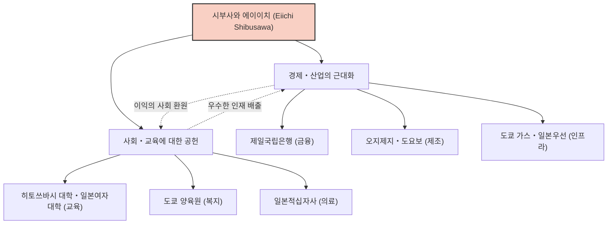

일본의 근대화에서 가장 중요한 역할을 한 인물 중 한 명인 시부사와 에이이치. 그는 '일본 자본주의의 아버지'라 불리며, 평생 약 500개의 기업 설립 및 육성에 관여하는 동시에 약 600개의 사회 공공 사업과 교육 기관을 지원하는 데 진력했습니다. 단순한 이익 추구에 그치지 않고 '논어와 주판'이라는 이념 아래 도덕과 경제의 조화를 추구한 그의 생애와 철학은 현대의 비즈니스맨들에게도 많은 시사점을 주고 있습니다.

## 격동의 막부 말기부터 메이지 유신으로: 다양한 경험이 길러낸 시야

시부사와 에이이치는 1840년, 현재의 사이타마현 후카야시에 있는 부농의 집에서 태어났습니다. 어린 시절부터 가업인 쪽(藍) 염료의 제조, 판매와 양잠을 도우며 실학으로서의 상업 감각을 길렀습니다. 동시에 사촌 형 오다카 준츄로부터 『논어』를 비롯한 학문을 배우며 도덕적 가치관의 기반을 다졌습니다.

청년기에는 존왕양이 사상에 심취하여 한때는 막부 타도를 꾀할 정도의 과격한 활동도 생각했지만, 교토로 향한 후 완전히 방향을 바꾸어 히토쓰바시 요시노부(훗날 에도 막부 15대 쇼군)를 섬기게 됩니다. 이 전환점이 그의 운명을 크게 바꾸어 놓았습니다. 1867년, 파리 만국박람회에 향하는 도쿠가와 아키타케(요시노부의 동생)의 수행원으로서 유럽으로 도항했습니다. 이 파리 체류 중에 서양의 발전된 산업 기술, 그리고 무엇보다 '주식회사'라는 근대적인 경제 시스템과 민관이 대등하게 기능하는 사회 구조에 큰 충격을 받습니다.

## '논어와 주판': 도덕경제합일의 철학

귀국 후 메이지 신정부의 대장성에 출사하여, 근대적인 화폐 제도의 확립이나 국립은행 조례 제정 등 국가의 기틀 마련에 분주히 움직입니다. 그러나 관료로서의 한계를 느끼고, 33세에 실업계로 투신합니다. 여기서부터 그의 진정한 활약이 시작됩니다.

시부사와 에이이치 사상의 핵심이 되는 것은 '도덕경제합일설'입니다. 저서 『논어와 주판』에서 그는 기업의 목적은 이익을 추구하는 것(주판)이지만, 그것은 결코 이기적인 것이어서는 안 되며, 사회 전체의 풍요로움으로 이어지는 윤리나 도덕(논어)에 바탕을 두어야 한다고 설파했습니다.

- **공익의 추구**: 일부 자본가가 부를 독점하는 것이 아니라 널리 자금을 모아(합본주의) 사업을 통해 사회에 환원한다.
- **신용의 중시**: 상업에서 가장 중요한 것은 신용이며, 그것은 성실한 행동에 의해서만 구축된다.
- **민관의 조화**: 민간의 활력을 이끌어내면서 국가의 발전과 개인의 이익을 일치시킨다.

이 철학은 현재 주목받고 있는 SDGs(지속가능 발전 목표)나 ESG 투자, 이해관계자 자본주의의 선구라고도 할 수 있는 혁신적인 것이었습니다.

## 500개의 기업과 600개의 사회사업: 실천된 합본주의

시부사와 에이이치의 특기할 만한 점은 그 이념을 압도적인 행동력으로 실천했다는 것입니다. 제일국립은행(현재의 미즈호은행)의 초대 은행장을 시작으로, 쇼시 회사(오지제지), 오사카 방적(도요보), 도쿄 가스, 일본우선, 도쿄 증권거래소 등 현재의 일본 경제를 지탱하는 수많은 기업의 설립에 관여했습니다.

특기할 만한 것은 그가 이들 기업의 주식을 독점하여 '시부사와 재벌'을 만들려고 하지 않았다는 점입니다. 사업이 궤도에 오르면 경영을 후진에게 양보하고, 스스로는 새로운 사업 개척이나 사회 공공 사업에 주력했습니다. 도쿄 양육원(의지할 곳 없는 아이들이나 노인들을 보호하는 시설)의 원장을 반세기 이상 역임한 것 외에도 일본적십자사의 설립, 히토쓰바시 대학이나 일본여자대학 등의 교육 기관 지원에도 힘썼습니다. 이는 '부자는 사회를 위해 부를 사용할 의무가 있다'는 그의 신념에 바탕을 둔 것이었습니다.

## 후세에의 영향: 새 1만 엔권의 얼굴로서

1931년, 91세의 나이로 세상을 떠날 때까지 시부사와 에이이치는 일본의 근대화를 위해 달려 나갔습니다. 그가 남긴 '논어와 주판'의 정신은 피터 드러커 등 해외의 경영학자들로부터도 높이 평가받고 있으며, "누구보다도 일찍 기업의 사회적 책임(CSR)을 설파한 인물"로 인식되고 있습니다.

2024년부터 발행된 새 1만 엔권의 초상화로 선정된 것은 단순히 과거 위인으로서의 재평가에 그치지 않습니다. 격차 사회나 환경 문제 등 지나친 자본주의의 폐해가 지적되는 현대에서, 그의 '도덕과 경제의 조화'라는 메시지가 다시금 강하게 요구되고 있다는 증거라고 할 수 있을 것입니다.

우리가 시부사와 에이이치의 생애에서 배울 수 있는 최대의 교훈은, 자기의 이익과 사회의 이익은 대립하는 것이 아니라 높은 윤리관에 의해 양립할 수 있다는 희망입니다. 그 보편적인 가르침은 앞으로도 일본, 그리고 세계 비즈니스의 지침으로서 계속 빛날 것입니다.
