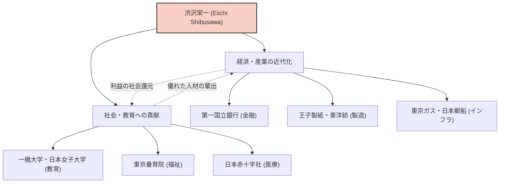

日本の近代化において最も重要な役割を果たした人物の一人、渋沢栄一。彼は「日本資本主義の父」と称され、生涯に約500もの企業の設立・育成に関わり、同時に約600の社会公共事業や教育機関の支援に尽力しました。単なる利益追求にとどまらず、「論語と算盤」という理念のもと、道徳と経済の調和を追求したその生涯と哲学は、現代のビジネスパーソンにも多くの示唆を与えています。

## 激動の幕末から明治維新へ：多様な経験が培った視野

渋沢栄一は1840年、現在の埼玉県深谷市にある富農の家に生まれました。幼少期から家業である藍玉の製造・販売や養蚕を手伝う中で、実学としての商業感覚を養います。同時に、従兄の尾高惇忠から『論語』をはじめとする学問を学び、道徳的価値観の基盤を築きました。

青年期には尊王攘夷思想に傾倒し、一時は倒幕を企てるほどの過激な活動も考えましたが、京都に赴いた後に一転して一橋慶喜（後の江戸幕府第15代将軍）に仕えることになります。この転機が彼の運命を大きく変えました。1867年、パリ万国博覧会に赴く徳川昭武（慶喜の弟）の随員としてヨーロッパへ渡航。このパリ滞在中に、西洋の進んだ産業技術、そして何より「株式会社」という近代的な経済システムや、官民が対等に機能する社会構造に強い衝撃を受けます。

## 「論語と算盤」：道徳経済合一の哲学

帰国後、明治新政府の大蔵省に出仕し、近代的な貨幣制度や国立銀行条例の制定など、国家の骨組み作りに奔走します。しかし、官僚としての限界を感じ、33歳で実業界へ転身。ここから彼の真の活躍が始まります。

渋沢栄一の思想の核となるのが、「道徳経済合一説」です。著書『論語と算盤』の中で彼は、企業の目的は利益を追求すること（算盤）であるが、それは決して自己中心的なものであってはならず、社会全体の豊かさにつながる倫理や道徳（論語）に基づいているべきだと説きました。

- **公益の追求**: 一部の資本家が富を独占するのではなく、広く資金を集め（合本主義）、事業を通じて社会に還元する。
- **信用の重視**: 商業において最も重要なのは信用であり、それは誠実な行動によってのみ築かれる。
- **官民調和**: 民間の活力を引き出しつつ、国家の発展と個人の利益を一致させる。

この哲学は、現在注目されているSDGs（持続可能な開発目標）やESG投資、ステークホルダー資本主義の先駆けとも言える革新的なものでした。

## 500の企業と600の社会事業：実践された合本主義

渋沢栄一の特筆すべき点は、その理念を圧倒的な行動力で実践したことです。第一国立銀行（現在のみずほ銀行）の頭取を皮切りに、抄紙会社（王子製紙）、大阪紡績（東洋紡）、東京瓦斯（東京ガス）、日本郵船、東京証券取引所など、現在の日本経済を支える数多くの企業の設立に携わりました。

特筆すべきは、彼がこれらの企業の株式を独占して「渋沢財閥」を作ろうとはしなかった点です。事業が軌道に乗ると経営を後進に譲り、自らは新たな事業の開拓や社会公共事業に注力しました。東京養育院（身寄りのない子供や老人を保護する施設）の院長を半世紀以上にわたって務めたほか、日本赤十字社の設立、一橋大学や日本女子大学などの教育機関の支援にも尽力。これは、「富者は社会のために富を用いる義務がある」という彼の信念に基づくものでした。

## 後世への影響：新一万円札の顔として

1931年、91歳でこの世を去るまで、渋沢栄一は日本の近代化のために駆け抜けました。彼の残した「論語と算盤」の精神は、ピーター・ドラッカーなど海外の経営学者からも高く評価されており、「誰よりも早く企業の社会的責任（CSR）を説いた人物」として認識されています。

2024年から発行された新一万円札の肖像に選ばれたことは、単に過去の偉人としての再評価にとどまりません。格差社会や環境問題など、行き過ぎた資本主義の弊害が指摘される現代において、彼の「道徳と経済の調和」というメッセージが、再び強く求められている証と言えるでしょう。

私たちが渋沢栄一の生涯から学べる最大の教訓は、自己の利益と社会の利益は対立するものではなく、高い倫理観によって両立できるという希望です。その普遍的な教えは、これからも日本の、そして世界のビジネスの指針として輝き続けるはずです。
