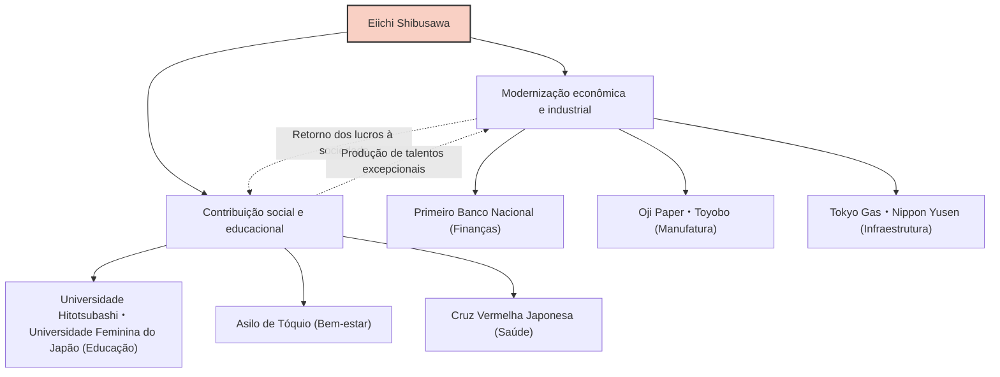

Eiichi Shibusawa, uma das figuras mais importantes na modernização do Japão, é conhecido como o "pai do capitalismo japonês". Ao longo de sua vida, esteve envolvido na criação e desenvolvimento de cerca de 500 empresas e, simultaneamente, apoiou cerca de 600 projetos sociais, públicos e instituições educacionais. Indo além da simples busca pelo lucro, sua vida e filosofia, guiadas pelo conceito de "Os Analectos e o Ábaco", buscavam a harmonia entre a moralidade e a economia, oferecendo ainda hoje muitas lições aos profissionais de negócios.

## Do turbulento fim do xogunato à Restauração Meiji: uma visão cultivada por experiências diversas

Eiichi Shibusawa nasceu em 1840 em uma família de agricultores ricos na atual cidade de Fukaya, província de Saitama. Desde a infância, ao ajudar no negócio da família de fabricação e venda de bolas de índigo e sericicultura, ele cultivou um senso de negócios voltado para a aprendizagem prática. Ao mesmo tempo, estudou os clássicos, incluindo "Os Analectos" de Confúcio, com seu primo Junchu Odaka, construindo a base de seus valores morais.

Em sua juventude, foi atraído pela ideologia "Sonnō jōi" (reverenciar o imperador, expulsar os bárbaros), chegando a considerar ações radicais para derrubar o xogunato. No entanto, após ir a Kyoto, mudou de rumo e passou a servir Yoshinobu Hitotsubashi (que mais tarde se tornaria o 15º e último xogum do xogunato Tokugawa). Esse ponto de virada mudou seu destino drasticamente. Em 1867, viajou para a Europa como membro da comitiva de Akitake Tokugawa (irmão mais novo de Yoshinobu) para a Exposição Universal de Paris. Durante essa estadia em Paris, ficou profundamente impressionado com a tecnologia industrial avançada do Ocidente e, acima de tudo, com o sistema econômico moderno da "sociedade anônima", bem como com uma estrutura social onde os setores público e privado funcionam em pé de igualdade.

## "Os Analectos e o Ábaco": A Filosofia da Unificação da Moral e da Economia

Ao retornar ao Japão, ingressou no Ministério das Finanças do novo governo Meiji, onde trabalhou incansavelmente para construir as bases do Estado, como o estabelecimento de um sistema monetário moderno e da Lei dos Bancos Nacionais. No entanto, sentindo os limites de ser um burocrata, mudou-se para o mundo dos negócios aos 33 anos. Foi a partir daqui que suas verdadeiras realizações começaram.

O núcleo do pensamento de Eiichi Shibusawa é a "teoria da unificação da moral e da economia". Em seu livro "Os Analectos e o Ábaco", ele argumentou que, embora o objetivo de uma empresa seja buscar o lucro (o ábaco), esse objetivo nunca deve ser egocêntrico; deve basear-se na ética e na moral (Os Analectos) que levam à prosperidade da sociedade como um todo.

- **Busca pelo interesse público**: Em vez de alguns poucos capitalistas monopolizarem a riqueza, deve-se reunir fundos amplamente (capitalismo de stakeholders ou "Gapponshugi") e retribuir à sociedade através dos negócios.
- **Importância da confiança**: No comércio, o mais importante é a confiança, que só é construída através de ações sinceras.
- **Harmonia entre público e privado**: Alinhar o desenvolvimento da nação com os interesses individuais, estimulando a vitalidade do setor privado.

Essa filosofia foi inovadora e pode ser considerada um precursor de conceitos contemporâneos, como os ODS (Objetivos de Desenvolvimento Sustentável), investimentos ESG e capitalismo de stakeholders.

## 500 empresas e 600 projetos sociais: O "Gapponshugi" colocado em prática

O que é notável em Eiichi Shibusawa é a incrível energia com a qual colocou seus ideais em prática. Começando como presidente do Primeiro Banco Nacional (hoje Mizuho Bank), ele esteve envolvido na criação de inúmeras empresas que ainda hoje sustentam a economia japonesa, como a Shoshi Kaisha (Oji Paper), a Osaka Spinning (Toyobo), a Tokyo Gas, a Nippon Yusen e a Bolsa de Valores de Tóquio.

Vale ressaltar que ele não tentou monopolizar as ações dessas empresas para criar um "zaibatsu Shibusawa" (conglomerado). Assim que o negócio se estabilizava, ele passava a gestão para a próxima geração e se concentrava no desenvolvimento de novos negócios e projetos de utilidade pública. Ele atuou como diretor do Asilo de Tóquio (uma instituição para órfãos e idosos sem família) por mais de meio século, além de dedicar-se à criação da Cruz Vermelha Japonesa e apoiar instituições educacionais, como a Universidade Hitotsubashi e a Universidade Feminina do Japão. Isso se baseava em sua crença de que "os ricos têm a obrigação de usar sua riqueza para a sociedade".

## Impacto nas gerações futuras: O rosto da nova nota de 10.000 ienes

Até sua morte em 1931, aos 91 anos, Eiichi Shibusawa trabalhou sem parar pela modernização do Japão. O espírito de seus "Analectos e o Ábaco" é altamente valorizado por especialistas internacionais em gestão, como Peter Drucker, que o reconheceu como "aquele que ensinou a responsabilidade social corporativa (RSC) antes de todos".

Sua escolha como o rosto da nova nota de 10.000 ienes emitida a partir de 2024 não é apenas uma reavaliação de um grande homem do passado. Na era atual, em que se apontam os males do capitalismo excessivo, como a desigualdade social e os problemas ambientais, é a prova de que sua mensagem de "harmonia entre moral e economia" é mais uma vez fortemente desejada.

A maior lição que podemos aprender com a vida de Eiichi Shibusawa é a esperança de que o interesse próprio e o interesse da sociedade não se opõem, mas podem coexistir através de altos padrões éticos. Esse ensinamento universal, sem dúvida, continuará a brilhar como um guia para os negócios no Japão e no mundo.
