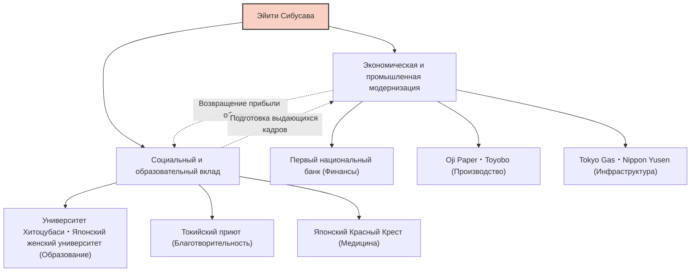

Эйити Сибусава, один из важнейших деятелей модернизации Японии, известен как «отец японского капитализма». При жизни он участвовал в создании и развитии около 500 компаний, одновременно поддерживая около 600 социальных и общественных проектов, а также образовательных учреждений. Не ограничиваясь лишь стремлением к прибыли, его жизнь и философия, основанные на концепции «Лунь юй и счёты», были направлены на гармонию морали и экономики, что и сегодня дает множество уроков современным предпринимателям.

## От бурного конца сёгуната до реставрации Мэйдзи: кругозор, сформированный разнообразным опытом

Эйити Сибусава родился в 1840 году в богатой крестьянской семье в нынешнем городе Фукая, префектура Сайтама. С детства, помогая семье в производстве и продаже индиго, а также в шелководстве, он развил коммерческое чутье на основе практического опыта. В то же время он изучал классические труды, включая «Лунь юй» Конфуция, у своего кузена Дзюнчу Одаки, что заложило основу его моральных ценностей.

В юности он увлекся идеологией "Сонно дзёи" (почитание императора, изгнание варваров) и даже задумывался о радикальных действиях по свержению сёгуната. Однако после поездки в Киото он изменил свои взгляды и поступил на службу к Ёсинобу Хитоцубаси (будущему 15-му сёгуну сёгуната Токугава). Этот поворотный момент сильно изменил его судьбу. В 1867 году в составе свиты Акитакэ Токугавы (младшего брата Ёсинобу) он отправился в Европу на Всемирную выставку в Париже. Во время пребывания в Париже на него произвели глубокое впечатление передовые промышленные технологии Запада и, прежде всего, современная экономическая система «акционерного общества», а также социальная структура, где государственный и частный секторы функционируют на равных.

## «Лунь юй и счёты»: Философия единства морали и экономики

По возвращении на родину он поступил на службу в Министерство финансов нового правительства Мэйдзи, где усердно трудился над созданием государственных основы, таких как современная денежная система и закон о национальных банках. Однако, осознав ограниченность роли чиновника, в возрасте 33 лет он перешел в сферу бизнеса. Именно здесь начались его истинные свершения.

Основой философии Эйити Сибусавы является «теория единства морали и экономики». В своей книге «Лунь юй и счёты» он утверждал, что хотя целью компании является получение прибыли (счёты), это не должно быть эгоцентричным процессом; прибыль должна основываться на этике и морали («Лунь юй»), способствуя процветанию общества в целом.

- **Стремление к общественному благу**: Нельзя позволять немногим капиталистам монополизировать богатство; необходимо широко привлекать средства (капитализм заинтересованных сторон или «Гаппонсюги») и возвращать их обществу через бизнес.
- **Важность доверия**: В коммерции самое важное — это доверие, которое строится только через искренние поступки.
- **Гармония государственного и частного**: Согласование развития нации с индивидуальными интересами при стимулировании активности частного сектора.

Эта философия была новаторской и ее можно считать предтечей современных концепций, таких как ЦУР (Цели устойчивого развития), ESG-инвестирование и капитализм заинтересованных сторон.

## 500 компаний и 600 социальных проектов: Воплощение "Гаппонсюги"

Особенно примечательной чертой Эйити Сибусавы была его невероятная энергия в воплощении своих идеалов на практике. Начиная с должности президента Первого национального банка (ныне Mizuho Bank), он участвовал в создании множества компаний, которые до сих пор поддерживают японскую экономику, таких как Shoshi Kaisha (Oji Paper), Osaka Spinning (Toyobo), Tokyo Gas, Nippon Yusen и Токийская фондовая биржа.

Стоит отметить, что он не пытался монополизировать акции этих компаний для создания конгломерата «Дзайбацу Сибусава». Как только бизнес вставал на ноги, он передавал управление преемникам и сосредотачивался на новых проектах и общественных делах. Он более полувека был директором Токийского приюта (учреждения для сирот и одиноких стариков), а также посвятил себя созданию Японского Красного Креста и поддержке образовательных учреждений, таких как Университет Хитоцубаси и Японский женский университет. Это основывалось на его убеждении, что «богатые обязаны использовать свое богатство на благо общества».

## Влияние на будущие поколения: Лицо новой банкноты в 10 000 иен

Вплоть до своей смерти в 1931 году в возрасте 91 года Эйити Сибусава непрерывно трудился ради модернизации Японии. Дух его «Лунь юй и счётов» высоко оценен зарубежными экспертами в области управления, такими как Питер Друкер, который признал его «человеком, проповедовавшим корпоративную социальную ответственность (КСО) раньше всех».

Выбор его портрета для новой банкноты номиналом 10 000 иен, выпущенной в 2024 году, — это не просто переоценка великой личности прошлого. В наше время, когда все чаще указывают на недостатки чрезмерного капитализма, такие как социальное неравенство и экологические проблемы, это свидетельствует о том, что его послание о «гармонии морали и экономики» вновь настоятельно востребовано.

Самый большой урок, который мы можем извлечь из жизни Эйити Сибусавы, — это надежда на то, что личные интересы и интересы общества не противоречат друг другу, а могут сосуществовать благодаря высоким этическим стандартам. Это универсальное учение, несомненно, продолжит сиять как путеводная звезда для бизнеса в Японии и во всем мире.
