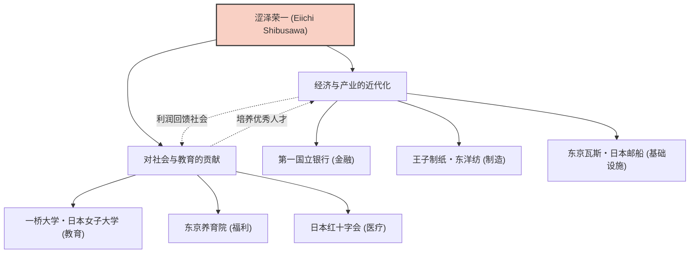

涩泽荣一是日本近代化进程中发挥了最重要作用的人物之一。他被誉为“日本资本主义之父”，一生参与创办和培育了约500家企业，同时还致力于支持约600项社会公共事业和教育机构。他不仅限于单纯追求利润，而是在“论语与算盘”的理念下，追求道德与经济的和谐，其一生和哲学为现代商业人士提供了许多启示。

## 从动荡的幕末到明治维新：丰富经验培养出的视野

涩泽荣一于1840年出生在现埼玉县深谷市的一个富农家庭。从幼年起，在帮助家族从事制造和销售蓝靛（蓝玉）及养蚕业的过程中，他培养了作为实学的商业感觉。同时，他从表兄尾高惇忠那里学习《论语》等学问，奠定了道德价值观的基础。

青年时期，他倾心于尊王攘夷思想，甚至一度考虑过企图倒幕的过激活动，但在前往京都后，他转而侍奉一桥庆喜（后来的江户幕府第15代将军）。这个转折点极大地改变了他的命运。1867年，作为随员陪同前往巴黎世界博览会的德川昭武（庆喜的弟弟）远赴欧洲。在巴黎逗留期间，他受到西方先进工业技术的强烈冲击，尤其是“股份公司”这一近代经济系统以及官民对等运作的社会结构。

## “论语与算盘”：道德经济合一的哲学

回国后，他在明治新政府的大藏省任职，为建立国家框架四处奔走，包括制定近代货币制度和国立银行条例等。然而，他感受到作为官僚的局限性，在33岁时投身商界。从此，他真正的活跃拉开了序幕。

涩泽荣一思想的核心是“道德经济合一说”。在《论语与算盘》一书中，他主张企业的目的虽然是追求利润（算盘），但绝不能是自我中心的，而应基于能带来整个社会富裕的伦理和道德（论语）。

- **追求公益**：不是由少数资本家垄断财富，而是广泛筹集资金（合本主义），通过事业回馈社会。
- **重视信用**：商业中最重要的就是信用，而信用只能通过诚实的行动建立。
- **官民和谐**：在激发民间活力的同时，使国家的发展与个人的利益相一致。

这一哲学可谓是如今备受关注的SDGs（可持续发展目标）、ESG投资和利益相关者资本主义的先驱，是极具创新性的。

## 500家企业与600项社会事业：实践的合本主义

涩泽荣一令人瞩目的一点在于，他以压倒性的行动力实践了其理念。从担任第一国立银行（现瑞穗银行）行长开始，他参与了许多支撑现代日本经济的企业的创立，如抄纸会社（王子制纸）、大阪纺织（东洋纺）、东京瓦斯（东京燃气）、日本邮船、东京证券交易所等。

特别值得一提的是，他并没有试图垄断这些企业的股份来建立“涩泽财阀”。当事业步入正轨后，他便将经营权让给后辈，自己则致力于开拓新事业和社会公共事业。他担任东京养育院（收容无依无靠的儿童和老人的设施）院长长达半个多世纪，并致力于成立日本红十字会，支持一桥大学和日本女子大学等教育机构。这是基于他“富人有义务为社会使用财富”的信念。

## 对后世的影响：作为新一万日元纸币的面孔

直到1931年以91岁高龄离世，涩泽荣一为了日本的近代化奔走了一生。他留下的“论语与算盘”精神，也受到彼得·德鲁克等海外管理学者的极高评价，被认为是“比任何人都更早主张企业社会责任（CSR）的人物”。

被选为2024年起发行的新一万日元纸币的肖像，不仅是对过去伟人的重新评价。在指出格差社会和环境问题等过度资本主义弊端的现代，可以说这是对他的“道德与经济的和谐”这一信息再次被强烈需求的证明。

我们从涩泽荣一的一生中能学到的最大教训是：自身利益与社会利益并不对立，通过高尚的伦理观可以实现两者的共存，这是一种希望。他那普遍的教诲，今后也必将作为日本乃至世界商业的指南针继续闪耀。
