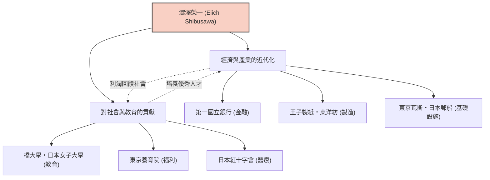

澀澤榮一是日本近代化進程中發揮了最重要作用的人物之一。他被譽為「日本資本主義之父」，一生參與創辦和培育了約500家企業，同時還致力於支持約600項社會公共事業和教育機構。他不僅限於單純追求利潤，而是在「論語與算盤」的理念下，追求道德與經濟的和諧，其一生和哲學為現代商業人士提供了許多啟示。

## 從動蕩的幕末到明治維新：豐富經驗培養出的視野

澀澤榮一於1840年出生在現埼玉縣深谷市的一個富農家庭。從幼年起，在幫助家族從事製造和銷售藍靛（藍玉）及養蠶業的過程中，他培養了作為實學的商業感覺。同時，他從表兄尾高惇忠那裡學習《論語》等學問，奠定了道德價值觀的基礎。

青年時期，他傾心於尊王攘夷思想，甚至一度考慮過企圖倒幕的過激活動，但在前往京都後，他轉而侍奉一橋慶喜（後來的江戶幕府第15代將軍）。這個轉折點極大地改變了他的命運。1867年，作為隨員陪同前往巴黎世界博覽會的德川昭武（慶喜的弟弟）遠赴歐洲。在巴黎逗留期間，他受到西方先進工業技術的強烈衝擊，尤其是「股份公司」這一近代經濟系統以及官民對等運作的社會結構。

## 「論語與算盤」：道德經濟合一的哲學

回國後，他在明治新政府的大藏省任職，為建立國家框架四處奔走，包括制定近代貨幣制度和國立銀行條例等。然而，他感受到作為官僚的局限性，在33歲時投身商界。從此，他真正的活躍拉開了序幕。

澀澤榮一思想的核心是「道德經濟合一說」。在《論語與算盤》一書中，他主張企業的目的雖然是追求利潤（算盤），但絕不能是自我中心的，而應基於能帶來整個社會富裕的倫理和道德（論語）。

- **追求公益**：不是由少數資本家壟斷財富，而是廣泛籌集資金（合本主義），透過事業回饋社會。
- **重視信用**：商業中最重要的就是信用，而信用只能透過誠實的行動建立。
- **官民和諧**：在激發民間活力的同時，使國家的發展與個人的利益相一致。

這一哲學可謂是如今備受關注的SDGs（可持續發展目標）、ESG投資和利益相關者資本主義的先驅，是極具創新性的。

## 500家企業與600項社會事業：實踐的合本主義

澀澤榮一令人矚目的一點在於，他以壓倒性的行動力實踐了其理念。從擔任第一國立銀行（現瑞穗銀行）行長開始，他參與了許多支撐現代日本經濟的企業的創立，如抄紙會社（王子製紙）、大阪紡織（東洋紡）、東京瓦斯（東京燃氣）、日本郵船、東京證券交易所等。

特別值得一提的是，他並沒有試圖壟斷這些企業的股份來建立「澀澤財閥」。當事業步入正軌後，他便將經營權讓給後輩，自己則致力於開拓新事業和社會公共事業。他擔任東京養育院（收容無依無靠的兒童和老人的設施）院長長達半個多世紀，並致力於成立日本紅十字會，支持一橋大學和日本女子大學等教育機構。這是基於他「富人有義務為社會使用財富」的信念。

## 對後世的影響：作為新一萬日元紙幣的面孔

直到1931年以91歲高齡離世，澀澤榮一為了日本的近代化奔走了一生。他留下的「論語與算盤」精神，也受到彼得·杜拉克等海外管理學者的極高評價，被認為是「比任何人都更早主張企業社會責任（CSR）的人物」。

被選為2024年起發行的新一萬日元紙幣的肖像，不僅是對過去偉人的重新評價。在指出貧富差距社會和環境問題等過度資本主義弊端的現代，可以說這是對他的「道德與經濟的和諧」這一訊息再次被強烈需求的證明。

我們從澀澤榮一的一生中能學到的最大教訓是：自身利益與社會利益並不對立，透過高尚的倫理觀可以實現兩者的共存，這是一種希望。他那普遍的教誨，今後也必將作為日本乃至世界商業的指南針繼續閃耀。
