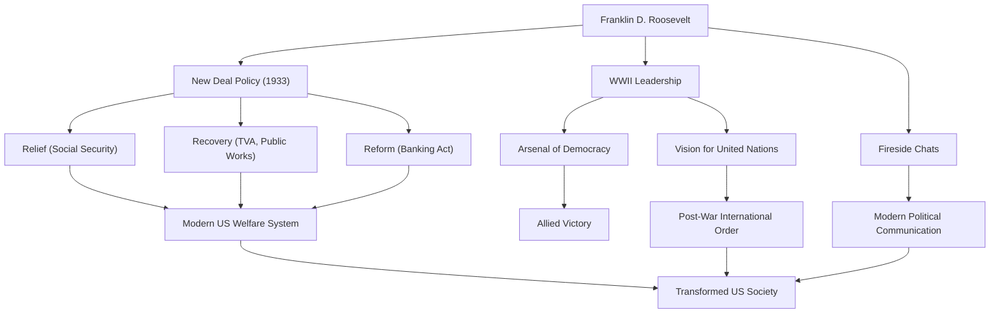

كان فرانكلين ديلانو روزفلت (FDR) الرئيس الثاني والثلاثين للولايات المتحدة وأحد أكثر القادة تأثيراً في تاريخ القرن العشرين. لقد قاد الأمة عبر أزمات غير مسبوقة مثل الكساد الكبير والحرب العالمية الثانية، وهو الرئيس الوحيد في تاريخ الولايات المتحدة الذي تم انتخابه لأربع فترات. دعونا نتعمق في حياته وفلسفته السياسية وتأثيره الدائم على العالم الحديث.

## نشأة متميزة ومحنة مفاجئة

وُلد روزفلت في عام 1882 لعائلة ثرية وبارزة في هايد بارك، نيويورك، ودرس في جامعة هارفارد وكلية الحقوق بجامعة كولومبيا، لتبدأ مسيرته ضمن صفوف النخبة. تزوج من إليانور روزفلت، ابنة أخ الرئيس السادس والعشرين ثيودور روزفلت، وصعد بثبات في السلم السياسي. تم انتخابه لعضوية مجلس الشيوخ بولاية نيويورك في عام 1910، وعمل لاحقًا كمساعد لوزير البحرية، وفي عام 1920 تم ترشيحه كمرشح ديمقراطي لمنصب نائب الرئيس.

ومع ذلك، في عام 1921، عندما كان عمره 39 عامًا، واجه محنة غيرت حياته بشكل جذري. فقد أصيب بشلل الأطفال وأصبح مشلولاً من الخصر إلى أسفل. بعد إجباره على العيش في كرسي متحرك، أظهر روزفلت روحه التي لا تقهر في هذا الموقف اليائس. إلى جانب تكريس نفسه لإعادة التأهيل، منحت المعاناة التي سببها المرض تعاطفًا عميقًا مع ألم الآخرين. سيصبح هذا التعاطف جوهر موقفه السياسي اللاحق.

## سياسة "الصفقة الجديدة" وتحدي الكساد الكبير

في الانتخابات الرئاسية لعام 1932، أدار روزفلت حملته الانتخابية على أساس سياسات من أجل "الرجل المنسي" (forgotten man)، وهزم الرئيس الحالي هربرت هوفر ليصبح رئيسًا. في ذلك الوقت، كانت أمريكا في أعماق الكساد الكبير الذي أثاره انهيار وول ستريت عام 1929؛ فقد بلغ معدل البطالة 25٪، وكان المواطنون في حالة يأس عميق.

كلماته القوية في خطاب تنصيبه، "الشيء الوحيد الذي يجب أن نخشاه هو الخوف نفسه"، منحت أملاً هائلاً للناس. خلال الفترة المعروفة باسم "المائة يوم الأولى"، سن على الفور سلسلة من التشريعات التاريخية، بما في ذلك استقرار العمليات المصرفية، وقانون التكيف الزراعي (AAA)، وقانون الانتعاش الصناعي الوطني (NIRA). كانت هذه سياسة "الصفقة الجديدة" (New Deal).

ابتعدت سياسة الصفقة الجديدة عن سياسات عدم التدخل الاقتصادي السابقة، ممهدة الطريق لتدخل حكومي نشط في الاقتصاد. خلقت مشاريع الأشغال العامة الضخمة من قبل هيئة وادي تينيسي (TVA) فرص عمل، ووضع سن قانون الضمان الاجتماعي الأساس لنظام الرعاية الاجتماعية الأمريكي الحديث. متمركزة حول "R الثلاثة" وهي "الإغاثة، الانتعاش، والإصلاح" (Relief, Recovery, and Reform)، أحدثت هذه السياسة تحولاً جوهرياً في بنية المجتمع الأمريكي.

## الحرب العالمية الثانية و"ترسانة الديمقراطية"

في منتصف الطريق للتعافي من الكساد الكبير، غمرت نيران الحرب العالم مرة أخرى. رداً على اندلاع الحرب العالمية الثانية في أوروبا، حافظت الولايات المتحدة في البداية على موقف انعزالي، لكن روزفلت أدرك بوضوح خطر الفاشية. جعل من أمريكا "ترسانة للديمقراطية" (Arsenal of Democracy)، حيث سن قانون الإعارة والتأجير لدعم بريطانيا والحلفاء الآخرين.

عندما دخلت الولايات المتحدة الحرب بعد الهجوم على بيرل هاربر عام 1941، أظهر روزفلت قيادة هائلة. بفضل الفطنة السياسية البارزة، وجه الإنتاج المحلي نحو الاحتياجات العسكرية ورسم خطة كبرى لقيادة دول الحلفاء إلى النصر. من خلال عقد اجتماعات قمة متكررة مع تشرشل (المملكة المتحدة) وستالين (اتحاد الجمهوريات الاشتراكية السوفياتية)، كرس نفسه لرؤية نظام دولي ما بعد الحرب، ألا وهو إنشاء الأمم المتحدة.

## فلسفته وتراثه للأجيال القادمة

كانت الفلسفة السياسية لروزفلت متجذرة في البراغماتية والنزعة الإنسانية العميقة. غير مقيد بالأيديولوجيا، سعى إلى حلول مرنة وعملية للتحديات التي واجهها. علاوة على ذلك، ابتكرت "محادثات المدفأة" (Fireside Chats) عبر الراديو شكلاً جديداً من أشكال التواصل السياسي حيث يتحدث الرئيس مباشرة إلى كل مواطن، مما يخلق رابطة قوية مع الجمهور.

في 12 أبريل 1945، ومع اقتراب النصر في الحرب العالمية الثانية، توفي روزفلت فجأة إثر نزيف في المخ. ومع ذلك، فإن الإرث الذي تركه وراءه لا يُقاس.

إن تعزيز السلطة الرئاسية التي أنشأها، وتدخل الحكومة الفيدرالية في الاقتصاد، ونظام الضمان الاجتماعي تشكل أساس النظام السياسي والاقتصادي الأمريكي الحديث. علاوة على ذلك، شكّل مُثُل التعاون المتعدد الأطراف من خلال الأمم المتحدة إطار النظام الدولي بعد الحرب.

على الرغم من أن فترة ولايته كان لها مزايا وعيوب (بما في ذلك وصمات مثل اعتقال الأمريكيين اليابانيين)، لا يزال فرانكلين د. روزفلت يحظى بتقدير كبير اليوم باعتباره عملاقاً أعطى الأمل للناس خلال أزمات غير مسبوقة، وأعاد بناء الأمة، وحرك مسار تاريخ العالم بشكل كبير.

### إنجازات وتأثير فرانكلين د. روزفلت

