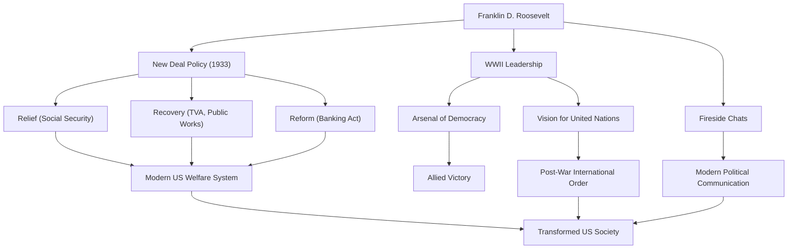

Franklin Delano Roosevelt (FDR) war der 32. Präsident der Vereinigten Staaten und eine der einflussreichsten Führungspersönlichkeiten in der Geschichte des 20. Jahrhunderts. Er führte die Nation durch die beispiellosen Krisen der Weltwirtschaftskrise und des Zweiten Weltkriegs und ist der einzige Präsident in der Geschichte der USA, der für vier Amtszeiten gewählt wurde. Lassen Sie uns tief in sein Leben, seine politische Philosophie und seine anhaltenden Auswirkungen auf die moderne Welt eintauchen.

## Eine privilegierte Erziehung und eine plötzliche Prüfung

Geboren 1882 in einer wohlhabenden und prominenten Familie in Hyde Park, New York, studierte Roosevelt an der Harvard University und der Columbia Law School und begann seinen Weg als Elite. Er heiratete Eleanor Roosevelt, Nichte des 26. Präsidenten Theodore Roosevelt, und stieg stetig die politische Leiter hinauf. Er wurde 1910 in den Senat des Staates New York gewählt, diente später als stellvertretender Marineminister und wurde 1920 als demokratischer Kandidat für das Amt des Vizepräsidenten nominiert.

1921, im Alter von 39 Jahren, stand er jedoch vor einer Prüfung, die sein Leben drastisch veränderte. Er erkrankte an Polio (Kinderlähmung) und war von der Taille abwärts gelähmt. Gezwungen, im Rollstuhl zu leben, bewies Roosevelt in dieser verzweifelten Situation seinen angeborenen unbeugsamen Geist. Neben seiner Hingabe zur Rehabilitation brachte ihm das durch die Krankheit verursachte Leid ein tiefes Einfühlungsvermögen für den Schmerz anderer. Dieses Einfühlungsvermögen sollte zum Kern seiner späteren politischen Haltung werden.

## Die „New Deal“-Politik und die Herausforderung der Weltwirtschaftskrise

Bei den Präsidentschaftswahlen 1932 warb Roosevelt für eine Politik für den „vergessenen Mann“ (forgotten man) und besiegte den Amtsinhaber Herbert Hoover, um Präsident zu werden. Zu dieser Zeit befand sich Amerika in den Tiefen der durch den Wall-Street-Crash von 1929 ausgelösten Weltwirtschaftskrise; die Arbeitslosenquote hatte 25 % erreicht, und die Bürger befanden sich in tiefer Verzweiflung.

Seine kraftvollen Worte in seiner Antrittsrede, „Das Einzige, was wir zu fürchten haben, ist die Furcht selbst“, gaben den Menschen immense Hoffnung. In der Zeit, die als die „Ersten Hundert Tage“ bekannt ist, erließ er sofort eine Flut von wegweisenden Gesetzen, darunter die Stabilisierung der Bankgeschäfte, den Agricultural Adjustment Act (AAA) und den National Industrial Recovery Act (NIRA). Dies war die „New Deal“-Politik.

Die New Deal-Politik wandte sich von den zuvor laissez-faire-geprägten Wirtschaftspolitiken ab und ebnete den Weg für aktive staatliche Eingriffe in die Wirtschaft. Massive öffentliche Bauprojekte durch die Tennessee Valley Authority (TVA) schufen Arbeitsplätze, und der Erlass des Social Security Act legte den Grundstein für das moderne amerikanische Wohlfahrtssystem. Zentriert um die „Drei R“ – „Relief, Recovery, and Reform“ (Linderung, Erholung und Reform) – veränderte diese Politik grundlegend die Struktur der amerikanischen Gesellschaft.

## Der Zweite Weltkrieg und das „Arsenal der Demokratie“

Auf halbem Weg der Erholung von der Weltwirtschaftskrise wurde die Welt erneut von den Flammen des Krieges erfasst. Als Reaktion auf den Ausbruch des Zweiten Weltkriegs in Europa bewahrten die Vereinigten Staaten zunächst eine isolationistische Haltung, aber Roosevelt erkannte scharfsinnig die Bedrohung durch den Faschismus. Er positionierte Amerika als das „Arsenal der Demokratie“ und erließ das Leih- und Pachtgesetz (Lend-Lease Act), um Großbritannien und andere Verbündete zu unterstützen.

Als die USA nach dem Angriff auf Pearl Harbor 1941 in den Krieg eintraten, bewies Roosevelt eine beeindruckende Führungsstärke. Mit herausragendem politischem Scharfsinn lenkte er die heimische Produktion auf militärische Bedürfnisse und entwarf einen großen Plan, um die alliierten Mächte zum Sieg zu führen. Bei wiederholten Gipfeltreffen mit Churchill (Großbritannien) und Stalin (UdSSR) widmete er sich der Vision einer Nachkriegsordnung, nämlich der Gründung der Vereinten Nationen.

## Seine Philosophie und sein Vermächtnis für die Nachwelt

Roosevelts politische Philosophie wurzelte in Pragmatismus und tiefem Humanismus. Ungebunden an Ideologie suchte er nach flexiblen und praktischen Lösungen für die Herausforderungen, vor denen er stand. Darüber hinaus schufen seine „Kaminplaudereien“ (Fireside Chats) im Radio eine neue Form der politischen Kommunikation, bei der der Präsident direkt zu jedem Bürger sprach und eine starke Bindung zur Öffentlichkeit aufbaute.

Am 12. April 1945, als der Sieg im Zweiten Weltkrieg unmittelbar bevorstand, starb Roosevelt plötzlich an einer Gehirnblutung. Das Vermächtnis, das er hinterlassen hat, ist jedoch unermesslich.

Die Stärkung der präsidialen Autorität, die er etablierte, die Beteiligung der Bundesregierung an der Wirtschaft und das Sozialversicherungssystem bilden das Fundament des modernen amerikanischen politischen und wirtschaftlichen Systems. Darüber hinaus bildete das Ideal der multilateralen Zusammenarbeit durch die Vereinten Nationen den Rahmen für die internationale Nachkriegsordnung.

Obwohl seine Amtszeit sowohl Verdienste als auch Fehler aufwies (einschließlich Makeln wie der Internierung von japanischen Amerikanern), wird Franklin D. Roosevelt heute immer noch hoch gelobt als ein Gigant, der den Menschen in beispiellosen Krisen Hoffnung gab, die Nation wieder aufbaute und den Lauf der Weltgeschichte maßgeblich veränderte.

### Die Erfolge und Auswirkungen von Franklin D. Roosevelt

