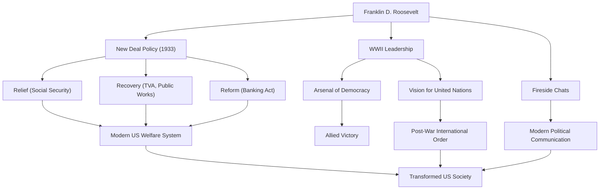

Franklin Delano Roosevelt (FDR) was the 32nd President of the United States and one of the most influential leaders in 20th-century history. He guided the nation through the unprecedented crises of the Great Depression and World War II, and is the only president in US history to be elected to four terms. Let's delve deeply into his life, political philosophy, and his enduring impact on the modern world.

## A Privileged Upbringing and a Sudden Trial

Born in 1882 into a wealthy and prominent family in Hyde Park, New York, Roosevelt studied at Harvard University and Columbia Law School, beginning his path as an elite. He married Eleanor Roosevelt, niece of the 26th President Theodore Roosevelt, and steadily climbed the political ladder. He was elected to the New York State Senate in 1910, later served as Assistant Secretary of the Navy, and in 1920 was nominated as the Democratic candidate for Vice President.

However, in 1921, at the age of 39, he faced a trial that drastically changed his life. He contracted polio (infantile paralysis) and became paralyzed from the waist down. Forced to live in a wheelchair, Roosevelt demonstrated his inherent indomitable spirit in this desperate situation. Along with devoting himself to rehabilitation, the suffering caused by the illness brought him a deep empathy for the pain of others. This empathy would become the core of his later political stance.

## The "New Deal" Policy and the Challenge of the Great Depression

In the 1932 presidential election, Roosevelt campaigned on policies for the "forgotten man," defeating the incumbent Herbert Hoover to become president. At the time, America was in the depths of the Great Depression triggered by the 1929 Wall Street crash; the unemployment rate had reached 25%, and the citizens were in deep despair.

His powerful words in his inaugural address, "The only thing we have to fear is fear itself," gave immense hope to the people. During the period known as the "First Hundred Days," he immediately enacted a flurry of landmark legislation, including the stabilization of banking operations, the Agricultural Adjustment Act (AAA), and the National Industrial Recovery Act (NIRA). This was the "New Deal" policy.

The New Deal policy shifted away from the previously laissez-faire economic policies, paving the way for active government intervention in the economy. Massive public works projects by the Tennessee Valley Authority (TVA) created jobs, and the enactment of the Social Security Act laid the foundation for the modern American welfare system. Centered around the "Three Rs" of "Relief, Recovery, and Reform," this policy fundamentally transformed the structure of American society.

## World War II and the "Arsenal of Democracy"

Halfway through the recovery from the Great Depression, the world was once again engulfed in the flames of war. In response to the outbreak of World War II in Europe, the United States initially maintained an isolationist stance, but Roosevelt acutely recognized the threat of fascism. Positioning America as the "Arsenal of Democracy," he enacted the Lend-Lease Act to support Britain and other allies.

When the US entered the war following the attack on Pearl Harbor in 1941, Roosevelt demonstrated formidable leadership. With outstanding political acumen, he directed domestic production towards military needs and outlined a grand design to lead the Allied Powers to victory. Holding repeated summit meetings with Churchill (UK) and Stalin (USSR), he dedicated himself to the vision of a post-war international order, namely the establishment of the United Nations.

## His Philosophy and Legacy for Posterity

Roosevelt's political philosophy was rooted in pragmatism and profound humanism. Unbound by ideology, he sought flexible and practical solutions to the challenges he faced. Furthermore, his "Fireside Chats" over the radio created a new form of political communication where the president spoke directly to each citizen, building a strong bond with the public.

On April 12, 1945, with victory in World War II imminent, Roosevelt died suddenly of a cerebral hemorrhage. However, the legacy he left behind is immeasurable.

The strengthening of presidential authority he established, the federal government's involvement in the economy, and the social security system form the foundation of the modern American political and economic system. Moreover, the ideal of multilateral cooperation through the United Nations formed the framework of the post-war international order.

Although his tenure had both merits and demerits (including stains such as the internment of Japanese Americans), Franklin D. Roosevelt remains highly acclaimed today as a giant who gave hope to the people during unprecedented crises, rebuilt the nation, and significantly moved the course of world history.

### The Achievements and Impact of Franklin D. Roosevelt

