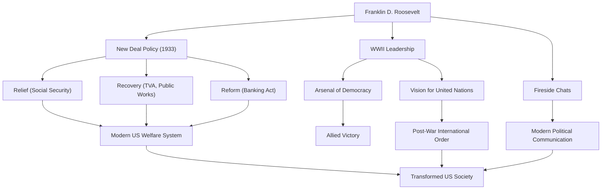

Franklin Delano Roosevelt (FDR) fue el 32º Presidente de los Estados Unidos y uno de los líderes más influyentes en la historia del siglo XX. Guió a la nación a través de las crisis sin precedentes de la Gran Depresión y la Segunda Guerra Mundial, y es el único presidente en la historia de los EE. UU. elegido para cuatro mandatos. Profundicemos en su vida, filosofía política y su impacto duradero en el mundo moderno.

## Una educación privilegiada y una prueba repentina

Nacido en 1882 en una familia rica y prominente en Hyde Park, Nueva York, Roosevelt estudió en la Universidad de Harvard y en la Facultad de Derecho de Columbia, comenzando su camino como una élite. Se casó con Eleanor Roosevelt, sobrina del 26º Presidente Theodore Roosevelt, y ascendió constantemente en la escala política. Fue elegido para el Senado del Estado de Nueva York en 1910, más tarde se desempeñó como Subsecretario de la Marina, y en 1920 fue nominado como candidato demócrata a la vicepresidencia.

Sin embargo, en 1921, a la edad de 39 años, enfrentó una prueba que cambió drásticamente su vida. Contrajo poliomielitis (parálisis infantil) y quedó paralizado de cintura para abajo. Obligado a vivir en una silla de ruedas, Roosevelt demostró su espíritu indomable inherente en esta situación desesperada. Junto con dedicarse a la rehabilitación, el sufrimiento causado por la enfermedad le trajo una profunda empatía por el dolor de los demás. Esta empatía se convertiría en el núcleo de su postura política posterior.

## La política del "New Deal" y el desafío de la Gran Depresión

En las elecciones presidenciales de 1932, Roosevelt hizo campaña con políticas para el "hombre olvidado" (forgotten man), derrotando al titular Herbert Hoover para convertirse en presidente. En ese momento, Estados Unidos estaba en las profundidades de la Gran Depresión desencadenada por el colapso de Wall Street en 1929; la tasa de desempleo había alcanzado el 25%, y los ciudadanos estaban en profunda desesperación.

Sus poderosas palabras en su discurso de investidura, "Lo único a lo que debemos temer es al miedo mismo", dieron una inmensa esperanza al pueblo. Durante el período conocido como los "Cien Días", promulgó de inmediato una serie de leyes históricas, incluida la estabilización de las operaciones bancarias, la Ley de Ajuste Agrícola (AAA) y la Ley de Recuperación Industrial Nacional (NIRA). Esta fue la política del "New Deal" (Nuevo Trato).

La política del New Deal se alejó de las políticas económicas de laissez-faire anteriores, allanando el camino para una intervención activa del gobierno en la economía. Proyectos masivos de obras públicas por la Autoridad del Valle del Tennessee (TVA) crearon empleos, y la promulgación de la Ley de Seguridad Social sentó las bases del moderno sistema de bienestar estadounidense. Centrada en las "Tres R" de "Alivio, Recuperación y Reforma", esta política transformó fundamentalmente la estructura de la sociedad estadounidense.

## La Segunda Guerra Mundial y el "Arsenal de la Democracia"

A mitad de camino de la recuperación de la Gran Depresión, el mundo se vio nuevamente envuelto en las llamas de la guerra. En respuesta al estallido de la Segunda Guerra Mundial en Europa, Estados Unidos mantuvo inicialmente una postura aislacionista, pero Roosevelt reconoció agudamente la amenaza del fascismo. Posicionando a Estados Unidos como el "Arsenal de la Democracia", promulgó la Ley de Préstamo y Arriendo para apoyar a Gran Bretaña y otros aliados.

Cuando EE. UU. entró en la guerra tras el ataque a Pearl Harbor en 1941, Roosevelt demostró un liderazgo formidable. Con una perspicacia política sobresaliente, dirigió la producción nacional hacia las necesidades militares y esbozó un gran diseño para llevar a las Potencias Aliadas a la victoria. Celebrando repetidas reuniones cumbre con Churchill (Reino Unido) y Stalin (URSS), se dedicó a la visión de un orden internacional de posguerra, a saber, el establecimiento de las Naciones Unidas.

## Su filosofía y legado para la posteridad

La filosofía política de Roosevelt estaba arraigada en el pragmatismo y el humanismo profundo. Sin ataduras a la ideología, buscó soluciones flexibles y prácticas a los desafíos que enfrentaba. Además, sus "Charlas junto al fuego" (Fireside Chats) por radio crearon una nueva forma de comunicación política donde el presidente hablaba directamente a cada ciudadano, construyendo un fuerte vínculo con el público.

El 12 de abril de 1945, con la victoria en la Segunda Guerra Mundial inminente, Roosevelt murió repentinamente de una hemorragia cerebral. Sin embargo, el legado que dejó atrás es inmensurable.

El fortalecimiento de la autoridad presidencial que estableció, la participación del gobierno federal en la economía y el sistema de seguridad social forman la base del sistema político y económico moderno de Estados Unidos. Además, el ideal de cooperación multilateral a través de las Naciones Unidas formó el marco del orden internacional de posguerra.

Aunque su mandato tuvo tanto méritos como deméritos (incluidas manchas como el internamiento de japoneses-estadounidenses), Franklin D. Roosevelt sigue siendo muy aclamado hoy como un gigante que dio esperanza al pueblo durante crisis sin precedentes, reconstruyó la nación y movió significativamente el curso de la historia mundial.

### Los logros y el impacto de Franklin D. Roosevelt

